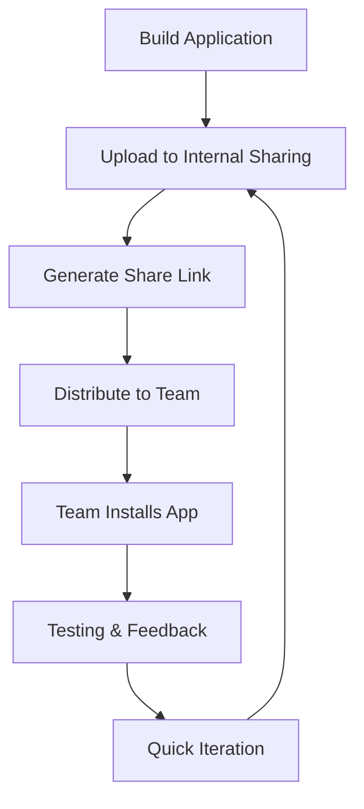

**Category:** App Store & Marketplace Platforms
**Difficulty:** Intermediate
**Reading time:** 6 min read

---

Internal App Sharing is a Google Play feature allowing developers to quickly share builds with internal team members without going through the review process. This accelerates testing and feedback cycles during development.

- **Shareable links** — generating links to distribute builds
- **Instant installation** — no app store listing required
- **Team collaboration** — quickly gathering internal feedback
- **Device compatibility** — testing across multiple device types
- **No review overhead** — bypassing app store review

Internal app sharing allows developers to upload APK or AAB builds directly to Google Play Console and generate unique sharing links. These links can be shared with team members, who can click the link and install the app on their devices with a single tap—no Google Play listing or review process required. Shared apps expire after 7 days, encouraging frequent updates and fresh shares. The feature supports testing across multiple device types and Android versions without requiring the devices to be registered with provisioning profiles. Internal sharing links can include additional testers by simply forwarding the link. The feature is particularly useful for rapid testing iterations during development before moving builds to formal testing tracks. It's faster than alternative approaches like manually installing APK files via USB or TestFlight-style services. The main limitation is that it's intended for internal testing only and shouldn't be used for public beta testing—that requires proper testing tracks.

- Quickly sharing builds with team members during development
- Testing app behavior before uploading to alpha/beta tracks
- Gathering quick feedback on design or functionality changes
- Testing on devices not connected to development infrastructure
- Rapid iteration on bug fixes and features

| Advantage | Disadvantage |
|-----------|--------------|
| Extremely fast setup | Limited to 7-day link validity |
| No review overhead | Not suitable for public testing |
| Easy team sharing | Limited analytics and feedback collection |
| Works immediately | Requires team member to have Google Play account |
| Good for rapid iteration | Can't track detailed metrics |

- [Closed Testing Tracks](closed-testing-tracks.md)
- [Open Testing (Beta) Programs](open-testing-beta-programs.md)
- [Google Play Console](google-play-console.md)

---
*Part of the [App Store & Marketplace Platforms](index.md) category · [Back to Master Index](../../index.md)*
