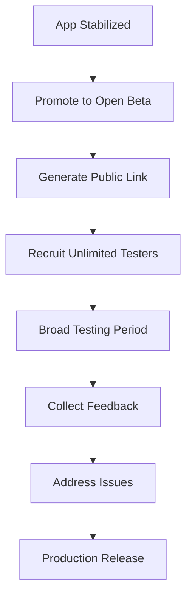

**Category:** App Store & Marketplace Platforms
**Difficulty:** Intermediate
**Reading time:** 6 min read

---

Open testing programs allow developers to release beta versions of apps to an unlimited number of testers through Google Play. This enables broad user feedback and testing at scale before public release.

- **Unlimited testers** — no limit on number of beta testers
- **Public link** — shareable link for recruiting testers
- **Managed access** — testers can join/leave at any time
- **Feedback collection** — gathering input from large tester base
- **Staged progression** — moving from open beta to production

Open testing allows unlimited testers to join a beta test through a public link. Developers promote a build from closed testing to open testing, generating a shareable link that can be posted on websites, social media, or sent directly to interested users. Anyone clicking the link can opt in to test the beta build. Unlike closed testing, open testing doesn't require managing a specific tester list. Testers see the beta version in their Google Play apps, and any updates to the beta build are automatically pushed to all testers. The play store review process still applies to open beta builds. Open testing is useful for gathering feedback from a large and diverse user base. Testers can leave reviews and ratings specific to the beta version. Analytics track crashes, performance issues, and user engagement from the beta audience. This real-world usage data helps developers identify issues not caught in internal testing. Once ready for production, developers graduate the build from open beta to production release.

- Getting feedback on major updates from large tester base
- Testing app with diverse geographic audiences
- Identifying device-specific issues before release
- Building community of engaged testers
- Validating new features with real users

| Advantage | Disadvantage |
|-----------|--------------|
| Unlimited tester capacity | Still requires app store review |
| Large diverse user base feedback | Less curated than closed testing |
| Public link simplifies recruitment | Difficult to control tester quality |
| Real-world usage patterns | Longer testing period needed |
| Can identify niche issues | Results less predictable |

- [Closed Testing Tracks](closed-testing-tracks.md)
- [Internal App Sharing](internal-app-sharing.md)
- [Production Release Management](production-release-management.md)

---
*Part of the [App Store & Marketplace Platforms](index.md) category · [Back to Master Index](../../index.md)*
