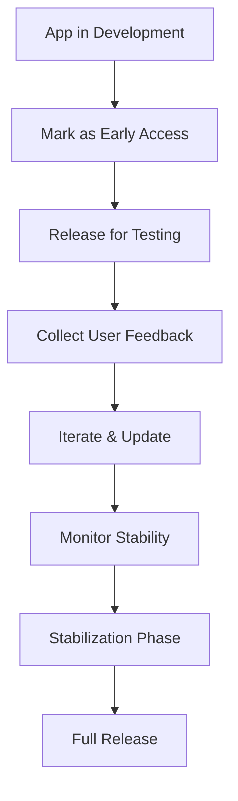

**Category:** App Store & Marketplace Platforms
**Difficulty:** Intermediate
**Reading time:** 6 min read

---

Play Store Early Access allows developers to release apps that are still under development, enabling early user feedback before the official launch. This helps validate concepts and gather feedback from a real user base.

- **Early access tag** — marking apps as work-in-progress
- **User expectations** — communicating that app is not feature-complete
- **Feedback collection** — gathering user input on development priorities
- **Rapid iteration** — frequently releasing updates based on feedback
- **Transition to full release** — moving from early access to production

The Early Access program allows developers to release apps that are explicitly not feature-complete. The app listing displays an "Early Access" tag informing users that the app is still under development and may have bugs or missing features. This sets appropriate expectations, reducing negative reviews from users expecting a finished product. Early access apps can be updated frequently as developers respond to user feedback. Analytics show crash logs and stability issues that developers can prioritize. User reviews provide direct feedback on which features are most important and what issues are causing frustration. Developers can iterate rapidly, releasing multiple updates per week if needed to address critical issues. The early access period helps developers validate that the app concept resonates with users before investing in full feature completeness. Once the app is stable enough and feature-complete, developers can request removal of the early access tag, transitioning to a full production release.

- Launching beta/MVP versions of apps to test market demand
- Gathering user feedback on feature priorities before full launch
- Validating product-market fit with real users
- Building engaged early user community
- Iterating rapidly based on real usage patterns

| Advantage | Disadvantage |
|-----------|--------------|
| Early market feedback on concept | Users expect incomplete features |
| Lower performance expectations | May receive harsher reviews |
| Rapid iteration cycle possible | Harder to attract users |
| Smaller committed user base | Competition from finished apps |
| Direct user communication | Requires clear communication about status |

- [Google Play Store Publishing](google-play-store-publishing.md)
- [Play Store Pre-Registration](play-store-pre-registration.md)
- [Closed Testing Tracks](closed-testing-tracks.md)

---
*Part of the [App Store & Marketplace Platforms](index.md) category · [Back to Master Index](../../index.md)*
