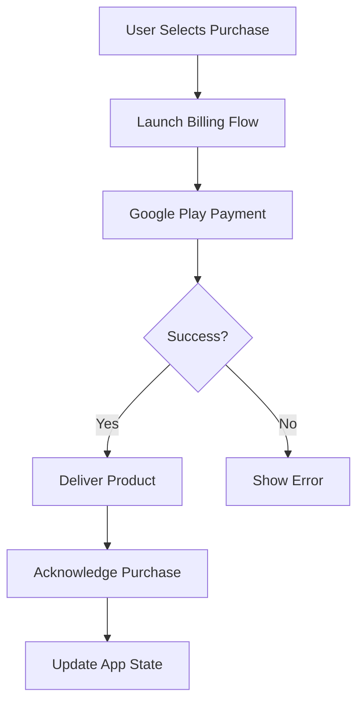

**Category:** App Store & Marketplace Platforms
**Difficulty:** Intermediate
**Reading time:** 6 min read

---

Play Store in-app purchases enable monetization through selling virtual goods and features within Android apps. Google Play handles payment processing while developers retain 70% of purchase price.

- **Consumable products** — items purchased repeatedly (coins, energy, power-ups)
- **Non-consumable products** — permanent unlocks purchased once
- **Subscription products** — recurring billing for ongoing access
- **Deferred billing** — delaying charges for upgrades and downgrades
- **Regional pricing** — setting region-specific product prices

In-app purchases on Google Play use the Google Play Billing Library. Developers first configure products in Google Play Console specifying the SKU, type (consumable, non-consumable, subscription), pricing, and description. When users make purchases, the Billing Client communicates with Google Play services to process payment. After successful payment, the library returns a Purchase object containing the purchase token and state. The developer must acknowledge the purchase within 3 days, confirming that the product was delivered. For consumables, the app can be consumed (marked as used) allowing the product to be purchased again. For non-consumables, the purchase is permanent and linked to the user's account. Google Play provides APIs for querying purchase history, allowing apps to restore purchases if users reinstall the app. Subscriptions are managed similarly to the App Store, with automatic renewal and cancellation handling. Regional pricing allows developers to set different prices in different countries, accounting for purchasing power differences and local market conditions. Developers can also define promotional pricing, offering discounts for limited periods or specific user segments.

- Implementing virtual currency systems in free-to-play games
- Selling permanent feature unlocks in productivity apps
- Offering subscription access to premium content
- Managing regional pricing strategies
- Creating promotional offers for user re-engagement

| Advantage | Disadvantage |
|-----------|--------------|
| Google handles payment processing | 30% commission reduces margins |
| Large user base on Google Play | Android user purchasing behavior lower |
| Multiple product types supported | Requires careful implementation |
| Automatic subscription renewal | Churn management is critical |
| Regional pricing flexibility | Fraud detection can be strict |

- [Google Play Billing Library](google-play-billing-library.md)
- [Play Store Subscriptions](play-store-subscriptions.md)
- [Play Store Pre-Registration](play-store-pre-registration.md)

---
*Part of the [App Store & Marketplace Platforms](index.md) category · [Back to Master Index](../../index.md)*
