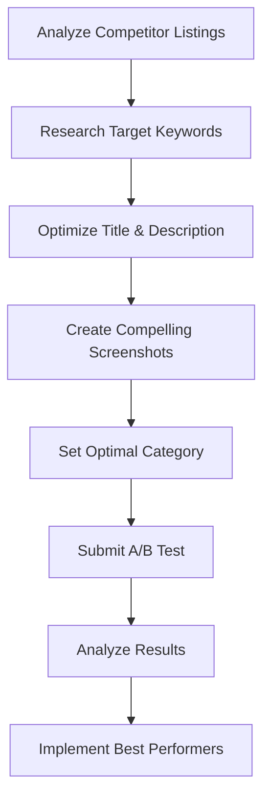

**Category:** App Store & Marketplace Platforms
**Difficulty:** Intermediate
**Reading time:** 6 min read

---

Play Store Listing Optimization involves optimizing app metadata, screenshots, and descriptions to improve visibility and conversion in Google Play Store search results and category listings.

- **Keyword research** — identifying high-volume search terms in Play Store
- **Title and description** — incorporating keywords naturally in app text
- **Visual optimization** — using screenshots to improve download conversion
- **A/B testing** — testing different descriptions and screenshots
- **Rating management** — maintaining high ratings through quality and response
- **Category selection** — choosing appropriate category to reach target users

Play Store listing optimization begins with understanding what terms users search for when looking for apps similar to yours. Unlike the App Store, Google Play uses a different search algorithm, so keyword research must be specific to Google's platform. Keywords are incorporated into the app title, subtitle, description, and keyword fields. The description should clearly communicate the value proposition, feature highlights, and unique differentiators while naturally including search terms. Screenshots are the primary factor influencing whether a user downloads an app—they should showcase the most compelling features, use clean visuals, and include text highlighting key benefits. Google Play Console offers a Listing Experiment feature allowing A/B testing of different descriptions, screenshots, and graphic assets. Testers can run concurrent experiments comparing variations and selecting the version with the highest conversion rate. Managing ratings is important because higher-rated apps rank better and have higher conversion rates. Responding to user reviews shows engagement and can address common concerns. The category chosen affects visibility within category rankings and recommendations.

- Optimizing new app listings to maximize initial visibility
- Improving conversion rates for apps with high downloads but low conversion
- Testing different value propositions through screenshot variation
- Researching competitor strategies to find positioning gaps
- Localizing listings for different languages and markets
- Managing app reviews and responding to user feedback

| Advantage | Disadvantage |
|-----------|--------------|
| Low-cost visibility improvement | Requires ongoing optimization |
| Data-driven A/B testing | Algorithm changes affect ranking |
| Directly impacts download conversion | Competition in popular categories is intense |
| Complements paid advertising | Quality app is essential for results |
| Applies across platforms | Results take time to accumulate |

- [Google Play Store Publishing](google-play-store-publishing.md)
- [Google Play Console](google-play-console.md)
- [Play Store In-App Purchases](play-store-in-app-purchases.md)

---
*Part of the [App Store & Marketplace Platforms](index.md) category · [Back to Master Index](../../index.md)*
