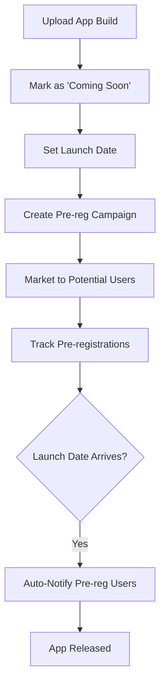

**Category:** App Store & Marketplace Platforms
**Difficulty:** Intermediate
**Reading time:** 6 min read

---

Play Store pre-registration allows users to express interest in upcoming apps before they're released. Pre-registrations generate momentum for app launches and provide developers with data about anticipated user interest.

- **Pre-registration campaign** — promoting upcoming app before launch
- **User notification** — automated alerts to pre-registered users on launch
- **Analytics** — tracking pre-registration interest and demographics
- **Early access** — closed beta access for pre-registered testers
- **Launch coordination** — timing release with marketing campaigns

Pre-registration is available for apps currently in beta or under development that will be released on Google Play in the future. Developers can set up pre-registration while the app is still being finalized, allowing interested users to opt in for launch notifications. Users can pre-register through the app's Play Store listing before launch—they'll automatically be notified when the app becomes available. Pre-registration provides developers with valuable data about anticipated demand, geographic distribution of interest, and audience demographics. This information helps developers make launch timing and localization decisions. Pre-registered users form an initial base of early installers that can boost ranking algorithms on launch day. The pre-registration feature also enables closed testing—some pre-registered users can be granted access to the beta version before public release. Pre-registration is particularly valuable for anticipated launches where marketing campaigns generate interest before availability. Analytics show how many users pre-registered, from which countries, and device types, helping developers prepare infrastructure and optimize launch timing.

- Building launch day momentum for highly anticipated new apps
- Gathering early user feedback through pre-registration beta access
- Analyzing regional interest to prioritize localization
- Coordinating marketing campaigns with app pre-registration
- Planning server capacity based on pre-registration volumes

| Advantage | Disadvantage |
|-----------|--------------|
| Builds launch day traction | Requires marketing effort |
| Early indicator of demand | Can set misleading expectations |
| Auto-notification increases launch day installs | Doesn't guarantee actual downloads |
| User base for feedback gathering | Pre-registration can decline if launch delayed |
| Geographic interest insights | Requires confidence in launch timeline |

- [Google Play Store Publishing](google-play-store-publishing.md)
- [Google Play Console](google-play-console.md)
- [Play Store Early Access](play-store-early-access.md)

---
*Part of the [App Store & Marketplace Platforms](index.md) category · [Back to Master Index](../../index.md)*
