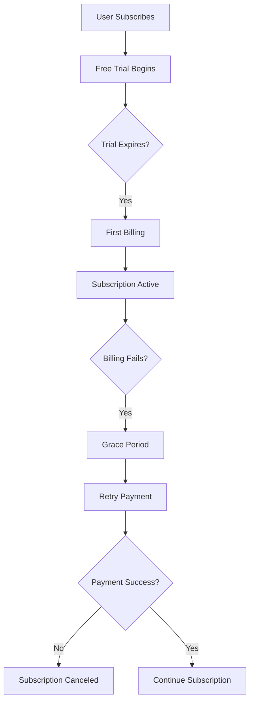

**Category:** App Store & Marketplace Platforms
**Difficulty:** Intermediate
**Reading time:** 6 min read

---

Play Store Subscriptions enable recurring billing for content and features on Android. Google Play manages subscription renewal, providing developers with a scalable monetization model.

- **Billing cycles** — configurable renewal periods (monthly, yearly, etc.)
- **Free trial periods** — introductory zero-cost access before charging
- **Subscription groups** — organizing related subscriptions to prevent multiple active ones
- **Upgrade/downgrade paths** — managing subscription tier changes
- **Grace periods** — windows for retrying failed payment before subscription cancellation

Play Store subscriptions are configured in Google Play Console with pricing, billing cycle (monthly, yearly, etc.), and optional free trial duration. When users purchase a subscription, they may enter a free trial period where they gain access without being charged. Once the trial expires, Google Play automatically charges the user at the configured interval. If a payment fails, Google enters a grace period where the user retains access while Google retries payment using the stored payment method. Developers can set up subscription groups where only one subscription from the group can be active simultaneously, preventing users from having overlapping duplicate subscriptions. Subscription management APIs allow users to view their subscription status, cancel anytime, or upgrade/downgrade to different subscription tiers. Developers can issue promotional offers granting discounts or free trials to existing or lapsed users. Google Play APIs provide webhooks notifying developers of subscription events including purchase, renewal, cancellation, and account hold status. Developers must handle subscription lifecycle appropriately in their apps, revoking access when subscriptions expire or are canceled.

- Monetizing content subscription services (news, music, video)
- Offering premium feature access in productivity apps
- Creating fitness or wellness app subscription tiers
- Managing subscription retention through promotional offers
- Handling subscription downgrades when users reduce tier

| Advantage | Disadvantage |
|-----------|--------------|
| Predictable recurring revenue | Requires ongoing content updates |
| Automatic renewal without user action | Customer churn can be high |
| Flexible trial periods for conversion | 30% commission reduces margins |
| Grace period reduces unintended cancellations | Requires good analytics for optimization |
| Proration support for tier changes | Refund requests can be contentious |

- [Play Store In-App Purchases](play-store-in-app-purchases.md)
- [Google Play Billing Library](google-play-billing-library.md)
- [Subscription App Revenue](subscription-app-revenue.md)

---
*Part of the [App Store & Marketplace Platforms](index.md) category · [Back to Master Index](../../index.md)*
