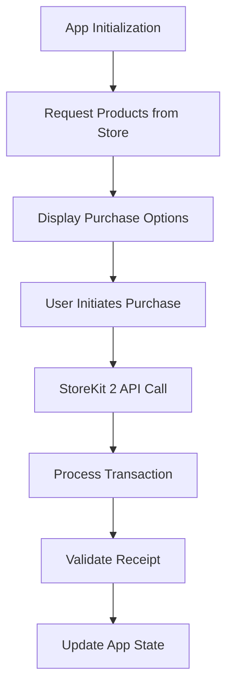

**Category:** App Store & Marketplace Platforms
**Difficulty:** Intermediate
**Reading time:** 6 min read

---

StoreKit 2 is Apple's modern framework for integrating in-app purchases, subscriptions, and product management into iOS, macOS, tvOS, and watchOS applications. It replaces the older StoreKit 1 with improved APIs and better handling of subscription lifecycle.

- **Product fetching** — retrieving product information from App Store Connect
- **Transaction handling** — processing purchase transactions asynchronously
- **Receipt validation** — server-side verification of purchase authenticity
- **Subscription tracking** — monitoring subscription status and renewal events
- **Async/await patterns** — modern Swift concurrency for payment operations

StoreKit 2 provides async/await based APIs that work seamlessly with Swift's modern concurrency model. When an app needs to offer products, it requests them from the App Store using product identifiers configured in App Store Connect. StoreKit returns product information including localized prices, descriptions, and subscription details. When users initiate a purchase, the app calls the purchase() method which presents Apple's payment sheet. The framework handles the transaction asynchronously and delivers a Transaction object upon completion. The app must validate this transaction using server-side receipt validation or the new App Store Server API for enhanced security. For subscriptions, StoreKit 2 provides updates about subscription status including renewal dates, expiration, and cancellation reasons. The framework also handles transaction history restoration, allowing users to regain access to previously purchased items. Event handlers notify the app when transactions complete, subscriptions renew, or status changes occur, enabling proper handling of these lifecycle events.

- Implementing in-app purchases in new iOS applications
- Upgrading from StoreKit 1 to modern StoreKit 2 APIs
- Managing complex subscription tiers and family subscriptions
- Handling subscription cancellations and retention offers
- Implementing promotional pricing for subscriptions

| Advantage | Disadvantage |
|-----------|--------------|
| Modern async/await API design | Requires iOS 15.0 or later |
| Better subscription handling | Learning curve from StoreKit 1 |
| Simpler transaction processing | Still requires server-side validation |
| Improved error messaging | Not yet fully mature ecosystem |
| Direct App Store Server API support | Documentation still evolving |

- [App Store In-App Purchases (IAP)](app-store-in-app-purchases-iap.md)
- [App Store Subscriptions](app-store-subscriptions.md)
- [App Store Monetization Strategies](app-store-monetization-strategies.md)

---
*Part of the [App Store & Marketplace Platforms](index.md) category · [Back to Master Index](../../index.md)*
