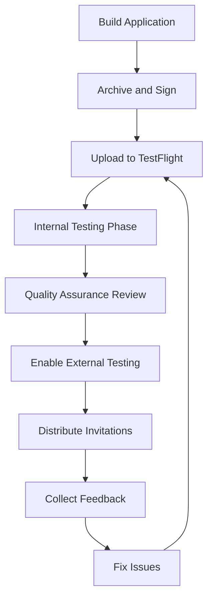

**Category:** App Store & Marketplace Platforms
**Difficulty:** Intermediate
**Reading time:** 6 min read

---

TestFlight is Apple's platform for distributing beta versions of apps to testers before public release. It enables developers to gather feedback, identify bugs, and ensure stability before submitting apps to the App Store.

- **Internal testing** — unlimited testers within the development team
- **External testing** — up to 10,000 beta testers outside the organization
- **Build management** — uploading and managing different versions for testing
- **Feedback collection** — gathering tester reports and crash logs
- **Automated testing** — XCTest and automated UI testing on beta builds
- **Build expiration** — beta builds expire after 90 days

TestFlight begins with developers uploading compiled app builds through Xcode or App Store Connect. Internal testing launches immediately, allowing team members and immediate stakeholders to test the build. Once an internal build has been tested, developers can enable external testing and send invitations to up to 10,000 beta testers. Testers install the TestFlight app, redeem invitations, and download the beta app. TestFlight automatically collects crash logs and performance data from all testers, providing developers with detailed diagnostics. Testers can submit feedback directly through the TestFlight app, answering developer-created questions or writing free-form comments. Developers can upload new builds at any time, and TestFlight automatically notifies testers about updates. Builds remain available for 90 days; after that, they expire and are no longer available for testing. The platform handles all the distribution infrastructure, UDID registration, and provisioning profile management automatically, significantly simplifying beta distribution compared to manually managing provisioning profiles.

- Beta testing major feature releases before public launch
- Gathering user feedback on design and functionality
- Identifying crashes and bugs in diverse device/OS combinations
- Validating app stability improvements across testers
- Testing subscription and in-app purchase functionality

| Advantage | Disadvantage |
|-----------|--------------|
| Streamlined beta distribution process | Limited testing duration (90 days) |
| Automatic crash reporting | Requires testers to install TestFlight app |
| Up to 10,000 external testers available | Tester recruitment can be challenging |
| No manual provisioning management | Device UDID registration required |
| Built into App Store ecosystem | Cannot test with outside payment methods |

- [Apple App Store Submission Process](apple-app-store-submission-process.md)
- [App Store Connect Management](app-store-connect-management.md)
- [Open Testing (Beta) Programs](open-testing-beta-programs.md)

---
*Part of the [App Store & Marketplace Platforms](index.md) category · [Back to Master Index](../../index.md)*
