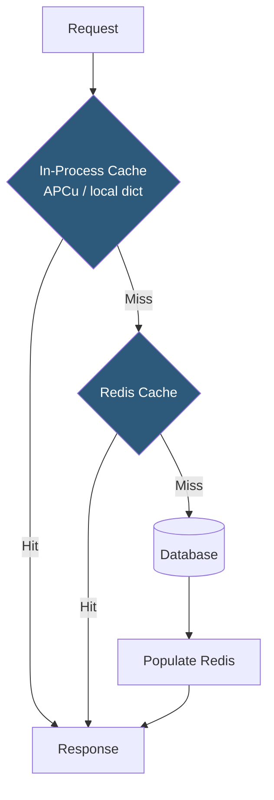

**Category:** Application Server Platforms
**Difficulty:** Intermediate
**Reading time:** 6 min read

---

Application caching layers store computed results, database query outputs, and rendered content in fast-access memory to avoid repeating expensive operations on every request. A well-designed caching strategy can reduce database load by 80–95% and cut response times from hundreds of milliseconds to single-digit milliseconds.

- **Cache-aside (lazy loading)** — Application checks cache before querying source; populates cache on miss
- **Write-through** — Cache is updated synchronously on every write, ensuring consistency at the cost of write latency
- **Write-behind (write-back)** — Writes go to cache immediately; asynchronous process flushes to database
- **TTL (Time to Live)** — Expiration time for cached entries; balance between freshness and cache hit rate
- **Cache eviction** — Removal policy when cache is full: LRU (least recently used), LFU (least frequently used), or FIFO
- **Redis** — In-memory data structure server supporting strings, hashes, sorted sets, and pub/sub; industry-standard cache
- **Memcached** — Simpler in-memory key-value store; faster for pure string caching with no persistence requirement
- **Cache stampede** — Multiple requests simultaneously missing the same key and all querying the database; mitigated by locks or probabilistic early expiration

Multi-layer caching uses progressively slower but larger storage tiers. The fastest tier is in-process cache (APCu in PHP, `lru-cache` in Node.js, `functools.lru_cache` in Python): nanosecond access within the application process. Its limitation is that data is not shared between processes and is lost on restart—suitable for static data like configuration or compiled templates.

The second tier is a networked cache store (Redis or Memcached). Redis stores data as key-value pairs with optional data structures. A cache-aside implementation: check `redis.get(cache_key)`, return if present; otherwise query database, call `redis.set(cache_key, result, ex=300)` (5-minute TTL), then return. The round-trip to Redis (typically 0.5–2ms on the same network) is orders of magnitude cheaper than a database query (10–500ms).

Cache key design determines cache effectiveness. Keys should be deterministic and specific: `user:1234:profile`, `product:5678:details`, `search:query:hash`. Namespace prefixes enable bulk invalidation (`redis.delete_pattern("user:1234:*")` on user update). Avoid overly broad cache keys that return huge payloads or require expensive deserialization.

Cache stampede occurs when a high-traffic key expires and hundreds of concurrent requests miss simultaneously, all querying the database. Mitigation strategies: mutex locks (first miss acquires a lock, others wait for cache population), probabilistic early expiration (randomly refresh cache before TTL, avoiding synchronized expiry), and background refresh (warm cache asynchronously before TTL expires).

Fragment caching stores partial page output or serialized model representations. Query result caching stores SQL results by query hash. Full-page caching (Varnish, Nginx proxy_cache) serves entire HTTP responses without touching the application—suitable for public, unauthenticated pages.

- High-read-ratio web applications where the same database rows are queried thousands of times per minute
- API response caching for expensive aggregation queries that can tolerate eventual consistency
- Session storage using Redis as a dual-purpose cache and session backend
- Rate limiting counters using Redis atomic INCR for fast per-user request counting
- Leaderboards and ranked data using Redis sorted sets with O(log N) insertion and range queries

| Advantage | Disadvantage |
|-----------|--------------|
| Redis TTL-based expiry handles cache invalidation automatically for time-tolerant data | Cache invalidation on data changes is complex; stale data causes bugs if not handled carefully |
| Dramatic database load reduction enables the same DB to serve 10× more traffic | Cache layer adds infrastructure dependency; Redis failure must be gracefully handled |
| Sub-millisecond read latency for hot data regardless of query complexity | Memory cost: Redis cluster memory must be sized for working set; can be expensive |
| Horizontal Redis Cluster shards data across nodes, scaling cache capacity | Cache stampede requires explicit mitigation code; often overlooked until production incident |

- [Session Management Strategies](session-management-strategies.md)
- [Application Server Scaling](application-server-scaling.md)
- [Background Job Processing](background-job-processing.md)

---
*Part of the [Application Server Platforms](index.md) category · [Back to Master Index](../../index.md)*
