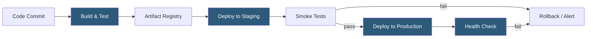

**Category:** Application Server Platforms
**Difficulty:** Intermediate
**Reading time:** 6 min read

---

Application deployment automation replaces manual release procedures with repeatable, scripted pipelines that build, test, and deliver application artifacts to target environments. Automated deployments reduce human error, enforce consistent release procedures, and enable continuous delivery practices where validated changes reach production within minutes of merge. A mature deployment automation system encompasses artifact building, environment-specific configuration injection, health checking, and rollback triggering.

- **CI/CD pipeline** — Ordered sequence of stages (build → test → publish → deploy) triggered automatically on code changes
- **Artifact** — Immutable deployable package produced by the build stage; Docker image, JAR, zip archive, or compiled binary
- **Deployment strategy** — Pattern governing how new application versions replace old ones (rolling, blue-green, canary)
- **Zero-downtime deployment** — Release approach that maintains availability by routing traffic to healthy instances throughout the update
- **Health check** — Automated probe (HTTP endpoint, TCP, command) that confirms a newly deployed instance is ready to serve traffic
- **Configuration injection** — Process of supplying environment-specific secrets and settings to application instances at deploy time rather than baking them into artifacts
- **Idempotency** — Property of a deployment script that produces the same result regardless of how many times it runs
- **Rollback** — Automated or manual reversion to a previous known-good artifact version upon deployment failure

Deployment automation begins with a trigger — typically a Git push or pull request merge to a target branch. The CI platform (GitHub Actions, GitLab CI, Jenkins) executes a pipeline defined in YAML or Groovy. The build stage compiles code and runs unit/integration tests; failure at this stage aborts the pipeline and notifies the author.

Successful builds produce a versioned artifact pushed to a registry (Docker Hub, ECR, Nexus, Artifactory). The artifact version, tied to the Git commit SHA, provides a traceable link between running software and its source.

Deployment stages consume the artifact and apply it to target environments. Tools like Ansible, Capistrano, Fabric, or custom shell scripts SSH into servers and perform the update sequence: pull new artifact, inject secrets from a vault (HashiCorp Vault, AWS Secrets Manager), restart the process manager, and verify the health check endpoint returns HTTP 200 before marking the deploy complete.

Container-based deployments use Kubernetes rolling updates (`kubectl set image`) or Helm chart upgrades, which gradually replace old pods while the readiness probe gates traffic routing. Zero-downtime is achieved because the load balancer only routes to pods passing readiness checks.

Post-deployment, automated smoke tests validate critical user journeys. Canary deployments direct a small percentage of traffic (5–10%) to the new version and compare error rates against the baseline before proceeding with full rollout. Automated rollback triggers revert the deployment if error rates or latency exceed defined thresholds.

- SaaS platforms releasing multiple times per day with zero-downtime requirements
- Microservices architectures where dozens of services deploy independently on different schedules
- Compliance-regulated environments requiring audit trails for every production change
- Multi-region deployments that need coordinated, sequential rollouts across availability zones
- Open-source projects using GitHub Actions to automate releases to package registries

| Advantage | Disadvantage |
|-----------|--------------|
| Eliminates manual steps and reduces human error in releases | Pipeline misconfiguration can automate bad deployments at speed |
| Provides full audit trail of what was deployed, when, and by whom | Initial pipeline setup and maintenance requires significant engineering investment |
| Enables rapid iteration with high deployment frequency | Complex rollback scenarios (database migrations) require careful design |
| Consistent process across staging and production environments | Automated tests must be comprehensive or failures slip through to production |

- [Application Server Scaling](application-server-scaling.md)
- [Application Server Monitoring](application-server-monitoring.md)
- [Session Management Strategies](session-management-strategies.md)

---
*Part of the [Application Server Platforms](index.md) category · [Back to Master Index](../../index.md)*
