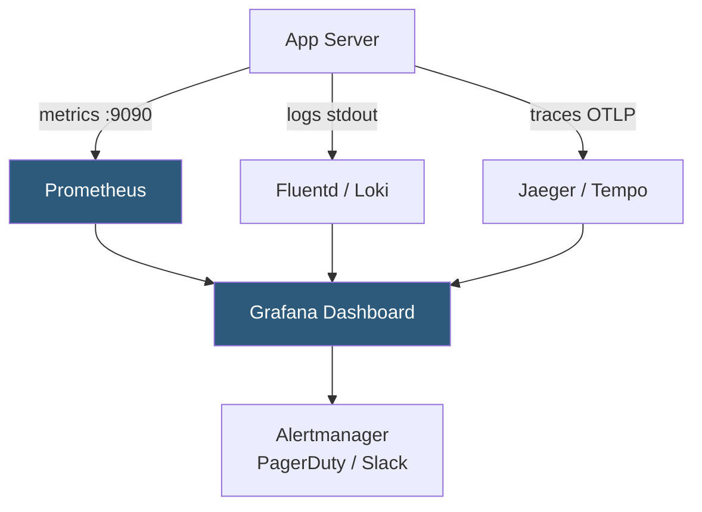

**Category:** Application Server Platforms
**Difficulty:** Intermediate
**Reading time:** 6 min read

---

Application server monitoring collects metrics, logs, and traces from web application runtimes to detect performance degradation, errors, and capacity issues before they impact users. Effective monitoring spans infrastructure metrics (CPU, memory), application-level metrics (request rate, error rate, latency), and distributed traces linking requests across services.

- **RED method** — Rate, Errors, Duration: the three signals for monitoring request-driven services
- **USE method** — Utilization, Saturation, Errors: signals for monitoring resource-bound systems
- **APM (Application Performance Monitoring)** — Tools like Datadog, New Relic, or Elastic APM providing auto-instrumented traces
- **Prometheus** — Pull-based metrics collection system with a powerful query language (PromQL)
- **Grafana** — Dashboard platform visualizing metrics from Prometheus, InfluxDB, and other sources
- **Structured logging** — JSON-formatted log output enabling parsing and aggregation by log management systems
- **Distributed tracing** — OpenTelemetry-standard trace propagation linking spans across microservices
- **Health endpoint** — HTTP `/health` or `/ready` returning server status for load balancer and orchestrator probes

Application server monitoring begins at the process level. OS-level metrics—CPU utilization, memory RSS, file descriptor count—are collected by node_exporter (Prometheus) or cloud provider agents. Application-level metrics require instrumentation: Go applications expose a `/metrics` endpoint via `promhttp.Handler()`; Django uses `django-prometheus`; Node.js uses `prom-client`. Prometheus scrapes these endpoints on a configurable interval (typically 15–30 seconds).

Key application metrics to monitor: request rate (requests/second per route), error rate (5xx responses as percentage of total), p50/p95/p99 latency (histogram buckets), active connections, worker queue depth, and memory usage. Alerting rules trigger on: error rate > 1%, p99 latency > 500ms, or worker saturation (queue length > pool size × 2).

Log aggregation uses structured JSON output. Application servers should log each request in a consistent format: `{"timestamp":"...","method":"GET","path":"/api/users","status":200,"duration_ms":45,"request_id":"abc123"}`. Fluentd, Logstash, or Vector ship logs to Elasticsearch/OpenSearch or Loki. Log-based alerting can fire on patterns like `level:error` rate spikes.

Distributed tracing via OpenTelemetry instruments the full request path. Each service injects a trace ID into outgoing requests (`traceparent` header); receiving services extract it and create child spans. Jaeger or Grafana Tempo stores traces and enables waterfall visualization showing exactly where latency occurs across service calls. This is essential for debugging slow requests in microservice architectures.

Uptime monitoring (synthetic checks) runs from external locations, validating that the application responds correctly every 30–60 seconds. Failing external checks trigger alerts before internal metrics detect issues.

- Web applications requiring SLA compliance where response time targets must be measured and enforced
- Microservice architectures where distributed tracing finds latency in cross-service call chains
- Auto-scaling systems using queue depth and CPU metrics as scaling triggers
- On-call engineering teams needing actionable alerts with context rather than raw log lines
- Performance regression detection by comparing p99 latency before and after deployments

| Advantage | Disadvantage |
|-----------|--------------|
| Prometheus pull model is firewall-friendly and doesn't require agent push | Prometheus cardinality explosion from high-dimension labels can degrade query performance |
| OpenTelemetry standardization enables vendor-agnostic instrumentation | Distributed tracing adds CPU and memory overhead to every instrumented service |
| Structured logs enable fast search and aggregation | Log volume at high traffic can be costly to store and process |
| Health endpoints enable instant load balancer removal of sick instances | False alerts from transient spikes can cause alert fatigue |

- [Application Server Scaling](application-server-scaling.md)
- [Application Caching Layers](application-caching-layers.md)
- [Application Deployment Automation](application-deployment-automation.md)

---
*Part of the [Application Server Platforms](index.md) category · [Back to Master Index](../../index.md)*
