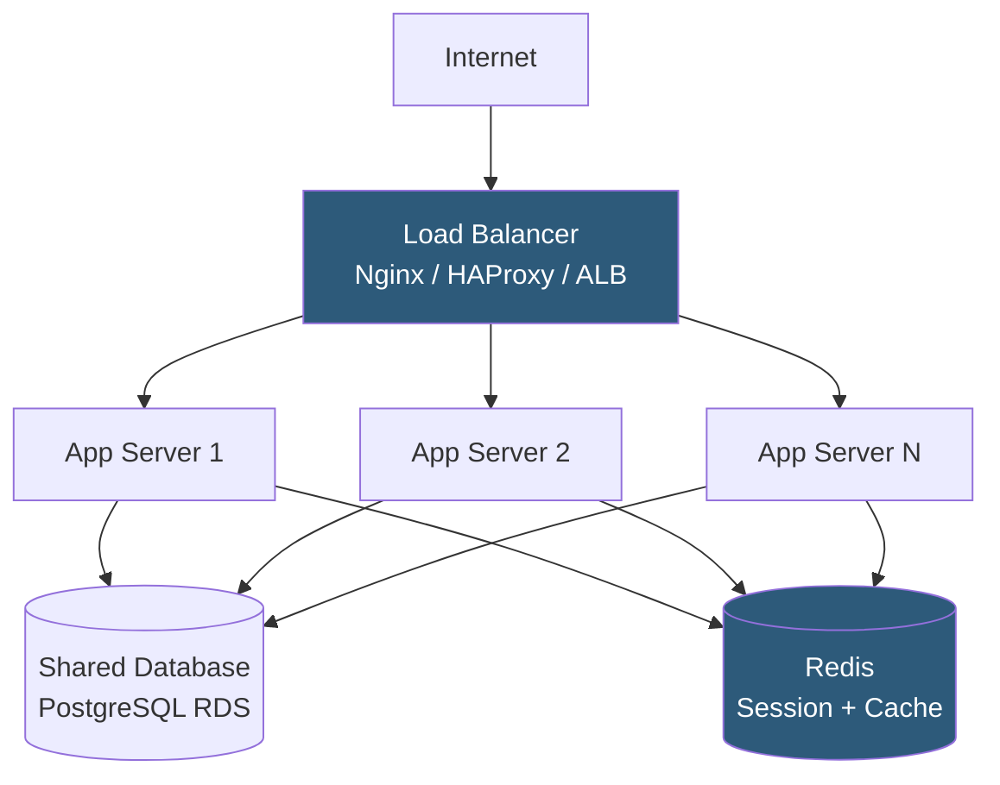

**Category:** Application Server Platforms
**Difficulty:** Intermediate
**Reading time:** 6 min read

---

Application server scaling encompasses the strategies, patterns, and infrastructure for increasing an application's capacity to handle growing request volumes. It spans vertical scaling (adding resources to existing servers), horizontal scaling (adding more server instances), and architectural changes that remove bottlenecks limiting scale.

- **Vertical scaling (scale up)** — Adding CPU, RAM, or faster storage to an existing server
- **Horizontal scaling (scale out)** — Adding more application server instances and distributing load across them
- **Load balancer** — Network component distributing incoming requests across multiple server instances
- **Stateless application** — App design where any instance can handle any request; essential for horizontal scaling
- **Session affinity (sticky sessions)** — Load balancer routing a user's requests to the same backend instance
- **Auto-scaling** — Cloud or Kubernetes mechanism automatically adding/removing instances based on metrics
- **Connection pooling** — Pre-allocating database connections to avoid per-request connection overhead at scale
- **Cache layer** — Redis or Memcached storing frequently accessed data to reduce database load

Horizontal scaling begins with designing stateless application servers. Each instance must handle any request without relying on local state from previous requests. This requires: moving sessions to a central store (Redis/Memcached), storing uploaded files in object storage (S3), and ensuring application configuration is read from environment variables or a config server rather than local files.

Load balancers distribute traffic using algorithms: round-robin for even distribution of similar requests; least-connections for uneven workloads; IP-hash for sticky sessions when stateless migration is not yet complete. AWS Application Load Balancer, Nginx upstream, and HAProxy are common choices. Health checks (`/health` endpoint) ensure the load balancer removes unhealthy instances before they receive traffic.

Database connections are the primary scaling constraint. Each application server worker needs database connections; with 20 app servers × 20 workers each = 400 potential connections. PostgreSQL's default limit is 100; PgBouncer connection pooler sits between app servers and the database, multiplexing thousands of application connections into a small pool of real database connections. This is non-negotiable for scaled deployments.

Auto-scaling uses CPU utilization, request queue depth, or custom metrics to trigger instance creation. AWS Auto Scaling Groups, Kubernetes Horizontal Pod Autoscaler (HPA), or GCP Managed Instance Groups watch metrics and add instances when thresholds are breached. Scale-in (removing instances) must be graceful: drain in-flight requests before termination.

Caching reduces database load exponentially: if 80% of requests can be served from Redis (cache hit rate), the database sees only 20% of traffic. Implement cache-aside pattern: check cache, return hit; on miss, query database, populate cache, return result. Cache TTL and invalidation strategy determine data freshness vs performance trade-off.

- SaaS platforms scaling from 100 to 100,000 users without rewriting the application
- E-commerce sites handling Black Friday traffic spikes with auto-scaling
- API gateways needing linear capacity increases as customer count grows
- Microservice architectures where individual services scale independently based on their load
- Seasonal applications (tax software, sports apps) requiring burst scaling during peak periods

| Advantage | Disadvantage |
|-----------|--------------|
| Horizontal scaling provides near-linear capacity with commodity hardware | Requires stateless application architecture; retrofitting stateful apps is complex |
| Auto-scaling reduces cost by right-sizing capacity to actual demand | Auto-scale lag: new instances take 1–3 minutes to start and warm up |
| Load balancer health checks enable zero-downtime maintenance | Load balancer itself becomes a single point of failure; requires HA configuration |
| Cache layer eliminates majority of database load at scale | Cache invalidation complexity grows with data consistency requirements |

- [Application Server Monitoring](application-server-monitoring.md)
- [Session Management Strategies](session-management-strategies.md)
- [Application Caching Layers](application-caching-layers.md)

---
*Part of the [Application Server Platforms](index.md) category · [Back to Master Index](../../index.md)*
