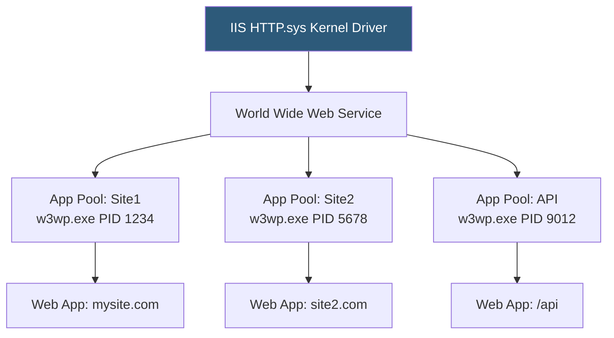

**Category:** Application Server Platforms
**Difficulty:** Intermediate
**Reading time:** 6 min read

---

IIS Application Pools are isolated execution environments within Internet Information Services that host ASP.NET applications, providing process-level isolation between web applications on the same IIS server. Each pool runs as a separate w3wp.exe worker process with configurable identity, memory limits, and recycling schedules.

- **w3wp.exe** — IIS worker process executable hosting the application pool and all assigned web applications
- **Application Pool Identity** — Windows account (ApplicationPoolIdentity, NetworkService, or custom) under which w3wp.exe runs
- **Recycling** — IIS process restart mechanism triggered by schedule, memory threshold, or request count
- **Idle timeout** — Duration after which IIS stops a pool with no incoming requests to reclaim resources
- **Rapid-fail protection** — IIS setting that disables a pool after repeated crashes within a time window
- **32-bit mode** — Forces pool to run as 32-bit process for legacy components requiring 32-bit address space
- **Pipeline mode** — Integrated (default) runs .NET requests in IIS native pipeline; Classic emulates IIS 6 behavior
- **Queue length** — Maximum pending requests queued before IIS returns HTTP 503

HTTP.sys, a Windows kernel-mode driver, intercepts all HTTP traffic and routes requests to the appropriate IIS worker process based on the URL binding configuration. Each Application Pool corresponds to one or more w3wp.exe processes (the `Maximum Worker Processes` setting enables web gardens with multiple processes per pool).

Creating a separate Application Pool per site is the best practice: it provides security isolation (one compromised application cannot access another's memory), stability isolation (a crash in Pool A doesn't affect Pool B), and independent recycling. The `ApplicationPoolIdentity` is a virtual account with minimal OS permissions; it has write access only to the application's content directory and IIS temp files.

Recycling restarts the worker process on a schedule (typically 29-hour default) or based on thresholds: `Recycling > Private Memory Limit` kills w3wp when it exceeds a set MB count, preventing memory leak accumulation. `Maximum Number of Worker Processes > 1` enables web gardens, where multiple w3wp instances share the port, providing CPU scaling without separate load balancers—but session state must be external (SQL Server or Redis) since processes don't share memory.

Integrated pipeline mode (default since IIS 7) merges ASP.NET and native IIS request processing, enabling ASP.NET modules (authentication, URL rewriting) to apply to all content types, not just `.aspx`. Classic mode is only needed for very old ISAPI-based applications that cannot be updated.

For ASP.NET Core, the ASP.NET Core Module (ANCM) v2 in-process model loads `hostfxr.dll` into w3wp.exe, running the Kestrel server inside the IIS process for maximum throughput. Out-of-process mode runs Kestrel separately and uses ANCM as a reverse proxy.

- IIS servers hosting multiple customer applications requiring security and stability isolation
- Windows authentication enterprise apps requiring `NETWORK SERVICE` or Active Directory identity
- Legacy ASP.NET WebForms/MVC applications requiring Classic pipeline mode compatibility
- High-memory ASP.NET applications needing automatic recycling to prevent leak accumulation
- ASP.NET Core applications on Windows Server using IIS in-process hosting

| Advantage | Disadvantage |
|-----------|--------------|
| Process isolation prevents one application's crash from impacting others | Managing dozens of pools adds administrative overhead |
| ApplicationPoolIdentity provides minimal-privilege security by default | Web gardens require external session state; in-memory session is lost on recycle |
| Recycling mitigates memory leak impact without code changes | Recycling causes request delays; warm-up modules are needed for cache pre-population |
| Integrated pipeline applies ASP.NET features to all content types | Windows-only; IIS is not available on Linux |

- [.NET Core Hosting](dotnet-core-hosting.md)
- [Application Server Monitoring](application-server-monitoring.md)
- [Session Management Strategies](session-management-strategies.md)

---
*Part of the [Application Server Platforms](index.md) category · [Back to Master Index](../../index.md)*
