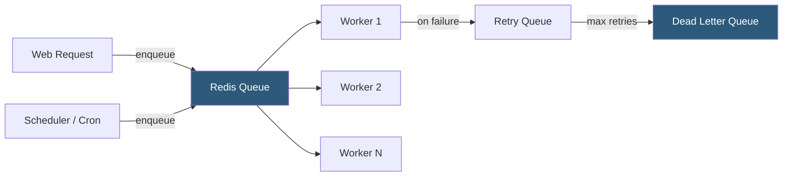

**Category:** Application Server Platforms
**Difficulty:** Intermediate
**Reading time:** 6 min read

---

Background job processing offloads time-consuming or asynchronous work from HTTP request handlers to separate worker processes, improving response times and decoupling task execution from user interactions. Job queues like Sidekiq (Ruby), Celery (Python), Bull (Node.js), and Resque handle task scheduling, retries, and dead-letter queues.

- **Job queue** — Persistent ordered collection of tasks awaiting execution, typically backed by Redis or a database
- **Worker** — Dedicated process polling the queue and executing jobs; separate from the web server process
- **Retry logic** — Automatic re-queuing of failed jobs with exponential backoff to handle transient failures
- **Dead letter queue (DLQ)** — Queue holding jobs that failed all retry attempts for manual inspection
- **Idempotency** — Job design ensuring repeated execution of the same job produces the same result; critical for safe retries
- **Job priority** — Queue tiering ensuring urgent jobs are processed before low-priority bulk tasks
- **Scheduled jobs (cron)** — Jobs enqueued on a time-based schedule (e.g., nightly reports, hourly cache warming)
- **Concurrency** — Number of jobs processed simultaneously per worker; bounded by available CPU and memory

The web server enqueues a job instead of executing work synchronously. For example, a user registers: the HTTP handler creates the user record, enqueues a `SendWelcomeEmailJob`, and returns 201 in ~10ms. The email worker picks up the job, calls the SMTP service, and the user receives their email within seconds—without the HTTP request waiting for email delivery.

**Sidekiq** (Ruby/Rails) is backed by Redis and uses threads within each worker process. `Sidekiq::Client.perform_async(SomeWorker, arg1, arg2)` serializes arguments to JSON and pushes to a Redis list. Worker processes call `sidekiq` command; each runs `CONCURRENCY` threads (default: 10). Failed jobs are moved to a retry set with exponential backoff (default: 25 retries over 21 days).

**Celery** (Python) uses Redis or RabbitMQ as broker. `task.delay(args)` sends the task to the broker. Workers started with `celery -A myapp worker --concurrency=4` process tasks using a pre-fork pool (default) or gevent for I/O-heavy tasks. Celery Beat provides scheduled task execution.

**Bull/BullMQ** (Node.js) provides Redis-backed queues with TypeScript support. `queue.add('email', {to: user.email})` adds a job. Workers use `queue.process(async (job) => {...})`, processing concurrently based on worker pool size.

Job idempotency is essential for correctness. Jobs may execute more than once due to worker crashes, network retries, or queue at-least-once delivery semantics. Design jobs to be safe to re-run: check if the work was already done before performing it, use database unique constraints, or track job completion state in a separate table.

- Email/SMS sending after user actions (registration, purchase confirmation)
- Image and video processing (resize, transcode) triggered by user uploads
- Third-party API synchronization (push CRM data, sync inventory, generate reports)
- Bulk operations (mass email campaigns, database migrations, CSV exports)
- Scheduled maintenance tasks (cache invalidation, data aggregation, cleanup of expired records)

| Advantage | Disadvantage |
|-----------|--------------|
| Decouples slow work from HTTP response path; dramatically improves perceived performance | Jobs execute asynchronously; UI must poll or use WebSockets to show completion |
| Redis-backed queues survive application restarts; jobs are not lost | Redis persistence configuration required; in-memory-only Redis loses jobs on restart |
| Retry logic with backoff handles transient failures automatically | Non-idempotent jobs cause data corruption or duplicate actions on retry |
| Priority queues ensure urgent jobs are not delayed by bulk processing | Worker infrastructure must be monitored and scaled independently from web servers |

- [Application Caching Layers](application-caching-layers.md)
- [Message Queue Integration](message-queue-integration.md)
- [Application Server Monitoring](application-server-monitoring.md)

---
*Part of the [Application Server Platforms](index.md) category · [Back to Master Index](../../index.md)*
