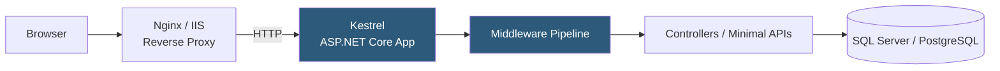

**Category:** Application Server Platforms
**Difficulty:** Intermediate
**Reading time:** 6 min read

---

.NET Core (now .NET 6/7/8) hosting enables cross-platform deployment of ASP.NET Core applications on Linux, Windows, and macOS. Kestrel, the built-in HTTP server, provides high-performance request handling, while IIS, Nginx, or Apache act as reverse proxies in production to add TLS, static file serving, and process management.

- **Kestrel** — ASP.NET Core's built-in, cross-platform HTTP server; runs as the application's direct web server or behind a reverse proxy
- **IIS In-Process** — ASP.NET Core model where the app runs inside the IIS worker process (w3wp.exe) for maximum performance on Windows
- **IIS Out-of-Process** — ASP.NET Core proxies through IIS to a separate Kestrel process via ASP.NET Core Module (ANCM)
- **ANCM (ASP.NET Core Module)** — IIS module bridging IIS and Kestrel processes for Windows deployments
- **`dotnet run` / `dotnet publish`** — Commands for development execution and production artifact generation
- **Self-contained deployment** — Published app includes .NET runtime; no runtime pre-installed on host required
- **Framework-dependent deployment** — Published app requires matching .NET runtime installed on the host
- **Environment variables** — `ASPNETCORE_ENVIRONMENT`, `ASPNETCORE_URLS`, `ConnectionStrings__DefaultConnection` control runtime behavior

ASP.NET Core applications use the `WebApplication` builder to configure services (dependency injection) and the middleware pipeline. `app.UseRouting()`, `app.UseAuthentication()`, `app.UseAuthorization()`, and `app.MapControllers()` are added in the middleware chain. The application starts Kestrel on `ASPNETCORE_URLS` (default: `http://localhost:5000;https://localhost:5001`).

For Linux production deployments, Nginx acts as reverse proxy with `proxy_pass http://localhost:5000`. The application runs as a systemd service with a unit file setting `WorkingDirectory`, `ExecStart` pointing to the `dotnet` binary and published DLL, and `Restart=always`. The `ASPNETCORE_ENVIRONMENT=Production` variable disables developer exception pages and enables production logging.

`dotnet publish -c Release -r linux-x64 --self-contained` generates a self-contained deployment with all runtime files in a single directory. Self-contained deployments eliminate host runtime version dependency at the cost of larger artifact size (~100 MB vs ~5 MB framework-dependent). Framework-dependent deployments require the matching .NET SDK/runtime installed via package manager.

On Windows, IIS in-process hosting (`hostingModel="InProcess"` in `web.config`) loads the ASP.NET Core Module into IIS's worker process, achieving the lowest request latency as it eliminates inter-process proxy overhead. Out-of-process hosting uses ANCM as an IIS reverse proxy to a Kestrel process, providing process isolation but adding one hop.

Dependency injection configuration in `Program.cs` registers application services: `builder.Services.AddDbContext<AppDbContext>()`, `builder.Services.AddStackExchangeRedisCache()`. Production connection strings are injected via environment variables that override `appsettings.json`, following a precedence hierarchy: environment variables > `appsettings.Production.json` > `appsettings.json`.

- Microservices built with ASP.NET Core Minimal APIs running in Linux Docker containers
- Enterprise web applications migrated from ASP.NET Framework to .NET 8 for cross-platform deployment
- Blazor Server applications requiring persistent SignalR connections managed by Kestrel
- High-performance gRPC services using .NET's Kestrel gRPC support
- Windows Server IIS-hosted enterprise intranets leveraging Windows Authentication via ANCM

| Advantage | Disadvantage |
|-----------|--------------|
| Cross-platform: same codebase deploys to Linux containers or Windows IIS | Self-contained deployments are large; each service bundles the full runtime |
| Kestrel benchmarks among the fastest HTTP servers across all platforms | Windows-specific features (Windows Auth, COM) require IIS or Windows hosting |
| Built-in DI, configuration, and logging reduces boilerplate infrastructure | .NET version fragmentation (Core 3.1, .NET 5/6/7/8) complicates long-lived systems |
| IIS in-process mode eliminates proxy hop for Windows deployments | Framework-dependent deployments require runtime installation management on every host |

- [ASP.NET Application Pools](aspnet-application-pools.md)
- [Application Server Monitoring](application-server-monitoring.md)
- [Application Deployment Automation](application-deployment-automation.md)

---
*Part of the [Application Server Platforms](index.md) category · [Back to Master Index](../../index.md)*
