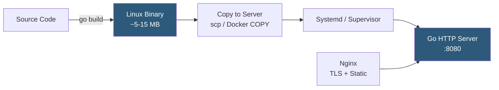

**Category:** Application Server Platforms
**Difficulty:** Intermediate
**Reading time:** 5 min read

---

Go (Golang) web applications compile to a single static binary containing the HTTP server, all dependencies, and the Go runtime, making deployment exceptionally simple compared to interpreted languages. The built-in `net/http` package provides production-quality HTTP serving without a separate application server layer.

- **Static binary** — Go compilation output: a single executable with no external dependencies or runtime requirements
- **`net/http`** — Go's standard library HTTP server, high-performance and production-suitable without frameworks
- **Cross-compilation** — Go's ability to build binaries for different OS/architecture from a single developer machine
- **`GOOS` / `GOARCH`** — Environment variables controlling target OS and CPU architecture during compilation
- **Goroutine** — Go's lightweight concurrency primitive; each HTTP request runs in its own goroutine
- **`GOMAXPROCS`** — Go runtime setting controlling maximum OS threads; defaults to CPU core count since Go 1.5
- **Health check endpoint** — Simple `/health` or `/ready` handler for load balancer and Kubernetes probes
- **Graceful shutdown** — Handling `os.Signal` to drain in-flight requests before process exit

Building a Go web application for Linux: `GOOS=linux GOARCH=amd64 go build -o app ./cmd/server`. The result is a self-contained binary. On a fresh Linux server with no dependencies installed, `./app` starts serving HTTP immediately. This simplicity makes Go ideal for minimal Docker images: a multi-stage Dockerfile builds in a `golang` image and copies only the binary to a `scratch` or `distroless` final image, producing containers as small as 5–20 MB.

Go's `net/http.Server` handles HTTP natively. The `ListenAndServe(":8080", handler)` call starts a goroutine-per-connection model: each new TCP connection spawns a goroutine (2–8 KB stack, expandable). Go's scheduler multiplexes goroutines onto OS threads (`GOMAXPROCS` OS threads), enabling millions of concurrent connections on a single instance where Python or Ruby would require dozens of processes.

Graceful shutdown requires capturing `syscall.SIGTERM` and `syscall.SIGINT`, calling `server.Shutdown(ctx)` with a timeout context. `Shutdown` stops accepting new connections and waits for all active handlers to complete before the process exits. This is essential for zero-downtime deployments.

In production, Nginx or Caddy reverse proxies the Go binary: terminating TLS, serving static assets, and providing request logging. Alternatively, Caddy's automatic HTTPS makes it a popular companion to Go services for small deployments—both are written in Go and trivial to install as static binaries.

Systemd manages the process lifecycle: a unit file with `ExecStart=/usr/local/bin/myapp`, `Restart=on-failure`, `RestartSec=5`, and environment variables via `EnvironmentFile` provides production-grade process supervision. Memory usage typically runs 20–60 MB for a Go web service, compared to 200+ MB for JVM or Ruby applications.

- High-throughput REST APIs and gRPC services requiring low memory per instance
- Microservices deployed as minimal Docker containers in Kubernetes
- CLI tools with embedded HTTP servers for admin/metrics endpoints
- Infrastructure tools (observability agents, proxies) where minimal footprint matters
- Edge services requiring sub-millisecond response times and low CPU usage

| Advantage | Disadvantage |
|-----------|--------------|
| Single binary simplifies deployment; no runtime installation | Compilation step adds build pipeline complexity vs interpreted languages |
| Low memory usage enables high container density | Goroutine model with shared memory requires careful synchronization with mutexes |
| Fast startup (milliseconds) ideal for serverless and batch invocations | Smaller ecosystem than Java/Node.js for application-level libraries |
| Static typing catches bugs at compile time | Verbose error handling compared to exception-based languages |

- [Rust Web Application Hosting](rust-web-application-hosting.md)
- [Application Server Monitoring](application-server-monitoring.md)
- [Application Deployment Automation](application-deployment-automation.md)

---
*Part of the [Application Server Platforms](index.md) category · [Back to Master Index](../../index.md)*
