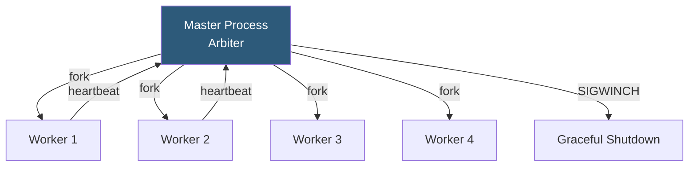

**Category:** Application Server Platforms
**Difficulty:** Intermediate
**Reading time:** 6 min read

---

Gunicorn (Green Unicorn) is a pre-fork WSGI HTTP server for Python web applications, widely used to serve Django and Flask in production. It bridges the gap between Nginx and application code, managing worker processes, request timeouts, and concurrency models to deliver reliable Python web hosting.

- **Pre-fork model** — Master process forks workers before requests arrive; workers are ready immediately
- **`--workers`** — Number of worker processes; `2*CPU+1` formula is the standard starting point
- **`--worker-class`** — Worker type: `sync` (default), `gevent`, `eventlet`, `gthread`, `uvicorn.workers.UvicornWorker`
- **`--timeout`** — Seconds a worker may be silent before the master kills and replaces it (default: 30)
- **`--graceful-timeout`** — Seconds workers have to finish in-flight requests during a restart
- **`--max-requests`** — Request count after which a worker restarts to prevent memory leaks
- **`--bind`** — Address/socket to listen on: `0.0.0.0:8000` or `unix:/tmp/gunicorn.sock`
- **`--access-logfile`** — Log file path for request logs; `-` logs to stdout (preferred in containers)

Gunicorn's master process (the "arbiter") forks worker processes and monitors their health via a heartbeat mechanism. Workers send `SIGUSR1` signals periodically; if a worker goes silent for `--timeout` seconds (indicating it's blocked on a slow operation), the master kills it with `SIGKILL` and forks a replacement.

The standard worker formula (`2 * cpu_cores + 1`) assumes CPU-bound Python workloads where each worker is active or waiting for the OS during computation. For I/O-heavy applications with many concurrent database queries or external API calls, gevent workers are more efficient: `--worker-class gevent --worker-connections 1000` enables one OS thread to handle 1000 concurrent requests via cooperative greenlet switching.

The `--max-requests` and `--max-requests-jitter` settings cause workers to gracefully restart after handling a set number of requests, preventing memory accumulation from Django ORM connection pools or application-level leaks. The jitter (e.g., `--max-requests-jitter 50`) staggers restarts to avoid all workers restarting simultaneously.

Unix socket binding (`--bind unix:/run/gunicorn/app.sock`) eliminates TCP stack overhead for Nginx→Gunicorn communication on the same host. The socket file permissions must allow the Nginx user to write.

Systemd service management is recommended over manual process supervision. A unit file sets `User`, `WorkingDirectory`, `ExecStart` (full Gunicorn command), `Restart=always`, and loads environment from an `EnvironmentFile`. `ExecReload=/bin/kill -HUP $MAINPID` enables configuration reloads without downtime.

Logging to stdout/stderr and collection by journald or a log aggregator like Loki is preferred in cloud deployments; in traditional deployments, `--access-logfile` and `--error-logfile` write to rotated files.

- Django production deployments on VPS or bare-metal servers behind Nginx
- Flask REST API servers containerized in Docker with Gunicorn as the entrypoint
- Python data science applications exposing model predictions over HTTP
- Multi-tenant applications running isolated Gunicorn instances per customer
- Staging environments mirroring production configuration for accurate performance testing

| Advantage | Disadvantage |
|-----------|--------------|
| Simple, well-documented configuration with sensible defaults | Sync workers waste resources on I/O wait without gevent/eventlet |
| Pre-fork model eliminates per-request import overhead | No built-in sticky session routing; requires Nginx upstream config |
| `--max-requests` handles memory leak mitigation automatically | Worker restarts create momentary capacity reduction |
| Zero-downtime restart via `SIGHUP` or `kill -HUP` | Does not serve static files; requires Nginx or Whitenoise for that |

- [Python WSGI Hosting](python-wsgi-hosting.md)
- [uWSGI Configuration](uwsgi-configuration.md)
- [Application Server Monitoring](application-server-monitoring.md)

---
*Part of the [Application Server Platforms](index.md) category · [Back to Master Index](../../index.md)*
