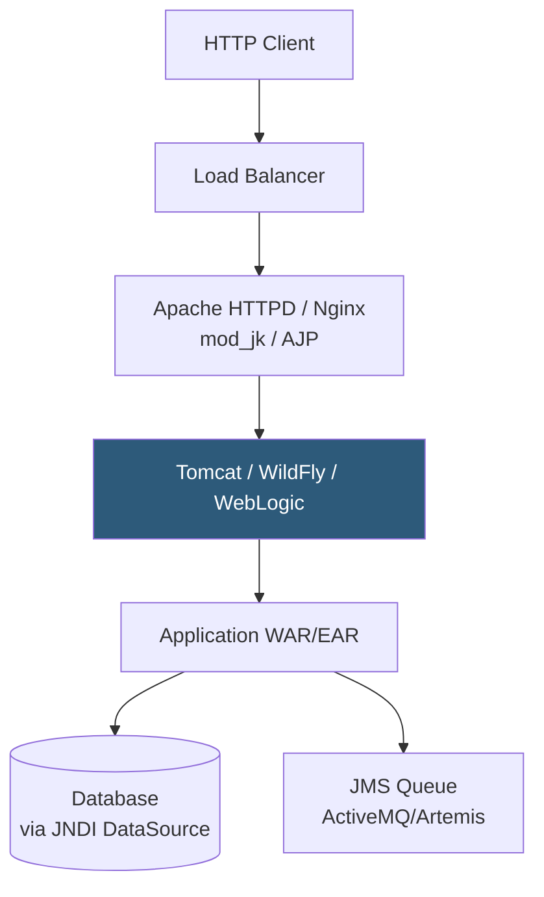

**Category:** Application Server Platforms
**Difficulty:** Intermediate
**Reading time:** 6 min read

---

Java application servers provide a managed runtime environment for deploying Java EE (Jakarta EE) and standalone Java applications, handling HTTP serving, connection pooling, transaction management, and component lifecycle. They range from lightweight servlet containers (Tomcat) to full Jakarta EE runtimes (WildFly, WebLogic) supporting EJBs, JMS, and JTA.

- **Servlet container** — Minimal Java runtime implementing the Jakarta Servlet spec; handles HTTP and WAR deployment
- **WAR file** — Web Application Archive; packaged Java web application deployed to a servlet container
- **JAR file** — Java Archive; self-contained executable used by Spring Boot embedded server deployments
- **JVM heap** — Memory region allocated with `-Xms`/`-Xmx` flags for Java object allocation
- **JVM metaspace** — Post-Java 8 memory region storing class metadata; controlled via `-XX:MaxMetaspaceSize`
- **Connection pool** — Pre-allocated database connections managed by the app server to reduce connection overhead
- **JNDI** — Java Naming and Directory Interface for looking up server-managed resources (datasources, queues)
- **Jakarta EE** — Modern successor to Java EE, defining APIs for servlets, CDI, JPA, JMS, and security

Java application servers load and manage application archives. A WAR file contains servlets, JSPs, static resources, and a `WEB-INF/web.xml` descriptor. The server deploys it to a context root (e.g., `/myapp`) and invokes the appropriate servlet for each request. Modern applications use annotation-based configuration via `@WebServlet`, `@Inject`, and `@Stateless` rather than XML.

The JVM runs under the application server process. Memory sizing is critical: `-Xms512m -Xmx2g` sets initial and maximum heap. Garbage collection algorithm selection matters at scale: G1GC (default Java 9+) targets pause times; ZGC and Shenandoah provide sub-millisecond pauses for latency-sensitive services. Metaspace (`-XX:MaxMetaspaceSize=256m`) holds class definitions; explosive class loading (e.g., dynamic class generation by ORM proxies) can exhaust it.

JDBC connection pools managed by the server (Tomcat JDBC Pool, HikariCP in Spring Boot, JBoss pool in WildFly) pre-establish database connections. Pool sizing follows `connections = (core_count * 2) + effective_spindle_count`. Connections are acquired from JNDI lookup (`java:comp/env/jdbc/myDB`) or injected via CDI.

Spring Boot changed Java deployment by embedding Tomcat, Jetty, or Undertow within a fat JAR. Running `java -jar app.jar` starts both the application and the HTTP server in one process, eliminating WAR deployment and making Docker packaging trivial. This is now the dominant pattern for new Java service development.

- Enterprise applications requiring Jakarta EE features (JTA transactions, EJBs, JMS)
- Legacy Java EE systems deployed to WildFly or WebLogic requiring full specification compliance
- Spring Boot microservices using embedded Tomcat for container-native deployment
- Multi-application server clusters where Tomcat handles servlet routing for dozens of WARs
- Financial systems requiring JTA distributed transactions across multiple databases

| Advantage | Disadvantage |
|-----------|--------------|
| Mature ecosystem with decades of production hardening | JVM startup time and memory overhead compared to Go or Rust runtimes |
| Full Jakarta EE servers provide enterprise features out of the box | Full EE servers add complexity unused by most modern microservices |
| JVM JIT provides excellent long-running throughput after warmup | Initial request latency ("cold start") high until JIT compiles hot paths |
| Strong tooling for profiling, APM, and thread dump analysis | Configuration (XML, JNDI, classpath) is verbose and error-prone |

- [Tomcat Deployment](tomcat-deployment.md)
- [JBoss/WildFly Hosting](jboss-wildfly-hosting.md)
- [Application Server Scaling](application-server-scaling.md)

---
*Part of the [Application Server Platforms](index.md) category · [Back to Master Index](../../index.md)*
