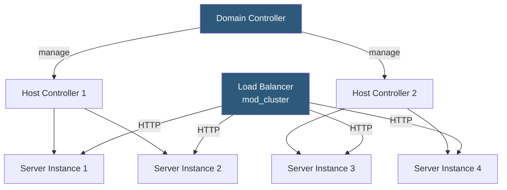

**Category:** Application Server Platforms
**Difficulty:** Advanced
**Reading time:** 7 min read

---

WildFly (formerly JBoss AS) is Red Hat's open-source Jakarta EE application server providing a full enterprise Java runtime with EJBs, CDI, JPA, JMS, JTA, and clustering. It is the upstream project for Red Hat JBoss Enterprise Application Platform (JBoss EAP), widely used in regulated industries requiring certified Jakarta EE compliance.

- **Subsystem** — WildFly's modular architecture unit; each Jakarta EE feature (web, ejb3, messaging) is a subsystem configured in `standalone.xml`
- **Domain mode** — WildFly topology where a domain controller manages configuration and deployment across multiple server instances
- **Standalone mode** — Single-server WildFly instance; appropriate for development and containerized deployments
- **Management CLI** — `jboss-cli.sh` for scripted server configuration changes without XML editing
- **Deployment scanner** — Directory watcher that auto-deploys WAR/EAR files placed in `standalone/deployments/`
- **Undertow** — WildFly's high-performance NIO web server subsystem (replaced JBoss Web/Tomcat in AS 8+)
- **Infinispan** — Distributed in-memory data grid bundled with WildFly for clustering and HTTP session replication
- **JBoss Modules** — Classloading system providing isolation between application and server modules

WildFly's subsystem architecture is defined in XML configuration files. `standalone.xml` is the baseline; `standalone-full.xml` adds messaging (ActiveMQ Artemis) and JTS; `standalone-ha.xml` adds clustering with Infinispan and JGroups. For production clusters, `standalone-full-ha.xml` combines all features.

The Management CLI (`$JBOSS_HOME/bin/jboss-cli.sh --connect`) provides a scripting interface for configuration changes. Operators use CLI scripts in CI/CD rather than editing XML directly: `data-source add --name=MyDS --driver-name=postgresql --connection-url=jdbc:postgresql://...` adds a JDBC datasource without restart.

JBoss Modules enforces strict classloading. Each module declares its dependencies in `module.xml`. Application classloaders inherit from the deployment module; third-party libraries not in the module repository must be bundled in `WEB-INF/lib` or declared as explicit dependencies via `MANIFEST.MF` or `jboss-deployment-structure.xml`. This prevents classpath conflicts between applications but adds complexity when integrating off-the-shelf libraries.

In domain mode, the domain controller holds the canonical configuration. Host controllers on each physical server receive configuration via the management protocol and start/stop server instances accordingly. Deployments are pushed from the domain controller to relevant server groups. mod_cluster integration enables automatic load balancer registration when servers join or leave.

Clustering relies on JGroups for group membership (UDP multicast or TCP unicast) and Infinispan for distributing HTTP sessions and EJB state across nodes. WildFly's `distributable-web` subsystem automatically replicates session state when applications are deployed to an HA server group.

- Enterprise applications requiring full Jakarta EE certification (EJB, JTA, JCA)
- Financial systems using XA distributed transactions across multiple databases
- Government and regulated-industry deployments requiring Red Hat JBoss EAP support subscription
- Multi-server production clusters with centralized configuration management via domain mode
- Legacy Java EE applications migrating from older JBoss AS versions with minimum code changes

| Advantage | Disadvantage |
|-----------|--------------|
| Full Jakarta EE certification covers all enterprise API requirements | High memory footprint and startup time compared to lightweight runtimes |
| Domain mode provides centralized cluster management | Domain mode complexity is overkill for small deployments |
| Infinispan clustering built in; no external cache server required | JBoss Modules classloading is complex and causes confusing `ClassNotFoundException` errors |
| Red Hat EAP provides long-term commercial support | Configuration XML verbosity; even simple changes require extensive XML knowledge |

- [Java Application Servers](java-application-servers.md)
- [Tomcat Deployment](tomcat-deployment.md)
- [WebLogic Server Management](weblogic-server-management.md)

---
*Part of the [Application Server Platforms](index.md) category · [Back to Master Index](../../index.md)*
