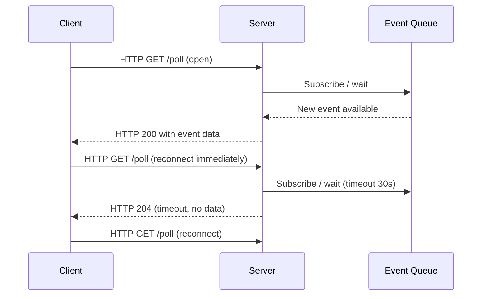

**Category:** Application Server Platforms
**Difficulty:** Intermediate
**Reading time:** 6 min read

---

Long-polling is a server push technique where the client sends an HTTP request and the server holds the connection open until new data is available or a timeout occurs, then responds and the client immediately reconnects. It simulates real-time communication over standard HTTP without requiring WebSocket upgrades or persistent TCP connections. While WebSockets and SSE have largely superseded it, long-polling remains relevant in environments with strict firewall rules or proxy constraints that block upgrade-based protocols.

- **Holding connection** — The server suspends the response, keeping the socket open, rather than immediately returning an empty body
- **Timeout interval** — Maximum hold duration (typically 20–60 seconds) before the server sends an empty response and the client reconnects
- **Reconnect loop** — Client-side pattern where the browser immediately issues a new request upon receiving any response
- **Async I/O** — Non-blocking server I/O model required to hold thousands of concurrent long-poll connections without spawning a thread per connection
- **Comet** — Legacy umbrella term for long-polling and streaming HTTP push techniques
- **Piggyback polling** — Optimization that bundles multiple queued events into a single long-poll response
- **Connection multiplexing** — Using a single long-poll channel to fan out multiple logical event streams
- **Backpressure** — Mechanism to slow down event production when the consumer (client) cannot keep pace

Long-polling exploits the fact that HTTP allows the server to delay sending the response body. When the client requests `/poll`, the server does not call `response.send()` immediately. Instead, it registers the response object (or future/promise) with a notification queue keyed by the client or channel ID.

On the server, an event dispatcher monitors the queue. When an event arrives, it resolves the pending response object, serializes the payload to JSON, and writes the HTTP response. The connection closes normally. The client's JavaScript immediately fires another request, creating the illusion of a persistent channel.

The critical infrastructure requirement is **async I/O**. Synchronous, thread-per-connection servers like traditional Apache with mod_php cannot hold tens of thousands of connections because each paused request occupies a thread. Node.js, Nginx with upstream proxies, Python asyncio (Sanic, Starlette), or Java NIO-based servers (Netty, Vert.x) handle this efficiently by using event loops that park suspended responses in heap memory rather than OS threads.

Server-side timeout handling prevents orphaned connections: if no event arrives within 30 seconds, the server returns HTTP 204 (or an empty JSON array), and the client reconnects. Load balancers must be configured with sufficiently long idle-connection timeouts (> 60 seconds) or long-poll requests will be prematurely terminated. Sticky sessions or a shared pub/sub backend (Redis Pub/Sub, message broker) are required when multiple backend instances serve the same client channel.

- Chat applications on networks where WebSocket upgrades are blocked by corporate proxies
- Notification delivery for legacy browsers or environments constrained to HTTP/1.1
- IoT dashboards where device data arrives sporadically and persistent connections are wasteful
- Mobile apps on unreliable networks where reconnect overhead is acceptable
- Fallback transport in libraries like Socket.io when WebSocket negotiation fails

| Advantage | Disadvantage |
|-----------|--------------|
| Works through any HTTP proxy or firewall without protocol negotiation | Higher overhead per message compared to WebSockets (full HTTP headers each cycle) |
| Simple to implement with standard HTTP tooling | Server must manage many pending response objects in memory |
| Graceful fallback for restrictive network environments | Latency spikes during reconnect cycles |
| Compatible with HTTP/1.1 without upgrade handshake | Load balancer timeout misconfiguration silently breaks sessions |

- [WebSocket Server Configuration](websocket-server-configuration.md)
- [Server-Sent Events (SSE)](server-sent-events-sse.md)
- [Node.js Hosting](nodejs-hosting.md)

---
*Part of the [Application Server Platforms](index.md) category · [Back to Master Index](../../index.md)*
