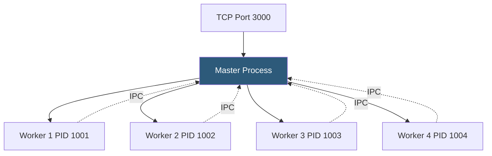

**Category:** Application Server Platforms
**Difficulty:** Intermediate
**Reading time:** 6 min read

---

Node.js clustering enables a single-threaded application to utilize all CPU cores by spawning multiple worker processes that share a listening socket. This architectural pattern is essential for CPU-bound request handling and achieving horizontal throughput scaling on multi-core servers without adopting full container orchestration.

- **Master process** — Parent process that forks workers and distributes incoming connections via IPC
- **Worker process** — Child process running the application code and handling requests
- **`cluster.fork()`** — Node.js API call in the master process that spawns a new worker
- **Round-robin scheduling** — Default connection distribution on Linux, rotating connections across workers in order
- **IPC (Inter-Process Communication)** — `process.send()` / `process.on('message')` channel between master and worker
- **Sticky sessions** — Routing a client's requests to the same worker, required when in-memory session state is used
- **Worker restart** — Respawning a worker when it exits, maintaining the target pool size
- **`worker.disconnect()`** — Graceful shutdown signal causing the worker to stop accepting new connections

Node.js's `cluster` module, introduced in v0.6, allows the master process to fork worker processes that each run a copy of the application. All workers call `server.listen(3000)` on the same port; the master intercepts this call and distributes connections to workers rather than letting each worker bind independently.

On Linux, the master uses round-robin distribution by default (`cluster.schedulingPolicy = cluster.SCHED_RR`). Each incoming TCP connection is passed to the next worker in rotation via a file descriptor sent over IPC. On Windows and macOS, the OS schedules connections at the socket level, which can cause uneven distribution.

A minimal clustering implementation checks `cluster.isPrimary`: the master process calls `cluster.fork()` once per CPU core and listens for `'exit'` events to respawn crashed workers. Each worker runs `app.listen()` normally. The `os.cpus().length` value determines the optimal fork count, though I/O-heavy apps may benefit from `cpus.length * 2` workers.

A critical limitation is the absence of shared memory between workers. In-memory session stores, rate limiters, and caches are not shared. Solutions include: Redis for sessions and rate limiting, Nginx sticky sessions (with `ip_hash`) for routing a client to the same worker, or complete elimination of in-process state. For cache sharing, tools like `node-redis` or `ioredis` centralize state.

PM2's cluster mode wraps the native `cluster` module with monitoring, zero-downtime reloads, and log aggregation. For new projects, PM2 is generally preferred over manual `cluster` implementation for the additional operational tooling.

- Express.js REST APIs running CPU-intensive JSON transformation that blocks the event loop
- Next.js SSR servers fully utilizing 8-core VPS hardware
- Real-time servers where each worker handles a subset of WebSocket connections
- Multi-core development servers needing throughput testing under simulated load
- BFF layers with heavy JWT validation or data aggregation logic

| Advantage | Disadvantage |
|-----------|--------------|
| Utilizes all CPU cores with minimal configuration | Shared state requires external services (Redis, database) |
| Workers are isolated; one crash doesn't down the entire service | Worker startup time adds latency during rapid respawn cycles |
| IPC channel allows master/worker coordination | Complex state synchronization across workers is error-prone |
| Compatible with any Node.js framework | Memory usage multiplies with worker count; tune `instances` to available RAM |

- [Node.js Process Management (PM2)](nodejs-process-management-pm2.md)
- [Node.js Hosting](nodejs-hosting.md)
- [Session Management Strategies](session-management-strategies.md)

---
*Part of the [Application Server Platforms](index.md) category · [Back to Master Index](../../index.md)*
