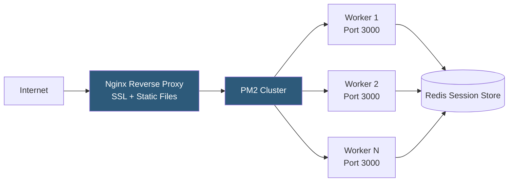

**Category:** Application Server Platforms
**Difficulty:** Beginner
**Reading time:** 6 min read

---

Node.js hosting provides the runtime environment for JavaScript server-side applications, combining V8 engine execution with an event-driven I/O model. Unlike traditional PHP or Java hosting, Node.js requires persistent process management and careful handling of the single-threaded event loop to achieve reliable production performance.

- **Event loop** — Node.js's mechanism for handling asynchronous I/O without blocking threads, processing callbacks from a queue
- **V8 engine** — Google's JavaScript runtime that compiles JS to native machine code, embedded in Node.js
- **npm / yarn** — Package managers for installing Node.js dependencies from the public registry
- **PM2** — Production process manager providing clustering, auto-restart, and log management for Node.js
- **nvm (Node Version Manager)** — Tool for installing and switching between multiple Node.js versions
- **Reverse proxy** — Nginx or Caddy placed in front of Node.js to handle SSL, static files, and load balancing
- **Port binding** — Node.js apps listen on a TCP port; reverse proxy forwards public traffic to that port
- **Environment variables** — `process.env.PORT`, `NODE_ENV`, and secrets injected at process startup

A Node.js application is a persistent OS process, unlike PHP which spawns per-request. The Node.js runtime starts the application, binds to a port, and keeps running—processing all incoming requests in an event loop on a single thread (unless cluster mode is used).

Hosting begins with selecting a Node.js version. The LTS (Long-Term Support) releases (even-numbered: 18, 20, 22) receive security patches for 30 months and are recommended for production. nvm or `n` manage multiple versions on a single machine.

The application is started with `node server.js` or, in production, via a process manager like PM2 (`pm2 start ecosystem.config.js`). PM2 handles auto-restart on crash, watches for file changes in development, aggregates logs, and provides a `pm2 monit` dashboard. In cluster mode, PM2 forks `os.cpus().length` worker processes, distributing incoming connections via Node's built-in cluster module—each worker shares the same port via the master process's socket.

A reverse proxy (Nginx) sits in front: it terminates TLS, serves static assets from `dist/public` without touching Node, and forwards dynamic requests to `http://127.0.0.1:3000`. This separates concerns and allows Nginx to queue requests during Node restarts. Nginx upstream `keepalive 32` maintains persistent connections to the Node process pool.

Environment configuration is passed via `.env` files loaded by `dotenv`, or directly set in the deployment platform (Heroku `Config Vars`, Docker environment, systemd `EnvironmentFile`). `NODE_ENV=production` enables Express.js optimizations like view cache and condensed error messages.

- Real-time applications (chat, notifications) leveraging persistent WebSocket connections
- REST and GraphQL APIs built with Express, Fastify, or NestJS
- Server-side rendering (SSR) with Next.js requiring persistent Node processes
- Proxy services and API gateways where I/O throughput matters more than CPU
- BFF (Backend for Frontend) layers aggregating multiple microservice APIs

| Advantage | Disadvantage |
|-----------|--------------|
| Non-blocking I/O handles thousands of concurrent connections per process | CPU-bound operations block the event loop, requiring worker threads or child processes |
| Single language (JavaScript) across frontend and backend reduces context switching | Memory leaks in long-running processes require periodic restarts or careful profiling |
| npm ecosystem provides vast library coverage | Dependency supply chain risk with thousands of transitive packages |
| Cluster mode fully utilizes multi-core servers | Shared state must use external stores (Redis) since workers don't share memory |

- [Node.js Process Management (PM2)](nodejs-process-management-pm2.md)
- [Node.js Clustering](nodejs-clustering.md)
- [Application Server Monitoring](application-server-monitoring.md)

---
*Part of the [Application Server Platforms](index.md) category · [Back to Master Index](../../index.md)*
