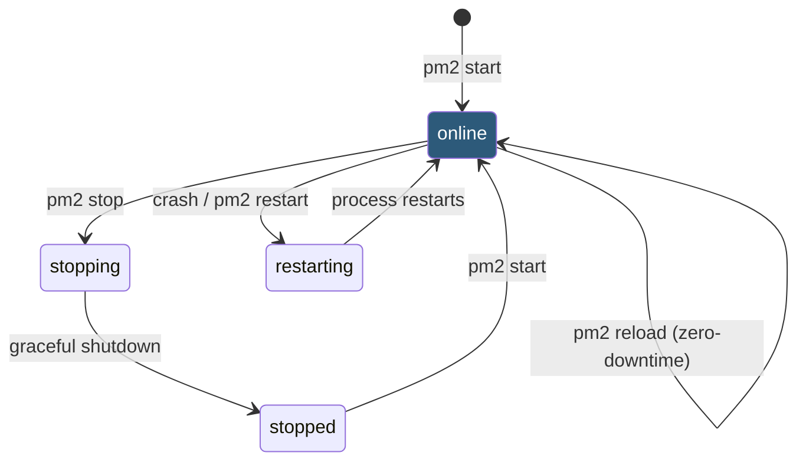

**Category:** Application Server Platforms
**Difficulty:** Intermediate
**Reading time:** 6 min read

---

PM2 is a production-grade process manager for Node.js applications that handles process lifecycle, automatic restarts, log aggregation, and cluster mode scaling. It acts as a supervisor layer between the OS and your application, ensuring availability without a full container orchestration stack.

- **ecosystem.config.js** — PM2 configuration file declaring apps, environments, cluster settings, and watch rules
- **Cluster mode** — PM2 forks `instances` worker processes using Node.js cluster module, sharing one port
- **Fork mode** — Single process per app; no port sharing; used for non-web workers or scripts
- **`pm2 startup`** — Generates an OS-specific init script (systemd, launchd) to auto-start PM2 on boot
- **`pm2 save`** — Persists the current process list to disk for restoration after reboots
- **Log rotation** — `pm2-logrotate` module automatically truncates and archives log files
- **Graceful reload** — `pm2 reload app` sends SIGINT, waits for in-flight requests to complete, then restarts workers one-by-one
- **Memory restart** — `max_memory_restart` setting triggers automatic restart when a worker exceeds a RAM threshold

PM2 runs as a daemon process that manages one or more application processes. When you run `pm2 start app.js --name api --instances max`, PM2 forks worker processes equal to the CPU core count, registers them under the name `api`, and begins routing TCP connections from a shared port.

The `ecosystem.config.js` file externalizes all configuration. A typical entry specifies `script`, `instances`, `exec_mode` (`cluster` or `fork`), `watch` (boolean or path array for auto-restart on file change), `env` and `env_production` blocks for environment-specific variables, and `max_memory_restart` (e.g., `"500M"`) for leak protection.

PM2's cluster mode leverages Node.js's built-in `cluster` module: the PM2 master process listens on the port and distributes connections to workers using round-robin (Linux default) or OS-level scheduling (Windows/macOS). Workers share the listening socket via IPC, so all appear to bind the same port.

`pm2 reload app` achieves zero-downtime restarts: PM2 sends `SIGINT` to one worker and waits up to `kill_timeout` milliseconds for it to exit cleanly. Applications should listen for `SIGINT` and stop accepting connections before calling `server.close()`. Once the old worker exits, PM2 starts a new one before proceeding to the next, maintaining capacity throughout.

Log management is handled by the `pm2-logrotate` module: `pm2 install pm2-logrotate` activates rotation with configurable `max_size`, `retain` count, and `compress` options. Logs are accessible via `pm2 logs app` for real-time streaming or forwarded to external sinks via PM2's log forwarding modules.

- Single-server Node.js APIs requiring automatic restart on uncaught exceptions
- Multi-core servers running Express/Fastify APIs in cluster mode to use all CPUs
- Background job processors (queue workers) requiring persistent operation and restart-on-crash
- Development environments using watch mode for hot-reload without Docker
- VPS deployments where Kubernetes overhead is unjustified but reliability is required

| Advantage | Disadvantage |
|-----------|--------------|
| Zero-downtime reloads without load balancer changes | In-memory state lost between restarts; requires external session storage |
| Simple CLI and config; low operational overhead | Not a replacement for container orchestration at large scale |
| Memory-based auto-restart catches slow memory leaks | `max_memory_restart` causes traffic interruption if leak is rapid |
| Built-in log aggregation across all workers | Log rotation requires separate PM2 module install |

- [Node.js Hosting](nodejs-hosting.md)
- [Node.js Clustering](nodejs-clustering.md)
- [Application Server Scaling](application-server-scaling.md)

---
*Part of the [Application Server Platforms](index.md) category · [Back to Master Index](../../index.md)*
