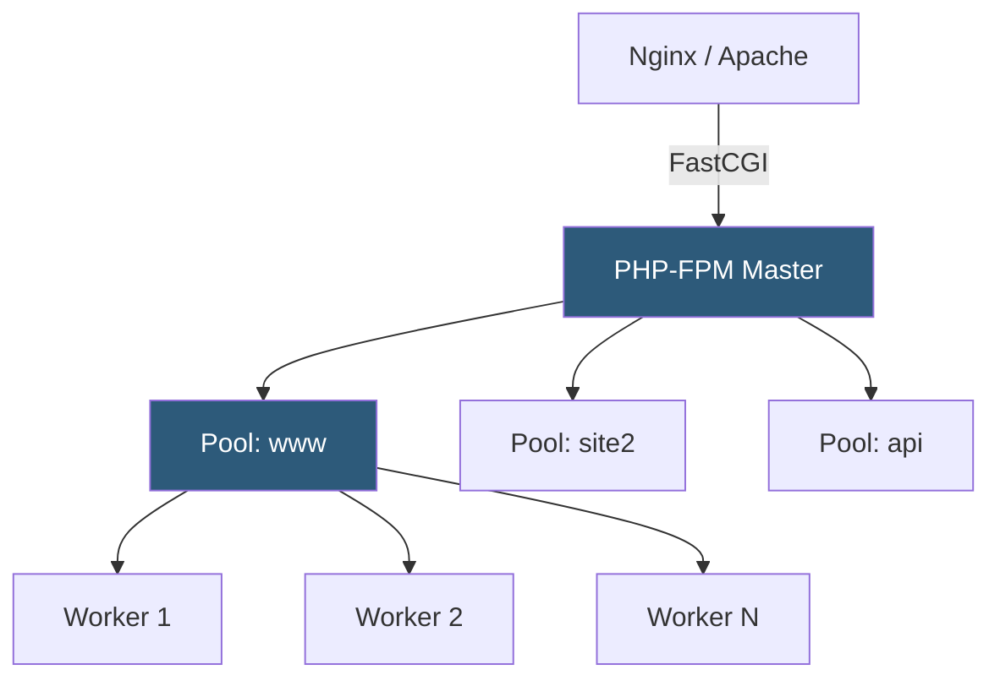

**Category:** Application Server Platforms
**Difficulty:** Intermediate
**Reading time:** 6 min read

---

PHP-FPM (FastCGI Process Manager) is the reference implementation for running PHP as a high-performance FastCGI server, replacing older Apache mod_php embedding. It provides flexible process pooling, resource limits per pool, and fine-grained logging that make it the standard for production PHP deployments.

- **Pool** — An isolated group of PHP worker processes with its own user, limits, and socket
- **pm.max_children** — Hard ceiling on total worker processes to prevent memory exhaustion
- **pm.start_servers** — Workers spawned at PHP-FPM startup (dynamic mode only)
- **pm.min_spare_servers / pm.max_spare_servers** — Bounds on idle workers kept warm for sudden traffic
- **request_terminate_timeout** — Maximum wall-clock time before a hung request is killed
- **slowlog** — Log file capturing stack traces of requests exceeding a configurable threshold
- **chroot** — Optional filesystem jail isolating a pool to a subdirectory for security
- **listen** — Socket path or IP:port the pool accepts FastCGI connections on

PHP-FPM runs as a master process that forks worker processes according to pool configuration. The master monitors worker health, respawns crashed workers, and handles POSIX signals for graceful reload (`SIGUSR2`) and shutdown (`SIGTERM`).

Each pool is defined in a `.conf` file under `/etc/php/8.x/fpm/pool.d/`. The `listen` directive accepts either a Unix socket path (e.g., `/run/php/php8.2-fpm.sock`) or a TCP address. Unix sockets are preferred on single-server setups for lower overhead; TCP is needed for remote PHP backends.

The process manager (`pm`) directive drives scaling strategy. `static` mode keeps `pm.max_children` workers always running—ideal for servers where PHP consumes a predictable memory footprint and traffic is consistently high. `dynamic` mode maintains a pool between `min_spare_servers` and `max_spare_servers`, respawning extras as requests arrive and killing idle ones. `ondemand` starts each worker on first request and terminates it after `pm.process_idle_timeout`, minimizing RAM on low-traffic pools.

Per-pool resource controls include `php_admin_value[memory_limit]` to override `php.ini` settings, `request_terminate_timeout` to kill runaway processes, and `rlimit_files` to cap open file descriptors. Environment variables can be passed with `env[VAR]` directives, enabling per-pool database credentials without shared `.env` files.

The `slowlog` captures PHP backtraces of requests exceeding `request_slowlog_timeout`, invaluable for profiling production performance regressions without full APM tooling.

- Multi-tenant shared hosting isolating each customer in a separate pool with distinct OS users
- Microservice PHP APIs requiring separate resource budgets per service
- High-traffic WordPress hosting using static pools sized to available RAM
- Development environments using ondemand pools to conserve memory across many dormant sites
- Security-sensitive deployments using chroot pools to limit filesystem exposure

| Advantage | Disadvantage |
|-----------|--------------|
| Per-pool isolation prevents one noisy tenant from starving others | More pools increase master process memory overhead |
| Dynamic scaling reduces idle RAM consumption | Spawning new workers under traffic spikes adds hundreds of milliseconds |
| Slowlog provides production profiling without code changes | Slowlog parsing requires manual analysis tooling |
| Supports user/group per pool for OS-level security | Requires web server socket permission alignment per pool |

- [PHP Hosting Optimization](php-hosting-optimization.md)
- [PHP OPcache](php-opcode-caching-opcache.md)
- [Application Server Scaling](application-server-scaling.md)

---
*Part of the [Application Server Platforms](index.md) category · [Back to Master Index](../../index.md)*
