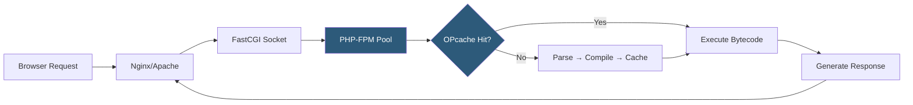

**Category:** Application Server Platforms
**Difficulty:** Intermediate
**Reading time:** 6 min read

---

PHP hosting optimization involves tuning the PHP runtime, web server configuration, and supporting infrastructure to maximize throughput and minimize response latency. Well-optimized PHP hosting dramatically reduces server load, enabling more concurrent users on the same hardware while improving end-user experience.

- **PHP-FPM** — FastCGI Process Manager that manages pools of PHP worker processes for non-blocking request handling
- **OPcache** — Bytecode cache that stores precompiled PHP scripts in memory, eliminating repeated parsing overhead
- **Process pool** — A set of PHP-FPM worker processes sized to match expected concurrency
- **Bytecode** — Compiled intermediate representation of PHP scripts executed by the Zend Engine
- **Memory limit** — Per-process cap on PHP memory allocation, balancing safety against application needs
- **Max execution time** — Maximum seconds a PHP script may run before the server terminates it
- **Realpath cache** — Kernel-level filesystem cache for resolved file paths, reducing `stat()` calls
- **Worker process model** — PHP-FPM's static, dynamic, or on-demand process spawning strategy

PHP hosting optimization operates at multiple layers. At the language runtime level, OPcache stores compiled PHP bytecode in shared memory, so subsequent requests skip the parse-and-compile step that normally consumes 20–40% of request time. OPcache must be sized to hold all application scripts—typically 128–512 MB for large frameworks like Laravel or Symfony.

At the process management layer, PHP-FPM maintains worker pools that accept FastCGI connections from the web server over a Unix socket or TCP port. The pool's `pm` directive controls worker lifecycle: `static` spawns a fixed number suitable for high-traffic, memory-predictable apps; `dynamic` scales between `pm.min_spare_servers` and `pm.max_children` for variable traffic; `ondemand` starts workers only on requests, ideal for low-traffic sites.

Web server integration is critical: Nginx's `fastcgi_pass` directive connects to the PHP-FPM socket, while Apache uses `mod_proxy_fcgi`. Connection reuse via Unix sockets is 10–30% faster than TCP loopback.

Additional gains come from tuning `php.ini` settings: increasing `realpath_cache_size` to 4096k reduces filesystem calls; setting `max_input_vars` appropriately prevents denial-of-service from malformed forms; and enabling `zlib.output_compression` offloads gzip to PHP rather than requiring a separate Nginx layer.

At the database layer, persistent connections (PDO's `PDO::ATTR_PERSISTENT`) eliminate per-request MySQL handshakes, and APCu or Redis caches frequently queried data in RAM.

- High-traffic WordPress or WooCommerce hosting requiring sub-100ms page generation
- Laravel/Symfony SaaS applications handling thousands of concurrent API requests
- PHP-based e-commerce platforms requiring consistent checkout performance under load
- Shared hosting providers maximizing tenant density per physical server
- Media platforms with PHP backends serving dynamic ad-injected content

| Advantage | Disadvantage |
|-----------|--------------|
| OPcache eliminates repeated compilation overhead | Stale bytecode requires cache flush on deployments |
| FPM process pools isolate tenants and limit blast radius | Large static pools waste RAM when traffic is low |
| Unix socket connections reduce TCP overhead | Socket file permissions must be carefully managed |
| Dynamic pool scaling handles traffic spikes automatically | Spawning new workers adds latency during rapid ramp-up |

- [PHP-FPM Configuration](php-fpm-configuration.md)
- [PHP OPcache](php-opcode-caching-opcache.md)
- [Application Server Monitoring](application-server-monitoring.md)

---
*Part of the [Application Server Platforms](index.md) category · [Back to Master Index](../../index.md)*
