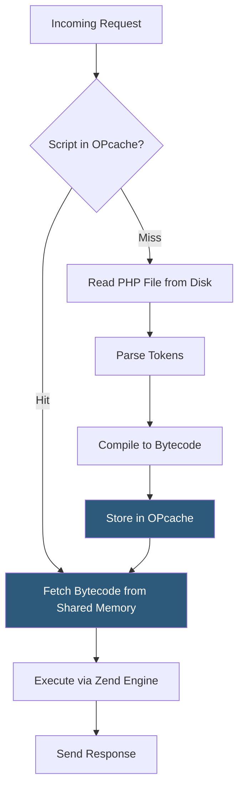

**Category:** Application Server Platforms
**Difficulty:** Beginner
**Reading time:** 5 min read

---

OPcache is a Zend Engine extension that stores compiled PHP bytecode in shared memory, eliminating the need to parse and compile scripts on every request. It is bundled with PHP 5.5+ and is the single highest-impact performance optimization available for PHP applications.

- **Opcode** — Low-level instruction produced by compiling a PHP source file, executed by the Zend Engine
- **Shared memory** — OS memory region accessible by all PHP-FPM worker processes simultaneously
- **opcache.memory_consumption** — Megabytes of shared memory allocated for the bytecode cache
- **opcache.max_accelerated_files** — Maximum number of PHP files OPcache may store
- **opcache.validate_timestamps** — When enabled, checks file modification time on each request to detect changes
- **opcache.revalidate_freq** — Seconds between filesystem checks when `validate_timestamps` is on
- **JIT (Just-In-Time)** — PHP 8.0+ extension of OPcache that compiles hot code paths to native machine code
- **opcache.file_cache** — Secondary disk-based cache surviving process restarts

When PHP first loads a script, it tokenizes the source text, builds an Abstract Syntax Tree, and compiles it to an array of opcodes—a platform-independent bytecode. Without OPcache, this process repeats for every request that touches the script. With OPcache, the compiled bytecode is stored in a shared memory segment and reused across all worker processes.

The `opcache.memory_consumption` setting (recommended: 128–512 MB for large frameworks) controls the shared memory pool size. `opcache.max_accelerated_files` should exceed the application's total PHP file count—running `find /app -name "*.php" | wc -l` gives the baseline. Setting this too low causes eviction and re-compilation.

By default, `opcache.validate_timestamps=1` causes OPcache to check file modification timestamps every `opcache.revalidate_freq` seconds (default: 2). For production deployments where code changes only on deploys, setting `validate_timestamps=0` eliminates all filesystem checks and yields additional throughput, but requires manual cache invalidation via `opcache_reset()` or PHP-FPM reload on deploy.

PHP 8.0 added JIT compilation as part of OPcache. Two modes exist: `opcache.jit=tracing` profiles hot loops and compiles them to native x86/ARM code, benefiting CPU-intensive math operations; `opcache.jit=function` compiles entire functions. For I/O-bound web apps, JIT gains are modest (5–15%); for numerical workloads like image processing or ML inference, gains can reach 3×.

- WordPress/WooCommerce sites reducing average PHP execution from ~80ms to ~20ms
- Laravel applications caching framework bootstrap files (400+ files loaded per request)
- High-traffic APIs processing thousands of requests per second per server
- CLI workers where `opcache.enable_cli=1` caches long-running script loads
- Containerized PHP apps using `opcache.file_cache` for warm-up across container restarts

| Advantage | Disadvantage |
|-----------|--------------|
| Eliminates parse/compile overhead for every cached script | Stale bytecode served if `validate_timestamps=0` and cache not flushed on deploy |
| Zero code changes required—purely `php.ini` configuration | Memory fragmentation over time may require periodic PHP-FPM restarts |
| JIT provides native-speed execution for compute-heavy paths | JIT increases memory usage and startup time; may destabilize edge-case code |
| Shared memory accessible to all workers with no duplication | A single misconfigured `memory_consumption` wastes RAM or causes evictions |

- [PHP Hosting Optimization](php-hosting-optimization.md)
- [PHP-FPM Configuration](php-fpm-configuration.md)
- [PHP Version Management](php-version-management.md)

---
*Part of the [Application Server Platforms](index.md) category · [Back to Master Index](../../index.md)*
