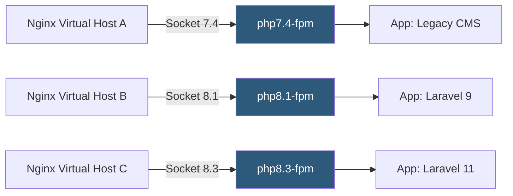

**Category:** Application Server Platforms
**Difficulty:** Intermediate
**Reading time:** 5 min read

---

PHP version management enables hosting environments to run multiple PHP versions simultaneously, allowing different applications to use the runtime they require without conflict. This is essential for shared hosting providers and development environments supporting legacy and modern codebases side-by-side.

- **phpenv** — Shim-based PHP version manager modeled on rbenv, allowing per-directory PHP selection
- **phpbrew** — Tool for compiling and managing multiple PHP builds with custom extension sets
- **php-switcher** — Ubuntu/Debian utility for toggling the system-default PHP CLI and FPM versions
- **update-alternatives** — Linux mechanism for managing symlink priorities between versioned binaries
- **`.php-version` file** — Directory-local file specifying the PHP version phpenv should activate
- **Multi-PHP FPM** — Running parallel PHP-FPM instances (e.g., php7.4-fpm, php8.2-fpm) each on separate sockets
- **EOL (End of Life)** — PHP versions no longer receiving security patches, creating upgrade urgency
- **Extension compatibility** — PECL extensions compiled against a specific PHP ABI, requiring recompilation per version

On Debian/Ubuntu systems, the `ondrej/php` PPA provides parallel-installable packages for all supported PHP versions (e.g., `php7.4-fpm`, `php8.2-fpm`, `php8.3-cli`). Each version installs its binaries under `/usr/bin/php8.x`, its configuration under `/etc/php/8.x/`, and runs a separate systemd service with its own socket file (e.g., `/run/php/php8.2-fpm.sock`).

Nginx virtual host configurations select the correct PHP version by pointing `fastcgi_pass` at the appropriate socket path. This means a single Nginx instance can serve dozens of applications each running a different PHP version, with zero interference between them.

For CLI version management, `update-alternatives --config php` switches the default `php` symlink. Developer tools like Composer, WP-CLI, and Artisan respect whichever PHP binary resolves from `$PATH`. phpenv takes this further by reading a `.php-version` file from the project directory, enabling per-project version pins without modifying global state—critical in monorepo setups or when multiple developers use different projects.

PECL extensions (e.g., Redis, Imagick, MongoDB) must be compiled against each PHP version independently. Most package managers handle this: installing `php8.2-redis` and `php8.1-redis` installs separate compiled `.so` files under `/usr/lib/php/8.2/` and `/usr/lib/php/8.1/` respectively.

Version migration planning should follow PHP's official release schedule: each minor version (8.1, 8.2, 8.3) receives active support for two years, then security-only patches for one more year before EOL.

- Shared hosting platforms where customer applications span PHP 7.4 through 8.3
- Development machines running multiple client projects with different framework requirements
- Gradual migration paths from PHP 7.x to 8.x without a hard cutover
- CI/CD pipelines running test matrices across multiple PHP versions simultaneously
- WordPress hosting supporting both legacy plugins requiring PHP 7 and modern themes requiring 8.x

| Advantage | Disadvantage |
|-----------|--------------|
| Multiple applications coexist without version conflicts | Each installed PHP version consumes disk, RAM (FPM processes), and maintenance overhead |
| Per-directory version pinning prevents accidental upgrades | Developers must remember to set `.php-version` files in new projects |
| Security patches can be applied per-version without global impact | Operators must monitor EOL status for each installed version independently |
| PHP version upgrade testing possible in isolation | PECL extension installation must be repeated for every PHP version |

- [PHP-FPM Configuration](php-fpm-configuration.md)
- [PHP Hosting Optimization](php-hosting-optimization.md)
- [Application Deployment Automation](application-deployment-automation.md)

---
*Part of the [Application Server Platforms](index.md) category · [Back to Master Index](../../index.md)*
