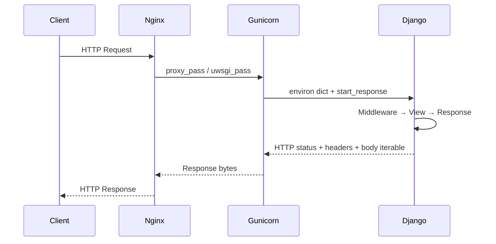

**Category:** Application Server Platforms
**Difficulty:** Intermediate
**Reading time:** 6 min read

---

WSGI (Web Server Gateway Interface) is the Python standard (PEP 3333) defining a synchronous interface between web servers and Python web applications. It underpins Django, Flask, and Pyramid deployments, routing HTTP requests from a production web server to Python application code through a WSGI-compliant application server like Gunicorn or uWSGI.

- **WSGI callable** — A Python function or class with the signature `(environ, start_response)` that handles each request
- **`environ`** — Dictionary containing CGI-style request metadata (headers, path, method, body as file-like object)
- **`start_response`** — Callable provided by the WSGI server to set response status and headers
- **Gunicorn** — Pure-Python WSGI server using pre-fork worker model; the most common Python web server
- **uWSGI** — C-based WSGI server with richer configuration, emperor mode, and protocol extensions
- **WSGI middleware** — Composable layer between server and app implementing cross-cutting concerns (auth, compression)
- **Worker type** — Gunicorn worker class: sync, gevent (greenlets), eventlet, or tornado for async handling
- **Virtual environment** — Isolated Python package set preventing dependency conflicts between applications

A WSGI application is any Python callable accepting two arguments: `environ` (request context) and `start_response` (a function to declare the response status/headers). The application returns an iterable producing the response body. This simple interface enables the ecosystem of WSGI servers and middleware.

In production, Gunicorn is started with: `gunicorn myapp.wsgi:application --workers 4 --bind 0.0.0.0:8000`. It pre-forks `--workers` processes (recommended: `2 * cpus + 1` for CPU-bound; higher for I/O-heavy), each loading the full application into memory. This means Django's ORM, settings, and cached URL patterns are loaded once per worker, not per request.

Nginx acts as reverse proxy: `proxy_pass http://127.0.0.1:8000` forwards requests to Gunicorn while Nginx handles SSL termination, static file serving (`location /static`), and request buffering. Nginx buffers the full client request body before forwarding to Gunicorn, protecting Python workers from slow clients.

Worker types control concurrency model. The default `sync` worker handles one request at a time. `gevent` workers use greenlets to multiplex I/O-bound requests (database queries, HTTP calls) within one OS thread, dramatically increasing concurrency. For Django Channels or async views, ASGI servers (Daphne, Uvicorn) replace WSGI entirely.

Python virtual environments (`python -m venv`) isolate per-application dependencies. Systemd service units activate the venv and set `DJANGO_SETTINGS_MODULE` before launching Gunicorn, ensuring clean separation between applications on shared servers.

- Django applications with synchronous ORM-heavy views and admin interfaces
- Flask microservices handling REST API requests in containerized environments
- Multi-tenant SaaS platforms deploying separate Gunicorn processes per tenant
- Internal tools where async performance matters less than development simplicity
- Legacy applications requiring WSGI compatibility without ASGI migration

| Advantage | Disadvantage |
|-----------|--------------|
| Simple, well-understood synchronous programming model | Synchronous workers block on I/O; one slow database query stalls the worker |
| Vast ecosystem of WSGI-compatible frameworks and middleware | Cannot handle long-lived WebSocket connections without ASGI replacement |
| Pre-fork model isolates worker crashes from the entire service | High worker count multiplies memory consumption (each loads full Django) |
| Nginx buffering protects Python workers from slow clients | Context switching overhead when workers exhaust under high concurrency |

- [Gunicorn Deployment](gunicorn-deployment.md)
- [uWSGI Configuration](uwsgi-configuration.md)
- [Application Server Scaling](application-server-scaling.md)

---
*Part of the [Application Server Platforms](index.md) category · [Back to Master Index](../../index.md)*
