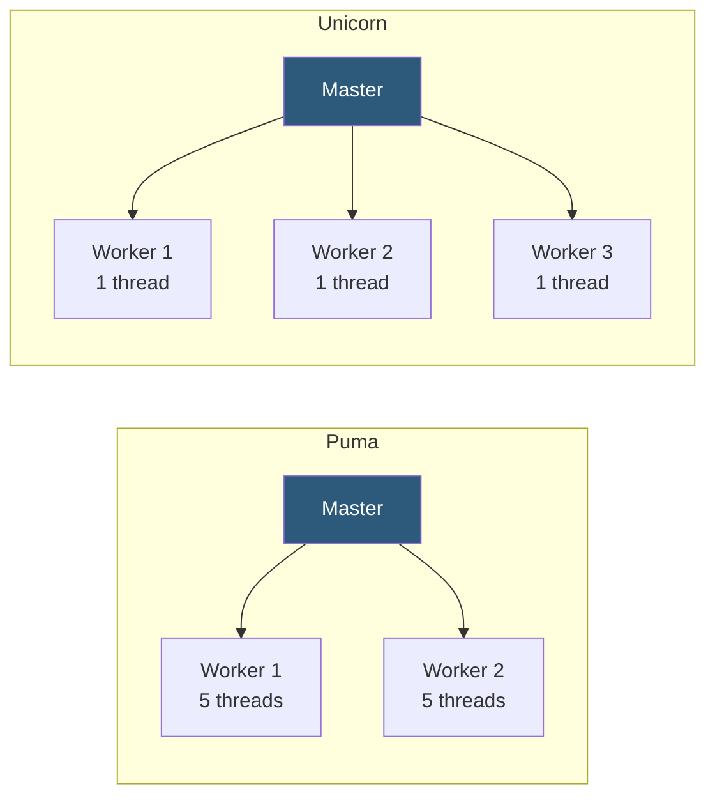

**Category:** Application Server Platforms
**Difficulty:** Intermediate
**Reading time:** 6 min read

---

Puma and Unicorn are the two dominant Rack-compatible application servers for Ruby web applications. Puma uses a multi-threaded cluster model for efficient I/O concurrency, while Unicorn employs a single-threaded pre-fork model favored for memory isolation and zero-downtime deploys via master process replacement.

- **Rack** — Ruby web server interface protocol connecting frameworks (Rails, Sinatra) to app servers
- **Puma** — Multi-threaded, multi-process Ruby app server; Rails default since version 5
- **Unicorn** — Pre-fork, single-threaded server using Unix socket inheritance for zero-downtime deploys
- **`WEB_CONCURRENCY`** — Environment variable controlling Puma/Unicorn worker process count
- **`RAILS_MAX_THREADS`** — Puma thread count per worker; default 5
- **Preload app** — Loading application code in master before forking, enabling copy-on-write memory sharing
- **Phased restart** — Puma feature rolling-restarting workers one at a time, avoiding downtime
- **Zero-downtime deploy** — Unicorn's technique of spawning new master while old handles live traffic

**Puma** runs in cluster mode with `workers` OS processes, each containing `threads` Ruby threads. Threads share the process's memory space, making Puma more memory-efficient than pure pre-fork servers: 2 workers × 5 threads handles 10 concurrent requests but uses memory for only 2 process copies of the app. The thread pool accepts connections from Puma's reactor (built on Celluloid-I/O or native I/O), queuing them for available threads. During I/O waits (database, HTTP), the GIL releases, allowing other threads to execute.

**Unicorn** takes a different approach: it forks many single-threaded workers. The master process listens on a Unix socket and passes file descriptors to workers. Because each worker is strictly single-threaded, Ruby's GIL is irrelevant—worker isolation is the key benefit. A misbehaving request can't corrupt another worker's memory. Unicorn's signature feature is live deployment: sending `SIGUSR2` causes the master to exec a new Unicorn master from the new codebase. Once the new master's workers are ready, sending `SIGWINCH` to the old master causes it to gracefully stop—all without dropping connections.

Both servers support `preload_app true` (Unicorn) / `preload_app!` (Puma). This loads the Rails application in the master before forking workers. Fork-on-write memory semantics mean workers initially share the master's memory pages; pages are copied only when workers write to them, reducing total RAM for read-heavy applications.

Puma's `phased-restart` (via `pumactl phased-restart`) rolls workers through restart one-at-a-time, ensuring capacity is maintained. This is simpler than Unicorn's USR2-based deploy for most modern deployment pipelines.

- New Rails applications where Puma is the default bundled server
- Memory-constrained deployments where Puma's threaded model saves RAM vs Unicorn
- Legacy Rails applications using Unicorn where its battle-tested single-threaded model reduces risk
- High-deployment-frequency services using Puma phased-restart for zero-downtime
- Applications with non-thread-safe C extensions requiring Unicorn's full worker isolation

| Advantage | Disadvantage |
|-----------|--------------|
| Puma uses less memory than equivalent Unicorn worker count | Puma threads share memory; non-thread-safe gems cause race conditions |
| Unicorn worker isolation prevents cross-request memory corruption | Unicorn uses more RAM per concurrent request than Puma |
| Unicorn USR2 deploy is well-tested for zero-downtime | Unicorn deploy process is complex and requires careful signal management |
| Puma phased restart is simpler for modern CI/CD | Puma preload with threads can cause issues with database connection pools |

- [Ruby on Rails Hosting](ruby-on-rails-hosting.md)
- [Application Server Scaling](application-server-scaling.md)
- [Session Management Strategies](session-management-strategies.md)

---
*Part of the [Application Server Platforms](index.md) category · [Back to Master Index](../../index.md)*
