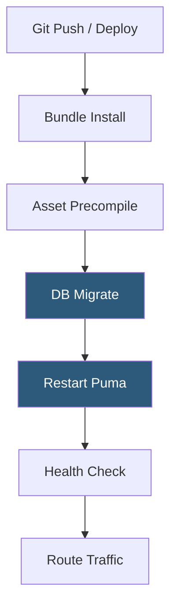

**Category:** Application Server Platforms
**Difficulty:** Intermediate
**Reading time:** 6 min read

---

Ruby on Rails hosting requires a Ruby runtime, a Rack-compatible application server, a relational database, and a reverse proxy. The opinionated Rails framework imposes specific deployment patterns around asset precompilation, database migrations, and environment configuration that distinguish it from other platform deployments.

- **Rack** — Minimal Ruby webserver interface standard (like WSGI for Python) that all Rails app servers implement
- **Puma** — Default multi-threaded Rails application server bundled since Rails 5
- **Bundler** — Dependency manager for Ruby gems, using `Gemfile` and `Gemfile.lock` for reproducible installs
- **rbenv / rvm** — Ruby version managers for maintaining multiple Ruby versions on one host
- **Asset pipeline** — Rails mechanism for compiling, fingerprinting, and serving CSS/JS/images in production
- **`RAILS_ENV=production`** — Environment variable enabling production optimizations (caching, compressed assets, etc.)
- **Database migrations** — `rails db:migrate` applies schema changes; must run before new app version starts
- **`SECRET_KEY_BASE`** — Required secret for cookie signing; must be consistent across all instances

A production Rails deployment follows a specific sequence. After pulling new code, `bundle install --deployment` installs gems from `Gemfile.lock` into `vendor/bundle`. `RAILS_ENV=production bundle exec rails assets:precompile` compiles and fingerprints CSS/JS into `public/assets`, enabling long-lived HTTP caching by browsers. `bundle exec rails db:migrate` applies pending schema changes.

Puma (or an alternative like Unicorn) starts with `bundle exec puma -C config/puma.rb`. The `config/puma.rb` file sets thread count (`threads_count = ENV.fetch("RAILS_MAX_THREADS") { 5 }`), worker count (`workers ENV.fetch("WEB_CONCURRENCY") { 2 }`), and the bind address or socket path. Puma in cluster mode forks `workers` OS processes, each with `threads` concurrent Ruby threads.

Rails MRI (CRuby) has a Global Interpreter Lock (GIL), meaning threads cannot execute Ruby bytecode in parallel. However, threads do execute concurrently during I/O (database queries, HTTP calls), making multi-threaded Puma effective for Rails' typical I/O-heavy workloads. `RAILS_MAX_THREADS=5` is the standard default.

Nginx serves static assets directly from `public/assets` and `public/packs` without hitting Puma, using `try_files $uri $uri/ @puma`. Dynamic requests go to Puma via `proxy_pass` or Nginx's `puma_pass` upstream.

Environment variables (`DATABASE_URL`, `SECRET_KEY_BASE`, `REDIS_URL`) are set via systemd `EnvironmentFile`, Heroku config vars, or Kubernetes Secrets. Rails reads these via `ENV[]` in `config/` initializers.

- SaaS applications built on Rails 7 using Hotwire/Turbo for real-time UI
- E-commerce platforms using Spree or Solidus on Rails
- Content management systems built with Rails and ActiveAdmin
- API-only Rails applications serving JSON to mobile and SPA frontends
- Internal business tools leveraging Rails scaffolding for rapid CRUD development

| Advantage | Disadvantage |
|-----------|--------------|
| Convention-over-configuration reduces deployment configuration decisions | Asset precompilation adds minutes to deployment time for large asset trees |
| Bundler lock files ensure dependency reproducibility across environments | MRI GIL limits true CPU parallelism; memory scales linearly with workers |
| Rails built-in migration system provides safe, versioned schema changes | Migration errors mid-deployment can leave DB in inconsistent state |
| Large ecosystem of production-ready gems for common requirements | Ruby memory usage per process is high compared to Go or Java runtimes |

- [Ruby Application Servers (Puma, Unicorn)](ruby-application-servers-puma-unicorn.md)
- [Application Server Monitoring](application-server-monitoring.md)
- [Application Deployment Automation](application-deployment-automation.md)

---
*Part of the [Application Server Platforms](index.md) category · [Back to Master Index](../../index.md)*
