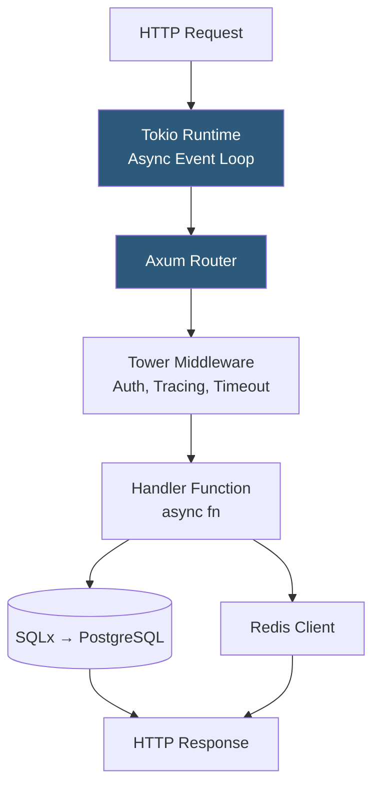

**Category:** Application Server Platforms
**Difficulty:** Advanced
**Reading time:** 6 min read

---

Rust web application hosting leverages Rust's memory safety guarantees and zero-cost abstractions to produce web services with native performance, minimal memory footprint, and no garbage collector pauses. Frameworks like Actix-web and Axum provide async HTTP handling built on Tokio's async runtime.

- **Tokio** — Asynchronous runtime for Rust providing an event loop, thread pool, and async I/O primitives
- **Actix-web** — High-performance Rust web framework; consistently tops TechEmpower benchmarks
- **Axum** — Tower-based Rust web framework developed by the Tokio team; composable middleware architecture
- **`async/await`** — Rust's zero-cost async syntax compiled to state machines with no heap allocation overhead
- **`cargo build --release`** — Rust compilation with optimizations enabled; required for production binaries
- **MUSL libc** — Alternative C library enabling fully static binaries (`x86_64-unknown-linux-musl`) for minimal containers
- **Ownership model** — Rust's compile-time memory management eliminating use-after-free and data races
- **Tower** — Middleware abstraction library used by Axum for composable request/response transformations

Rust web services use the async/await model atop Tokio's multi-threaded runtime. `tokio::main` spawns a thread pool sized to CPU core count (configurable via `TOKIO_WORKER_THREADS`). Each incoming connection is assigned a Tokio task—a lightweight cooperative unit similar to a goroutine but with compile-time memory safety guarantees.

An Axum application defines routes using `Router::new().route("/users", get(list_users)).route("/users/:id", get(get_user))`. Handlers are async functions returning types that implement `IntoResponse`. State is shared via `Extension` or `State` extractors, with Arc<T> wrapping for thread-safe shared access.

Compilation with `cargo build --release` enables LLVM optimizations including inlining, loop unrolling, and SIMD auto-vectorization. Release binaries are typically 2–10 MB and start in under 10 milliseconds. MUSL compilation (`cargo build --release --target x86_64-unknown-linux-musl`) produces a fully static binary with zero dynamic library dependencies, enabling `FROM scratch` Docker images of 3–8 MB.

Database access uses async drivers like SQLx (compile-time SQL query verification), Diesel, or SeaORM. SQLx's `query!` macro verifies SQL against an actual database schema at compile time, catching type mismatches and missing columns before runtime. This brings SQL safety to the same level as Rust's type system.

Production deployment mirrors Go: Nginx or Caddy as TLS-terminating reverse proxy, systemd for process supervision. The absence of a garbage collector means memory usage is flat and predictable over time—critical for latency-sensitive services where GC pauses cause response time jitter.

- Ultra-high-throughput APIs handling 100k+ requests/second on modest hardware
- WebAssembly server-side execution (Rust compiles to WASM via `wasm32-wasi`)
- Systems programming services requiring C-compatible FFI and minimal dependencies
- Embedded devices and edge nodes where memory constraints prohibit GC runtimes
- Security-critical services where memory safety eliminates CVE classes (buffer overflow, use-after-free)

| Advantage | Disadvantage |
|-----------|--------------|
| No GC pauses; predictable sub-millisecond latency at high percentiles | Steep learning curve; ownership and borrow checker require significant adaptation |
| Memory safety at compile time eliminates entire CVE categories | Longer compilation times than Go; incremental builds help but full builds take minutes |
| Sub-5 MB static binaries; ideal for minimal container images | Smaller ecosystem than Go or Java; some libraries lack async support |
| Highest benchmark throughput of any memory-safe language | Async Rust complexity (Pin, Future, lifetime annotations) is challenging |

- [Go Application Deployment](go-application-deployment.md)
- [Application Server Monitoring](application-server-monitoring.md)
- [Application Server Scaling](application-server-scaling.md)

---
*Part of the [Application Server Platforms](index.md) category · [Back to Master Index](../../index.md)*
