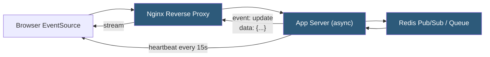

**Category:** Application Server Platforms
**Difficulty:** Intermediate
**Reading time:** 6 min read

---

Server-Sent Events (SSE) is an HTTP-based protocol that enables servers to push a stream of text events to browser clients over a single long-lived HTTP connection using the `text/event-stream` MIME type. Unlike WebSockets, SSE is unidirectional (server to client only), uses standard HTTP, and includes automatic reconnection and event ID tracking built into the browser's EventSource API. SSE is well-suited for real-time dashboards, live feeds, and notification streams where the client does not need to send data back to the server.

- **EventSource API** — Browser native JavaScript interface that manages SSE connections, automatic reconnection, and event dispatching
- **text/event-stream** — MIME type that signals the browser to treat the response as an SSE stream rather than a standard HTTP response
- **event field** — Named event type within the stream; browser dispatches it as a custom DOM event
- **data field** — Payload of each event; multi-line data uses repeated `data:` lines
- **id field** — Cursor value sent in the `Last-Event-ID` header on reconnect to resume from last known position
- **retry field** — Milliseconds the browser waits before reconnecting after a disconnection
- **Chunked transfer encoding** — HTTP mechanism that sends response body incrementally, enabling SSE to push events without buffering
- **Heartbeat** — Server-sent comment lines (`: ping`) that keep the connection alive through idle-timeout-prone proxies

SSE uses a standard HTTP GET request where the server responds with `Content-Type: text/event-stream` and keeps the connection open indefinitely. The response body is a stream of UTF-8 text blocks, each event separated by a blank line. An event block contains one or more fields prefixed by field names (`data:`, `event:`, `id:`, `retry:`).

The browser's built-in `EventSource` object handles all transport mechanics: it opens the connection, parses the stream, dispatches events to registered listeners, and automatically reconnects on disconnection. When reconnecting, it sends the `Last-Event-ID` header containing the last received event ID, allowing the server to replay missed events from a durable log.

On the server side, SSE requires async I/O to hold many concurrent streams without thread exhaustion. Frameworks with first-class SSE support include Node.js (using `res.write()`), Python's FastAPI/Starlette (`StreamingResponse`), and Go's `http.Flusher` interface. The server must flush response buffers after each event write; buffering middleware (Nginx gzip, response buffers) must be disabled or bypassed for SSE routes.

Nginx configuration for SSE requires `proxy_buffering off;` and `proxy_cache off;` on SSE location blocks, plus setting `X-Accel-Buffering: no` in the upstream response. Connection limits must account for long-lived SSE connections per user. Browser limitations (max 6 concurrent HTTP/1.1 connections per domain) are resolved by serving SSE over HTTP/2, which multiplexes streams over a single TCP connection.

- Live stock ticker or sports score dashboards pushing updates every few seconds
- CI/CD build log streaming from server to browser developer interface
- Real-time notification feeds in web applications
- Live sports or election result updates on media platforms
- IoT sensor data visualization in browser-based monitoring panels

| Advantage | Disadvantage |
|-----------|--------------|
| Built-in browser reconnection and last-event-ID resume | Unidirectional only — client cannot send data over the same connection |
| Standard HTTP — works through HTTP/2 multiplexing | Limited to 6 concurrent connections per domain on HTTP/1.1 |
| Simpler than WebSockets for pure server-push scenarios | Long-lived connections require careful proxy and load balancer configuration |
| Automatic text encoding; no binary framing complexity | Not supported in older IE/Edge Legacy browsers |

- [WebSocket Server Configuration](websocket-server-configuration.md)
- [Long-polling Implementation](long-polling-implementation.md)
- [Node.js Hosting](nodejs-hosting.md)

---
*Part of the [Application Server Platforms](index.md) category · [Back to Master Index](../../index.md)*
