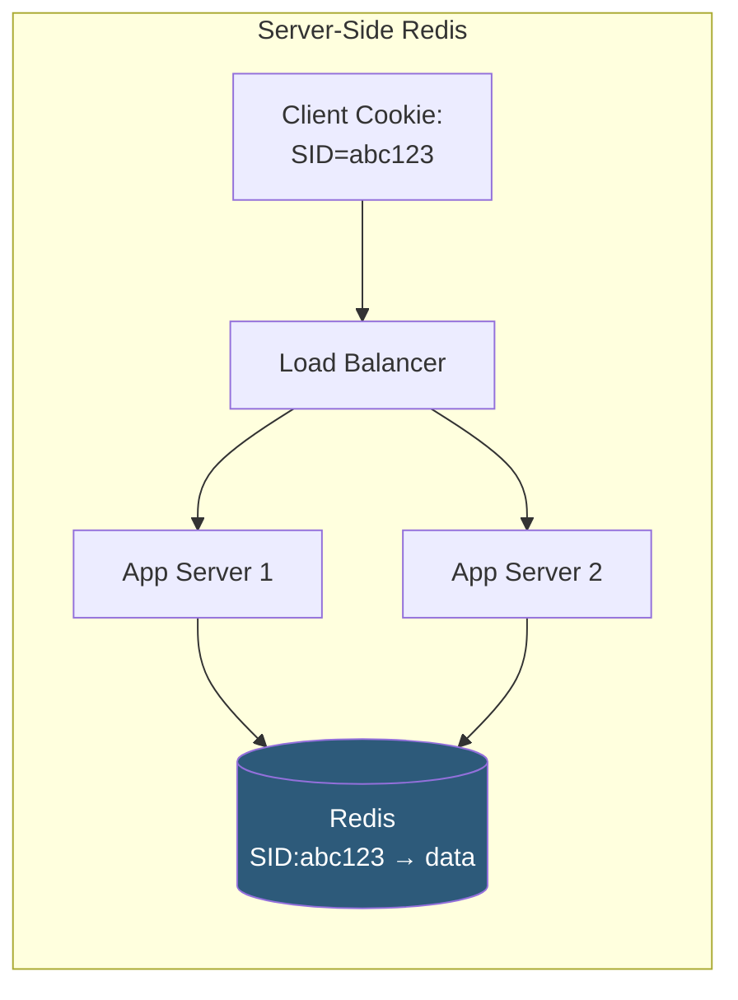

**Category:** Application Server Platforms
**Difficulty:** Intermediate
**Reading time:** 6 min read

---

Session management stores client state between stateless HTTP requests, enabling user authentication, shopping carts, and personalization. The strategy chosen—in-memory, database-backed, cookie-based JWT, or centralized Redis—determines scalability, security characteristics, and operational complexity.

- **Session ID** — Cryptographically random token issued to the client, stored in a cookie, referencing server-side state
- **In-memory sessions** — Session data stored in application process RAM; fast but lost on restart, incompatible with horizontal scaling
- **Redis session store** — Centralized key-value store holding session data accessible by all application instances
- **JWT (JSON Web Token)** — Signed token containing encoded claims stored client-side; stateless, no server-side lookup
- **Cookie attributes** — `HttpOnly`, `Secure`, `SameSite=Strict/Lax` settings protecting session cookies from XSS and CSRF
- **Session fixation** — Attack where an attacker pre-sets a session ID before user authentication; mitigated by regenerating ID on login
- **Sliding expiration** — Session TTL resets on each request, keeping active users logged in while expiring idle sessions
- **Sticky sessions** — Load balancer routing a user to the same backend instance; band-aid for in-memory sessions in scaled deployments

**In-memory sessions** (Express `express-session` default, PHP `$_SESSION`) store session data in application process memory. A session ID is set in a `Set-Cookie` response header; subsequent requests include the cookie, and the server looks up the session in memory. This is fast (nanosecond lookup) but breaks with multiple processes: Nginx round-robin sends the second request to a different worker that has no record of the session.

**Redis-backed sessions** replace in-memory storage with a networked key-value store. All application instances connect to the same Redis, so any instance can serve any session. TTL-based expiration handles session lifetime. Redis's persistence options (AOF/RDB) survive Redis restarts. Session serialization overhead (JSON or MessagePack) adds ~0.5–2ms per request, acceptable for most applications.

**JWT (JSON Web Tokens)** shift session state to the client. The server signs a payload (`{user_id, roles, exp}`) with a private key and returns it as a cookie or Authorization header value. Subsequent requests include the token; the server verifies the signature and extracts claims without any storage lookup—enabling truly stateless operation. The trade-off: JWTs cannot be invalidated before expiry without a blocklist (which reintroduces server-side state). Short expiry (15 minutes) with refresh token rotation mitigates this.

**Database sessions** store session data in SQL tables or document collections. This works at scale but adds query overhead per request. Indexing by session_id is essential; without it, session lookup becomes a full table scan.

Security fundamentals apply regardless of strategy: regenerate session ID on authentication state change (login, privilege escalation) to prevent fixation; set `HttpOnly` to block JavaScript access; set `Secure` to restrict to HTTPS; set `SameSite=Lax` to prevent CSRF in cross-site requests.

- Single-server web apps: in-memory sessions are simplest and sufficient
- Horizontally scaled web applications requiring Redis-backed sessions for consistency
- Stateless microservice APIs using JWT bearer tokens for authentication
- E-commerce sites needing persistent shopping carts surviving browser restarts (database sessions)
- Applications requiring immediate session revocation (suspicious activity response) requiring server-side session stores

| Advantage | Disadvantage |
|-----------|--------------|
| Redis sessions scale horizontally without sticky sessions | Redis becomes a critical dependency; its failure logs out all users |
| JWTs eliminate server-side storage, simplifying infrastructure | JWTs cannot be revoked without a blocklist; compromised tokens remain valid until expiry |
| In-memory sessions have zero network overhead | In-memory sessions break with multiple processes or restart |
| Database sessions survive all server failures | Database session queries add latency; require proper indexing |

- [Application Server Scaling](application-server-scaling.md)
- [Application Caching Layers](application-caching-layers.md)
- [WebSocket Server Configuration](websocket-server-configuration.md)

---
*Part of the [Application Server Platforms](index.md) category · [Back to Master Index](../../index.md)*
