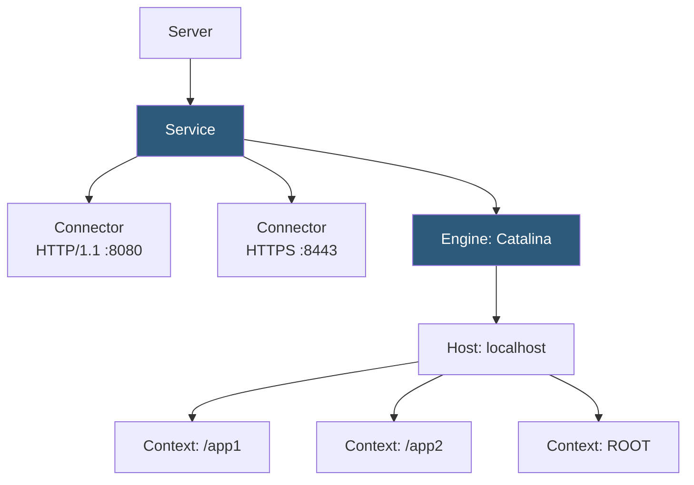

**Category:** Application Server Platforms
**Difficulty:** Intermediate
**Reading time:** 6 min read

---

Apache Tomcat is the most widely deployed open-source Java servlet container, implementing the Jakarta Servlet, JSP, and WebSocket specifications. It serves as both a standalone web server for Java web applications and as the embedded HTTP engine in Spring Boot applications, making it a foundational component of the Java hosting ecosystem.

- **Connector** — Tomcat component accepting HTTP/1.1 (NIO), HTTP/2, or AJP connections; configured in `server.xml`
- **Host** — Virtual host configuration allowing multiple applications on one Tomcat instance
- **Context** — Individual web application deployment at a specific path; corresponds to a WAR file
- **`catalina.sh`** — Startup/shutdown script for standalone Tomcat
- **NIO connector** — Non-blocking I/O connector (default) handling many concurrent connections with few threads
- **APR connector** — Apache Portable Runtime connector using native C code for improved SSL performance
- **`setenv.sh`** — Script for setting JVM flags and environment variables loaded at Tomcat startup
- **Manager app** — Built-in Tomcat web UI for deploying, undeploying, and reloading WAR files

Tomcat's architecture is hierarchical: Server > Service > Connector/Engine > Host > Context. The `server.xml` file defines this hierarchy. A Connector listens on a port and passes requests to the Engine, which routes them to the matching Host (based on HTTP Host header), which then selects the Context matching the request path prefix.

The NIO connector (default since Tomcat 8.5) uses a thread pool (`Executor` element) to process requests. The `maxThreads` attribute (default: 200) caps concurrent request handling threads. Unlike older BIO connectors, NIO can hold thousands of keep-alive connections using OS selector threads without consuming a thread per idle connection.

WAR deployment works by placing a `.war` file in `$CATALINA_HOME/webapps/`. Tomcat's deployer automatically unpacks and deploys it. Hot deployment (replacing the WAR while Tomcat runs) works but is not recommended in production due to class loader leak risks; full restarts are safer. Context descriptors in `conf/Catalina/localhost/` override settings per application.

JVM tuning is handled in `bin/setenv.sh`: `export CATALINA_OPTS="-Xms512m -Xmx2048m -XX:+UseG1GC -Djava.awt.headless=true"`. This file is sourced at startup and is the correct place for JVM flags, avoiding modification of core startup scripts.

In production, Tomcat runs behind Nginx or Apache HTTPD. Nginx terminates TLS and forwards HTTP to Tomcat's port 8080 via `proxy_pass`. The `RemoteIpValve` in `context.xml` ensures Tomcat reads the real client IP from `X-Forwarded-For` headers rather than seeing only the proxy's address.

- Legacy Java EE web applications requiring servlet container deployment
- Spring Boot applications using embedded Tomcat for self-contained JAR execution
- Multi-WAR servers hosting several Java applications on one Tomcat instance
- Enterprise portals deployed to Tomcat cluster behind a hardware load balancer
- CI/CD systems using Tomcat Manager REST API for automated WAR deployment

| Advantage | Disadvantage |
|-----------|--------------|
| Lightweight compared to full Jakarta EE servers (WildFly, WebLogic) | Does not provide EJB, JTA, or full Jakarta EE feature set |
| Large community, extensive documentation, stable release cadence | WAR deployment model adds packaging/deployment steps vs Spring Boot fat JARs |
| NIO connector handles high concurrency efficiently | Class loader leaks from hot-deploy can cause PermGen/Metaspace exhaustion |
| Excellent Nginx/Apache integration via proxy or AJP | AJP connector has had security vulnerabilities (Ghostcat); disable if unused |

- [Java Application Servers](java-application-servers.md)
- [JBoss/WildFly Hosting](jboss-wildfly-hosting.md)
- [Application Server Monitoring](application-server-monitoring.md)

---
*Part of the [Application Server Platforms](index.md) category · [Back to Master Index](../../index.md)*
