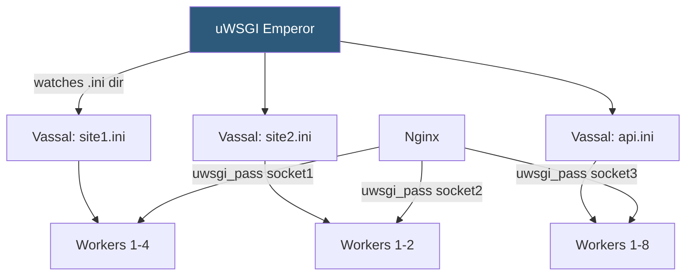

**Category:** Application Server Platforms
**Difficulty:** Advanced
**Reading time:** 7 min read

---

uWSGI is a high-performance, C-based application server supporting WSGI, ASGI, PSGI (Perl), and Rack (Ruby) protocols. Its rich configuration system, emperor mode for multi-app management, and native uwsgi protocol make it a powerful but complex alternative to Gunicorn for demanding production environments.

- **uwsgi protocol** — Binary, low-overhead protocol for Nginx↔uWSGI communication, faster than HTTP proxy
- **Emperor mode** — uWSGI supervisor managing multiple application instances (vassals) from a single process
- **Vassal** — An individual uWSGI instance managed by an emperor, defined by a `.ini` config file
- **Workers** — OS processes handling requests, similar to Gunicorn workers
- **Threads** — Optional threading within each worker (`--enable-threads --threads N`)
- **Harakiri** — uWSGI timeout mechanism that kills a worker if it exceeds the configured request duration
- **Master process** — Optional uWSGI master that handles signals, stats, and cheap reload
- **Cheap mode** — Workers spawn only when requests arrive and die when idle, saving resources

uWSGI is invoked with a `.ini` configuration file rather than command-line flags. A minimal Django deployment: `[uwsgi] module=myproject.wsgi chdir=/var/www/myproject socket=/run/uwsgi/myproject.sock processes=4 threads=2 master=true harakiri=30`. The `module` directive specifies the WSGI callable; `socket` uses the binary uwsgi protocol rather than HTTP.

Nginx connects with `uwsgi_pass unix:///run/uwsgi/myproject.sock` and `include uwsgi_params`, eliminating HTTP parsing overhead compared to `proxy_pass`. The uwsgi protocol is more efficient for high-request-rate services.

Emperor mode (activated with `--emperor /etc/uwsgi/vassals/`) monitors a directory for `.ini` files. Adding a new file spawns a vassal; removing one stops it; touching a file triggers graceful restart. This enables centralized multi-tenant management without separate systemd units per app.

uWSGI's `harakiri` terminates workers that exceed the specified seconds, similar to Gunicorn's timeout but with configurable per-request logging of killed processes. Combined with `max-requests` for leak prevention and `reload-mercy` for graceful shutdown grace periods, it provides robust lifecycle management.

Advanced features include: `cheaper=2 cheaper-initial=4 workers=16` for dynamic scaling based on queue depth; `stats=127.0.0.1:9191` exposing a JSON metrics socket; `log-format` customization; and `cron` for scheduled tasks within the application process. The `mule` feature runs background workers within the uWSGI process tree, enabling in-process task queues without external message brokers for light workloads.

- High-performance Django APIs requiring binary uwsgi protocol efficiency
- Multi-tenant hosting platforms leveraging emperor mode for centralized app lifecycle management
- Applications requiring both web workers and background task workers in the same process tree
- Python apps needing fine-grained per-process resource limits via uWSGI's resource management
- Sites with highly variable traffic using cheaper mode to conserve idle server resources

| Advantage | Disadvantage |
|-----------|--------------|
| Binary uwsgi protocol is faster than HTTP proxy | Configuration syntax is complex and poorly documented in places |
| Emperor mode simplifies multi-app server management | Debugging emperor/vassal failures requires careful log configuration |
| Richer scaling options (cheaper mode, dynamic workers) than Gunicorn | Higher operational complexity compared to Gunicorn's simpler model |
| In-process mules eliminate external broker dependency for simple tasks | Mule-based task queues are not scalable across multiple servers |

- [Python WSGI Hosting](python-wsgi-hosting.md)
- [Gunicorn Deployment](gunicorn-deployment.md)
- [Application Server Scaling](application-server-scaling.md)

---
*Part of the [Application Server Platforms](index.md) category · [Back to Master Index](../../index.md)*
