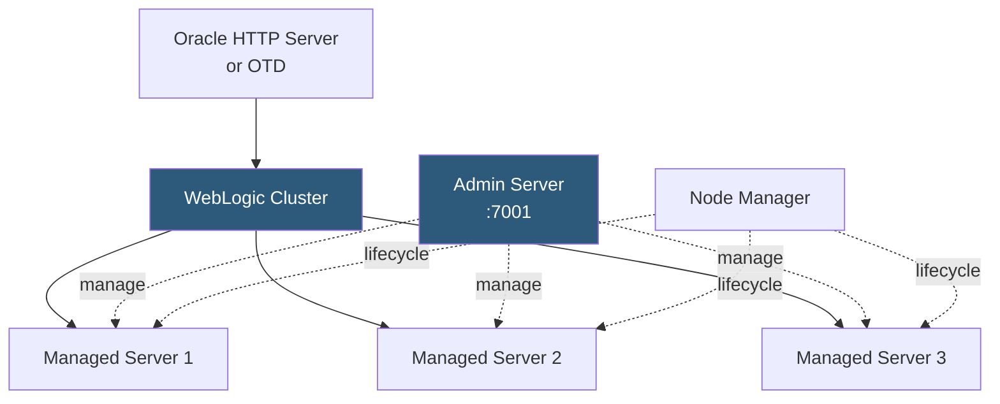

**Category:** Application Server Platforms
**Difficulty:** Advanced
**Reading time:** 7 min read

---

Oracle WebLogic Server is an enterprise-grade Jakarta EE application server with advanced clustering, Oracle database integration, and management tooling targeting large-scale financial, telecom, and government deployments. Its domain-based architecture, Administration Console, and WLST scripting interface distinguish it from open-source alternatives.

- **Domain** — WebLogic administrative unit containing an Administration Server and one or more Managed Servers
- **Administration Server** — Master server hosting WebLogic's admin console and configuration repository
- **Managed Server** — Application-hosting server instance; can run on separate machines from the Admin Server
- **Cluster** — Group of Managed Servers sharing deployment and providing failover for session replication
- **WLST** — WebLogic Scripting Tool; Jython-based CLI for automating domain creation and configuration
- **Node Manager** — Agent process on each machine enabling remote lifecycle management of Managed Servers
- **Work Manager** — WebLogic's thread allocation system controlling request queue prioritization
- **Coherence** — Oracle's distributed data grid tightly integrated with WebLogic for session and data clustering

A WebLogic domain starts with the Administration Server, which runs the management console (port 7001 by default) and holds the domain configuration in `config/config.xml`. All Managed Servers contact the Admin Server at startup to receive their configuration; if the Admin Server is unreachable, Managed Servers enter "MSI mode" (Managed Server Independence) using a local cached copy of configuration.

Node Manager runs as a daemon on each machine hosting Managed Servers. It receives commands from the Admin Server to start, stop, and monitor Managed Servers. This enables centralized lifecycle control across a multi-machine cluster. Node Manager communicates over SSL using keystore authentication.

Deployment uses the Administration Console (browser-based), WLST scripts, or `weblogic.Deployer` command-line tool. Applications are deployed as WARs or EARs to targets (clusters or individual servers). WebLogic's staging mode copies deployment artifacts to each Managed Server's staging directory; nostage mode has servers read from a shared filesystem.

Work Managers govern thread allocation for application requests. The `self-tuning` thread pool automatically adjusts thread count based on pending work items and CPU utilization. Custom Work Managers with `MinThreadsConstraint` and `MaxThreadsConstraint` can prioritize critical workloads over batch processing within the same server.

WebLogic-Oracle Database integration includes the Universal Connection Pool (UCP) with RAC-aware failover and Oracle Notification Service (ONS) for transparent application continuity during planned database maintenance. This tight integration is a primary reason for WebLogic adoption in Oracle-centric enterprises.

- Large enterprise applications requiring Oracle-certified Jakarta EE runtime
- Financial institutions running multi-million-transaction-per-day systems with XA transactions
- Organizations already invested in Oracle technology stack (DB, SOA Suite, ADF)
- Deployments requiring long-term vendor support with SLA guarantees
- Applications using Oracle ADF (Application Development Framework) built on WebLogic

| Advantage | Disadvantage |
|-----------|--------------|
| Tight Oracle DB integration with RAC-aware connection pooling | Expensive licensing; among the highest-cost Java application servers |
| Work Managers provide fine-grained thread scheduling for mixed workloads | Complex domain setup and ongoing administration requires specialized expertise |
| Node Manager enables centralized multi-machine cluster control | Large memory footprint; each Managed Server typically requires 2–4 GB heap |
| Mature, long-LTS support cycles with Oracle Premier Support | Migration off WebLogic is costly due to proprietary API usage |

- [JBoss/WildFly Hosting](jboss-wildfly-hosting.md)
- [Java Application Servers](java-application-servers.md)
- [Application Server Scaling](application-server-scaling.md)

---
*Part of the [Application Server Platforms](index.md) category · [Back to Master Index](../../index.md)*
