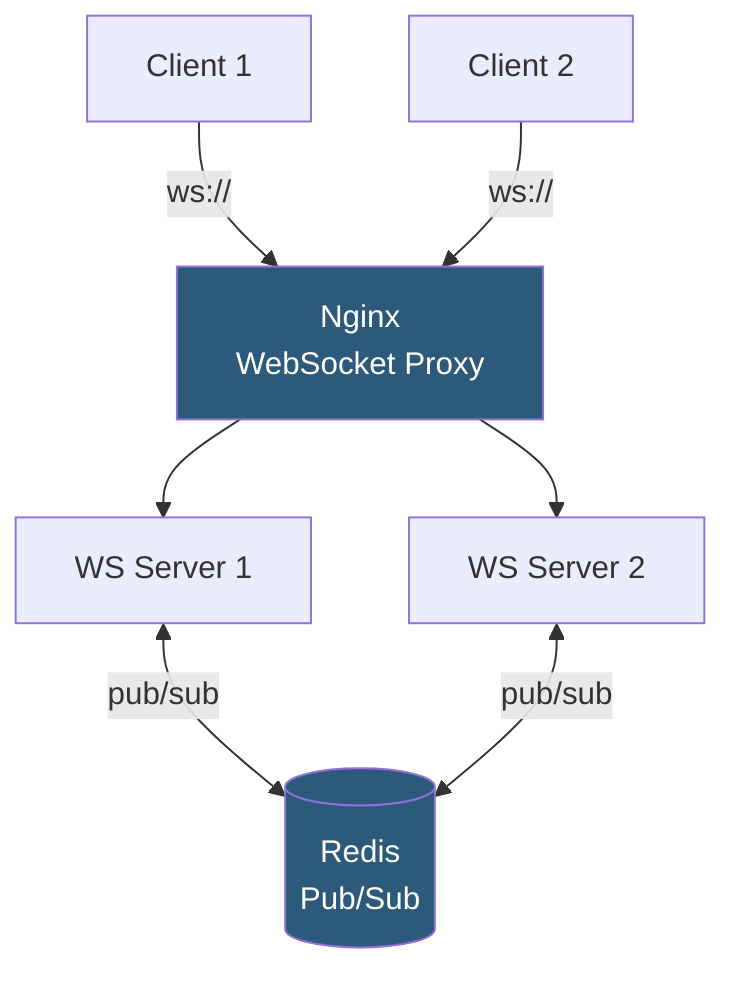

**Category:** Application Server Platforms
**Difficulty:** Intermediate
**Reading time:** 6 min read

---

WebSocket server configuration enables full-duplex, persistent TCP connections between clients and application servers, replacing polling patterns for real-time features like chat, live dashboards, and collaborative editing. Proper configuration requires connection lifecycle management, horizontal scaling strategies, and reverse proxy WebSocket passthrough.

- **WebSocket handshake** — HTTP upgrade negotiation converting an HTTP connection to a persistent WebSocket connection
- **Full-duplex** — Both client and server can send messages at any time without waiting for a request
- **`Upgrade` header** — HTTP header signaling WebSocket upgrade: `Upgrade: websocket`
- **Heartbeat / ping-pong** — Periodic frames exchanged to detect broken connections and keep NAT mappings alive
- **Socket.IO** — Node.js library providing WebSocket with fallback to long-polling and rooms/namespaces abstractions
- **Pub/Sub adapter** — Socket.IO adapter (Redis, NATS) enabling message broadcasting across multiple server instances
- **Connection limit** — OS file descriptor limit (`ulimit -n`) constraining maximum concurrent WebSocket connections
- **Backpressure** — Flow control mechanism preventing a fast sender from overwhelming a slow consumer

WebSocket connections begin as HTTP requests. The client sends an `Upgrade: websocket` header; the server responds with `101 Switching Protocols`. The TCP connection remains open; both parties can send framed binary or text messages. This persistent connection model means each connected client holds one file descriptor and one process-level connection object for the session duration.

Nginx WebSocket proxy requires `proxy_http_version 1.1` and setting `Upgrade` and `Connection` headers: `proxy_set_header Upgrade $http_upgrade; proxy_set_header Connection "upgrade"`. Without these, Nginx closes the connection after the HTTP response. The `proxy_read_timeout` should be set to a long duration (e.g., 3600s) or `0` to prevent Nginx from closing idle connections.

Node.js's `ws` library or Socket.IO handles WebSocket server implementation. Each connection triggers an `'open'` event; messages trigger `'message'`; disconnections trigger `'close'`. Connection state (subscribed rooms, user ID) is stored in a JavaScript Map on the server instance.

The scaling problem: if Server 1 holds User A's connection and User B connects to Server 2, a broadcast event must reach both users. Redis Pub/Sub adapters solve this: Server 2 publishes an event to a Redis channel; Server 1 subscribes to that channel and forwards the message to its connected clients. Socket.IO's `@socket.io/redis-adapter` implements this pattern.

OS tuning for high WebSocket counts: `ulimit -n 65535` raises file descriptor limits; `sysctl net.ipv4.tcp_max_syn_backlog=65535` handles connection queues; `net.core.somaxconn=65535` increases the listen backlog. Each connected WebSocket consumes ~10–50 KB of memory depending on message buffer sizes.

- Chat applications requiring instant message delivery to online users
- Live dashboards (trading, monitoring, analytics) pushing server-generated updates to browsers
- Collaborative editing (Google Docs-style) with real-time cursor positions and content changes
- Online gaming requiring low-latency bidirectional state synchronization
- Live sports scoring and notification systems broadcasting to thousands of simultaneous viewers

| Advantage | Disadvantage |
|-----------|--------------|
| Sub-10ms message delivery vs 1–30 second polling intervals | Persistent connections consume file descriptors; server capacity limits concurrent users |
| Eliminates polling overhead; reduces server load for real-time data | Redis pub/sub adapter is required for multi-instance horizontal scaling |
| Full-duplex enables server-initiated pushes without client requests | WebSocket connections are stateful; server crashes disconnect all clients |
| Binary frame support enables efficient non-text data transport | Firewalls and proxies sometimes block WebSocket upgrades; fallback required |

- [Long-Polling Implementation](long-polling-implementation.md)
- [Server-Sent Events (SSE)](server-sent-events-sse.md)
- [Session Management Strategies](session-management-strategies.md)

---
*Part of the [Application Server Platforms](index.md) category · [Back to Master Index](../../index.md)*
