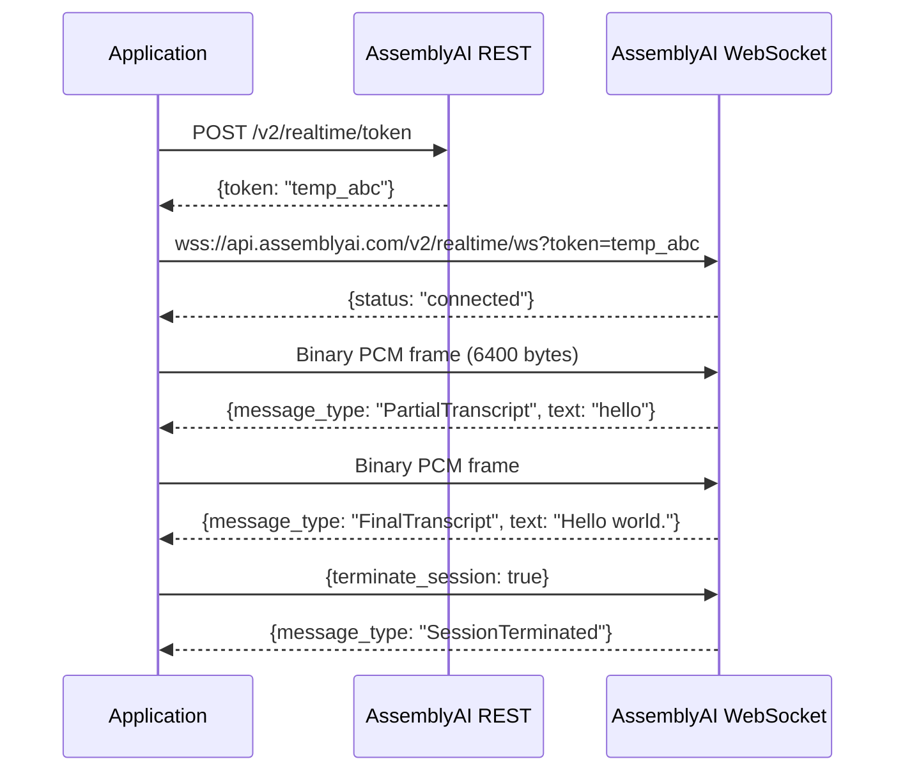

**Category:** Audio & Speech AI Hosting
**Difficulty:** Intermediate
**Reading time:** 6 min read

---

AssemblyAI's real-time transcription API uses a WebSocket connection to deliver streaming speech-to-text with partial and final transcript results at low latency, typically returning words within 300–500 ms of being spoken. The streaming interface accepts PCM audio at 16 kHz sample rate in binary WebSocket frames and emits JSON messages containing partial (in-progress) and session-terminated final transcripts. This enables live captioning, real-time voice command processing, and interactive voice applications without waiting for audio to complete.

- **WebSocket streaming** — Bidirectional persistent connection over which audio frames and transcript messages flow concurrently
- **Partial transcript** — Intermediate result returned as the model processes incoming audio; text may change as more context arrives
- **Final transcript** — Committed result for a utterance segment after a silence or turn boundary is detected
- **PCM audio** — Raw uncompressed pulse-code modulation audio; 16-bit signed integers at 16,000 Hz sample rate is the required format
- **Temporary token** — Short-lived authentication credential obtained from the REST API to authenticate WebSocket sessions without exposing API keys
- **Session termination** — Client sends `{"terminate_session": true}` to flush remaining audio and receive any pending finals
- **Word boost** — Vocabulary hints submitted at session open to improve recognition of domain-specific terms
- **End-of-utterance detection** — Model inference trigger based on acoustic silence; configurable threshold affects latency vs. segment granularity

Real-time transcription sessions begin by exchanging a short-lived token from AssemblyAI's REST API. This token is passed as a query parameter when opening the WebSocket connection from the browser or backend application, ensuring the API key is never exposed in client-side JavaScript. Session duration is limited to a configurable maximum.

Once connected, the client captures microphone audio (via the Web Audio API in browsers, or a microphone library in server-side code) and sends binary PCM frames over the WebSocket. Frames should be 100–200 ms of audio each (1,600–3,200 samples at 16 kHz) to balance latency and overhead. AssemblyAI's streaming ASR model processes frames using a streaming encoder architecture (likely CTC or RNN-T based), emitting partial transcripts as tokens are generated.

Partial transcripts allow the application to display live "typing" text in the UI. When the model detects end-of-utterance (a period of silence exceeding the threshold), it commits a final transcript for that segment. Final transcripts are stable and suitable for storing in a database or triggering downstream logic.

Word boost hints submitted at session open bias the language model toward specified terms, improving accuracy for product names, medical terminology, or unusual proper nouns. The session supports audio from any source that can produce PCM: browser microphone, VoIP streams captured via SIP integration, telephony platforms, or pre-captured audio played back in real-time.

- Live captioning for video conferencing integrations and accessibility compliance
- Real-time voice command interfaces for voice-first applications
- Call center agent assist tools that surface knowledge base articles during live calls
- Telehealth platforms transcribing clinician-patient conversations in real time
- Voice-driven search interfaces where queries are spoken rather than typed

| Advantage | Disadvantage |
|-----------|--------------|
| Sub-500ms latency from speech to displayed text | Requires audio capture infrastructure and PCM conversion in client code |
| Partial transcripts enable responsive live UI | Partial results change frequently; UI must handle revision gracefully |
| Temporary token mechanism secures browser-side streaming | WebSocket connections require persistent connectivity; mobile networks may drop sessions |
| Word boost improves domain accuracy without fine-tuning | Not suitable for batch processing of pre-recorded audio (use async API instead) |

- [AssemblyAI Speech-to-Text](assemblyai-speech-to-text.md)
- [Deepgram Streaming API](deepgram-streaming-api.md)
- [Voice Activity Detection (VAD)](voice-activity-detection-vad.md)

---
*Part of the [Audio & Speech AI Hosting](index.md) category · [Back to Master Index](../../index.md)*
