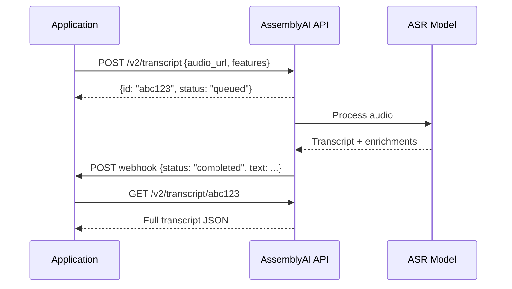

**Category:** Audio & Speech AI Hosting
**Difficulty:** Beginner
**Reading time:** 5 min read

---

AssemblyAI is a developer-focused speech recognition platform offering REST and WebSocket APIs for batch and real-time audio transcription, with enrichment features including speaker diarization, auto chapters, sentiment analysis, and PII redaction built into a single request. The platform targets application developers rather than ML teams, providing pre-trained models accessible via simple API calls without needing to understand the underlying model architecture. Pricing is usage-based per audio minute with tiered rates for different feature combinations.

- **Async transcription** — Submit audio URL, receive a job ID, poll or use webhook for results; suited for pre-recorded audio
- **Universal-2 model** — AssemblyAI's flagship ASR model with state-of-the-art English accuracy and optimized word error rate
- **Speaker diarization** — Automatic labeling of "who spoke when" across multiple speakers in a single recording
- **Auto chapters** — AI-generated chapter titles and summaries based on topic changes in the transcript
- **LeMUR** — AssemblyAI's LLM-over-transcript API enabling natural language Q&A and summarization on top of transcripts
- **PII redaction** — Automatic detection and replacement of personal identifiable information in transcript text and audio
- **Content safety** — Detection of hate speech, profanity, and sensitive content categories with confidence scores
- **Webhook** — HTTP callback to notify the application when asynchronous transcription completes

AssemblyAI's async transcription workflow begins with a POST to `/v2/transcript` containing the `audio_url` and optional feature flags. The API queues the job, returns an ID with status `queued`, and begins processing asynchronously. The API fetches the audio from the provided URL (or accepts direct file upload), runs the Universal-2 ASR model, and applies any requested enrichment features in parallel where possible.

Enrichment features are composable: enabling `speaker_labels: true` adds diarization without additional API calls; `auto_highlights: true` extracts key phrases; `sentiment_analysis: true` scores each sentence as positive/negative/neutral. These run as post-processing passes over the base transcript within the same response, avoiding the need to chain multiple API calls.

The LeMUR feature builds on top of completed transcripts: developers POST natural language prompts (e.g., "Summarize the action items from this meeting") and receive AI-generated responses grounded in the transcript content. This creates a complete audio-to-insight pipeline within a single platform.

For real-time use cases, AssemblyAI's streaming WebSocket API accepts PCM audio frames and returns partial then final transcripts with low latency. Authentication uses API keys; sessions are established with a temporary token obtained from the REST API to avoid exposing keys in browser JavaScript.

Rate limits depend on the pricing tier; enterprise plans support hundreds of concurrent transcription jobs. The API supports audio from URLs, direct upload, or integration with storage services.

- Meeting intelligence platforms extracting action items and summaries from recorded calls
- Podcast transcription services with speaker attribution for publication
- Legal and compliance recording transcription with PII redaction
- Customer service analytics platforms processing support call recordings
- Accessibility tools generating captions for video content platforms

| Advantage | Disadvantage |
|-----------|--------------|
| Rich feature set (diarization, chapters, sentiment) in a single API call | Dependent on third-party service; outages affect product availability |
| No infrastructure to manage; scales automatically | Per-minute pricing becomes costly at very high volume versus self-hosted |
| Webhook and polling support for async workloads | Audio must be accessible via URL or uploaded, adding latency for large files |
| LeMUR enables LLM queries directly on transcripts | English accuracy is best; other languages lag behind |

- [AssemblyAI Real-time Transcription](assemblyai-real-time-transcription.md)
- [Deepgram Speech Recognition](deepgram-speech-recognition.md)
- [Speaker Diarization Services](speaker-diarization-services.md)

---
*Part of the [Audio & Speech AI Hosting](index.md) category · [Back to Master Index](../../index.md)*
