**Category:** Audio & Speech AI Hosting
**Difficulty:** Intermediate
**Reading time:** 5 min read

---

Audio classification APIs analyze audio content to identify sound types, music genres, environmental sounds, speech vs. noise, and other categorical attributes without transcribing speech. These APIs are foundational for content moderation, media analytics, IoT sound detection, and accessibility applications. Major providers include Google Cloud's Video Intelligence API (for video audio), Amazon Rekognition Audio (limited), and specialized open-source models like YAMNet (Google), PANNs, and Wav2Vec2-based classifiers hosted on Hugging Face.

- **YAMNet** — Google's deep neural network for audio event classification trained on the AudioSet ontology (521 sound classes)
- **AudioSet** — Google's large-scale audio dataset and ontology containing 632 sound classes organized hierarchically
- **Sound event detection (SED)** — Temporal detection of when specific sounds occur within a recording, with onset/offset timestamps
- **Music genre classification** — Categorizing music audio into genres (rock, jazz, classical, etc.) using mel spectrogram features
- **Speech vs. music detection** — Binary classification separating spoken content from musical content for routing decisions
- **Mel spectrogram** — Time-frequency representation of audio used as input features for most deep learning audio classifiers
- **Top-k predictions** — Returning the most probable k class labels with confidence scores for each audio segment
- **Transfer learning** — Fine-tuning a pretrained audio classifier (YAMNet, PANNs) on a custom sound class dataset with limited labeled data

```mermaid
graph LR
    Audio["Audio Input"] --> Resample["Resample to 16kHz"]
    Resample --> Frames["Frame into 0.96s windows"]
    Frames --> MelSpec["Mel Spectrogram Extraction"]
    MelSpec --> Model["Classifier (YAMNet/PANNs)"]
    Model --> Embeddings["Audio Embeddings"]
    Embeddings --> Softmax["Class Probability Output"]
    Softmax --> TopK["Top-k Labels + Scores"]
    style MelSpec fill:#2d5a7a,color:#fff
    style Model fill:#2d5a7a,color:#fff
    style Softmax fill:#2d5a7a,color:#fff
```

Audio classification typically operates on fixed-length audio windows (0.96 seconds for YAMNet, 1–2 seconds for most classifiers) with overlapping frames processed sequentially to produce temporal predictions. The pipeline begins with resampling audio to the model's required sample rate (16 kHz for most models) and computing Mel spectrograms — log-scaled time-frequency representations that emphasize perceptually relevant frequency bands.

The classifier model (CNN, MobileNet, or transformer-based depending on the architecture) processes the Mel spectrogram and outputs a probability distribution over all sound classes. YAMNet uses a MobileNetV1 architecture that is lightweight enough for on-device deployment; PANN (Pretrained Audio Neural Networks) models include larger CNN14 and ResNet architectures achieving higher accuracy at higher compute cost.

For hosted API usage, Google Cloud's Speech-to-Text V2 API includes audio language identification and speech activity detection. For general audio event detection, the most practical hosted approach uses Hugging Face Inference Endpoints running YAMNet or fine-tuned Wav2Vec2 classifiers. The `transformers` library provides `pipeline("audio-classification")` for standardized access.

Sound event detection (SED) extends classification to temporal localization: rather than classifying the entire clip, SED models output per-frame predictions with onset and offset times for each detected event. This is implemented by processing overlapping short windows and applying threshold-based peak detection on the class probability time series.

Fine-tuning for custom sound classes (e.g., detecting specific industrial equipment sounds or call center emotion) requires 100–500 labeled examples per class using transfer learning from YAMNet or PANN embeddings as feature extractors.

- Content moderation platforms classifying uploaded audio for gunshot, explosion, or distress sounds
- Smart home devices detecting glass breaking, smoke alarms, and baby crying without voice recognition
- Music streaming platforms building genre and mood playlists from audio-only classification
- Industrial IoT monitoring detecting machinery anomalies from ambient sound signatures
- Podcast platforms automatically tagging episodes by content type (interview, music, news)

| Advantage | Disadvantage |
|-----------|--------------|
| Pretrained models (YAMNet, PANNs) cover 500+ sound classes without training | AudioSet classes are broad; fine-tuning needed for specialized industrial or niche sounds |
| Lightweight YAMNet runs on CPU and mobile devices without GPU | Classification operates on fixed windows; transitional sounds spanning window boundaries can be missed |
| Transfer learning from pretrained embeddings requires minimal labeled data | Real-time classification adds streaming processing complexity versus batch analysis |
| Open-source models deployable without per-request API costs | Accuracy on overlapping simultaneous sounds is lower than single-source classification |

- [Music Information Retrieval](music-information-retrieval.md)
- [Audio Fingerprinting Services](audio-fingerprinting-services.md)
- [Voice Activity Detection (VAD)](voice-activity-detection-vad.md)

---
*Part of the [Audio & Speech AI Hosting](index.md) category · [Back to Master Index](../../index.md)*
