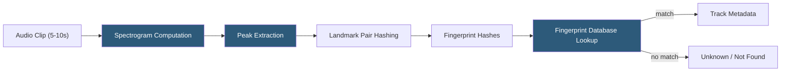

**Category:** Audio & Speech AI Hosting
**Difficulty:** Intermediate
**Reading time:** 6 min read

---

Audio fingerprinting identifies audio content by generating a compact, robust hash (fingerprint) from perceptually significant features of an audio signal that survives compression, noise, and encoding changes. The technology underlies music identification services (Shazam, AudD), broadcast monitoring systems, and rights management platforms. Core open-source implementations include Chromaprint (used by AcoustID) and dejavu; commercial APIs include AudD and ACRCloud, which identify music from short clips in real time.

- **Fingerprint** — Compact binary or hash representation derived from perceptually significant audio features; robust to distortion
- **Chromaprint** — Open-source fingerprinting algorithm using chroma-based features developed for the AcoustID music identification database
- **AcoustID** — Open music fingerprint database linking Chromaprint fingerprints to MusicBrainz identifiers for open music identification
- **ACRCloud** — Commercial audio recognition platform with a database of 100M+ tracks and a REST API for identification
- **AudD** — Commercial music recognition API identifying music from short audio clips with metadata returned from licensed databases
- **Landmark fingerprinting** — Shazam-style approach using frequency peak pairs as landmarks; efficient database lookup via combinatorial hash
- **Time-frequency peaks** — Local maxima in the spectrogram that are robust to additive noise and time/frequency shifts
- **Hash table lookup** — O(1) average-case fingerprint matching against a database of precomputed fingerprints

Landmark-based fingerprinting (Shazam's algorithm, published by Wang 2003) begins by computing the spectrogram of a short audio clip. Peak picking identifies local maxima in the time-frequency plane that are robust to masking by noise — peaks are chosen because they correspond to strong harmonic or percussive content that survives lossy compression and recording noise.

Pairs of peaks within a defined time window form landmarks. Each pair contributes a hash combining the frequency of both peaks and their time difference. This combinatorial hashing creates thousands of fingerprint hashes per second of audio. Database lookup retrieves tracks matching those hashes; the time alignment between matched hashes in the query and database confirms a match.

Chromaprint uses a different approach: it extracts chroma features (12-pitch-class energy) over 3.6-second windows and computes a 32-bit fingerprint integer per window by comparing adjacent chroma frame differences. A 120-second recording produces ~120 fingerprint integers. AcoustID's database maps fingerprint vectors to MusicBrainz track IDs, enabling free music identification for exact recordings (full quality, not short clips).

Commercial APIs (ACRCloud, AudD) accept audio uploads via REST, compute fingerprints server-side, and return matches from licensed databases containing metadata including ISRC, artist, album, and streaming links. ACRCloud supports real-time broadcast monitoring by accepting a continuous audio stream and returning identification events as matches occur. Their database covers music, TV shows, radio broadcasts, and custom audio assets.

Self-hosted fingerprinting uses the Python `pyacoustid` library (wrapping Chromaprint) for music identification or `dejavu` for custom fingerprint database construction and matching.

- Mobile apps identifying songs from ambient audio capture (Shazam-style)
- Broadcast monitoring services detecting music airplay for royalty collection and reporting
- Podcast platforms identifying background music in uploads for licensing compliance
- UGC platforms detecting copyrighted music in user-uploaded videos before publication
- Music archiving systems linking digitized recordings to metadata databases via fingerprint matching

| Advantage | Disadvantage |
|-----------|--------------|
| Identification works from 5–10 seconds of audio with background noise | Fingerprinting databases require licensing agreements or significant crawling investment to build |
| Hash-based lookup is sub-millisecond for database matching | Novel or unreleased music not in the database cannot be identified |
| Robust to MP3 compression, volume changes, and equalization | Live performances with different arrangements may not match studio recording fingerprints |
| ACRCloud and AudD provide ready-to-use identification APIs | Commercial APIs have per-query pricing that becomes costly for high-volume broadcast monitoring |

- [Audio Classification APIs](audio-classification-apis.md)
- [Music Information Retrieval](music-information-retrieval.md)
- [Real-time Audio Processing](real-time-audio-processing.md)

---
*Part of the [Audio & Speech AI Hosting](index.md) category · [Back to Master Index](../../index.md)*
