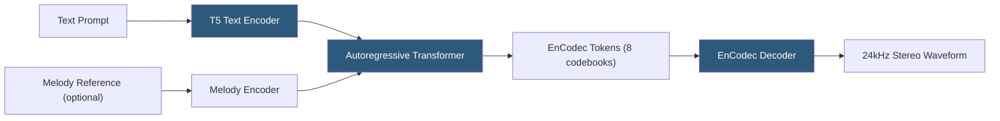

**Category:** Audio & Speech AI Hosting
**Difficulty:** Advanced
**Reading time:** 6 min read

---

AudioCraft is Meta's open-source generative audio framework encompassing three models: MusicGen (text-to-music), AudioGen (text-to-sound-effects), and EnCodec (neural audio codec). Released in 2023 under the MIT license, AudioCraft provides the infrastructure to self-host state-of-the-art generative audio models for music creation, sound effect generation, and audio compression research. Deployment requires GPU hardware and the AudioCraft Python library built on PyTorch and xformers.

- **MusicGen** — Text-to-music model generating 30-second stereo music clips from text descriptions and optional melody conditioning
- **AudioGen** — Text-to-sound-effects model generating environmental sounds, mechanical noise, and ambient audio from descriptions
- **EnCodec** — Neural audio codec compressing 24 kHz or 48 kHz audio to discrete tokens; used internally by MusicGen/AudioGen and available standalone
- **Melody conditioning** — MusicGen feature that generates music following a hummed or recorded melody provided as reference audio
- **CFG (Classifier-Free Guidance)** — Inference technique amplifying the text conditioning signal; higher CFG scales improve prompt adherence at some diversity cost
- **Model size** — MusicGen available in small (300M), medium (1.5B), and large (3.3B) parameter variants
- **Codebook** — Discrete vocabulary of audio tokens used by EnCodec; 8 codebooks at 75 Hz enable high-fidelity reconstruction
- **Stereo generation** — MusicGen-stereo variant producing two-channel audio with spatial separation

AudioCraft models share a common architectural pattern: a pretrained text encoder (T5-based) converts the text prompt to conditioning vectors; an autoregressive transformer generates sequences of discrete EnCodec tokens conditioned on the text; EnCodec's decoder reconstructs the waveform from those tokens.

MusicGen's autoregressive transformer generates tokens for all 8 EnCodec codebooks simultaneously using a delay pattern — each codebook level is offset by one timestep, enabling parallel generation while maintaining the inter-codebook dependencies required for high-fidelity reconstruction. This delay pattern is what enables MusicGen to generate in real time at similar speed to audio playback on high-end GPUs.

Melody conditioning in MusicGen-melody encodes a reference audio clip through a chromagram-based feature extractor, producing pitch contour representations that condition the generation to follow the melodic shape of the reference. This enables users to hum a tune and generate a fully produced musical arrangement matching that melody.

Deployment requires installing `audiocraft` from Meta's GitHub repository, PyTorch with CUDA, and xformers for attention optimization. The `small` MusicGen model fits in 4 GB VRAM; `large` requires 16+ GB. Generation of 30 seconds of audio takes 10–30 seconds on an A100 GPU depending on model size and CFG scale.

Production serving typically wraps the model in a Gradio demo or FastAPI endpoint with a job queue. Hugging Face Spaces provides free hosted demos of AudioCraft models for prototyping without self-hosting. For commercial use cases, the MIT license permits commercial deployment.

- Background music generation for videos, podcasts, and presentations from text descriptions
- Sound effect library generation for game development and film production
- Music prototyping tool for composers exploring arrangement ideas from melody humming
- Research into neural audio codec architectures and generative audio models
- Content creation platforms integrating AI music generation as a premium feature

| Advantage | Disadvantage |
|-----------|--------------|
| MIT license permits unrestricted commercial use | High VRAM requirements; large model needs 16+ GB GPU |
| Integrated melody conditioning enables intuitive music direction | Output limited to 30 seconds; long-form music requires concatenation strategies |
| EnCodec available standalone for audio compression research | No voice synthesis; purely music/sound effects domain |
| Stereo generation produces spatially interesting output | Text prompt quality significantly affects output; requires prompt engineering skill |

- [MusicGen Model Deployment](musicgen-model-deployment.md)
- [Stable Audio Generation](stable-audio-generation.md)
- [Bark Text-to-Audio Model](bark-text-to-audio-model.md)

---
*Part of the [Audio & Speech AI Hosting](index.md) category · [Back to Master Index](../../index.md)*
