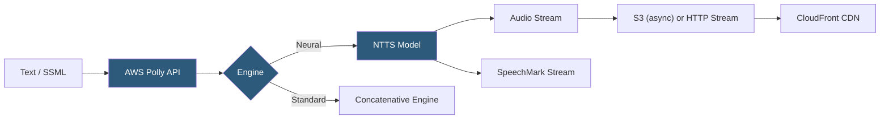

**Category:** Audio & Speech AI Hosting
**Difficulty:** Beginner
**Reading time:** 5 min read

---

AWS Polly is Amazon's text-to-speech service offering 60+ voices across 30+ languages using neural (NTTS) and standard (concatenative) synthesis engines. Polly is deeply integrated with the AWS ecosystem — output can be streamed directly, stored to S3 via SpeechMark async tasks, or integrated with Amazon Connect and Lex for IVR applications. SpeechMarks are a Polly-specific feature providing JSON metadata (word, sentence, SSML, viseme) synchronized with synthesized audio, enabling rich client-side applications.

- **NTTS (Neural TTS)** — Amazon's neural synthesis engine delivering more natural-sounding speech; uses Tacotron2 + WaveGlow architecture
- **Standard engine** — Traditional concatenative synthesis; lower cost and latency but less natural than NTTS
- **SpeechMark** — JSON metadata records (word, sentence, SSML, viseme types) synchronized with audio for client-side applications
- **Lexicons** — Custom pronunciation rules in PLS (Pronunciation Lexicon Specification) format, stored and reused across requests
- **SSML** — Speech Synthesis Markup Language support with standard tags plus Amazon-specific `<amazon:effect>` extensions
- **Asynchronous synthesis** — `StartSpeechSynthesisTask` for long text; output written to S3 bucket
- **Streaming synthesis** — `SynthesizeSpeech` for short text (3000 char NTTS, 6000 char standard); returns audio stream directly
- **Brand Voice** — Custom Polly voice creation program for enterprises (limited access, requires application)

Polly's `SynthesizeSpeech` API accepts up to 3000 billable characters (NTTS) or 6000 characters (standard). The `OutputFormat` parameter selects `mp3`, `ogg_vorbis`, `pcm`, or `json` (for SpeechMarks only). The `VoiceId` parameter selects from the 60+ available voices; `Engine` selects `neural` or `standard`.

SpeechMarks are the key differentiator for interactive applications. By requesting SpeechMark types in a separate API call (`OutputFormat: json`), Polly returns a stream of JSON objects, each containing a `type` (word, sentence, ssml, viseme), `value` (the word text or viseme ID), and `time` offset in milliseconds. Applications sync these events with audio playback to highlight words in read-along apps, drive avatar lip-sync, or trigger UI animations.

Lexicons allow custom pronunciations to be defined in PLS XML format and stored in the AWS account. A `PutLexicon` call stores the lexicon by name; synthesis requests reference lexicon names in the `LexiconNames` parameter. Lexicons are effective for product names, acronyms, and technical terms that Polly's default pronunciation rules handle incorrectly.

For long texts, `StartSpeechSynthesisTask` submits an async job with an S3 bucket for output. The task ID is polled via `GetSpeechSynthesisTask` or notification arrives via SNS. This bypasses the 3000/6000 character limits and is the standard pattern for document narration, audiobook generation, and IVR prompt management systems.

Polly integrates natively with Amazon Lex (conversational AI) and Amazon Connect (contact center), enabling speech synthesis without additional service calls in those workflows.

- AWS-native IVR and contact center systems using Amazon Connect with native Polly integration
- Read-along e-learning applications using SpeechMarks for synchronized word highlighting
- Audiobook and podcast generation pipelines writing output directly to S3 for CDN distribution
- Amazon Lex chatbots synthesizing voice responses in conversational AI applications
- Cost-sensitive high-volume TTS workloads using standard engine for price optimization

| Advantage | Disadvantage |
|-----------|--------------|
| SpeechMark metadata enables rich synchronized client experiences | 3000/6000 character limits require text chunking for long content on streaming endpoint |
| Native S3 output for async tasks integrates with AWS storage workflows | 60 voices across 30 languages is narrower than Google (380+) or Azure (400+) |
| Lexicon system for reusable pronunciation overrides | NTTS availability limited to subset of total voice catalog |
| Tight integration with Amazon Connect and Lex | Brand Voice custom voice program has very limited availability |

- [Google Cloud Text-to-Speech](google-cloud-text-to-speech.md)
- [Azure Neural TTS](azure-neural-tts.md)
- [IBM Watson Text to Speech](ibm-watson-text-to-speech.md)

---
*Part of the [Audio & Speech AI Hosting](index.md) category · [Back to Master Index](../../index.md)*
