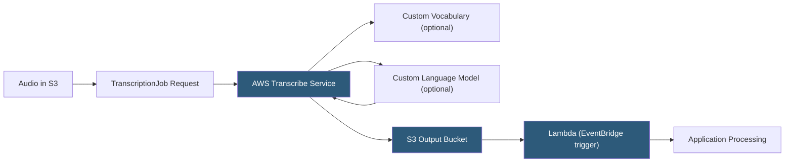

**Category:** Audio & Speech AI Hosting
**Difficulty:** Intermediate
**Reading time:** 6 min read

---

AWS Transcribe is Amazon's managed automatic speech recognition service integrated into the AWS ecosystem, offering both batch transcription for pre-recorded audio and streaming recognition via HTTP/2 or WebSocket. The service provides specialized variants including Transcribe Medical (FDA-compliant for clinical documentation), Transcribe Call Analytics (contact center intelligence), and Transcribe Subtitling. Tight integration with S3, Lambda, and Amazon Connect makes it the natural choice for AWS-native speech processing pipelines.

- **Transcription job** — Asynchronous batch request pointing to an S3 object; results are written to an S3 output location
- **Streaming transcription** — HTTP/2 bidirectional stream or WebSocket for real-time audio with partial and final results
- **Custom vocabulary** — File-based list of words with optional pronunciation hints to improve domain accuracy
- **Custom language model** — Fine-tuned language model trained on domain-specific text corpora (not audio)
- **Vocabulary filter** — Word-level profanity and PII masking applied to transcript output
- **Medical Transcribe** — Specialty service for clinical documentation meeting HIPAA requirements with medical vocabulary
- **Call Analytics** — Transcription service with built-in call summarization, issue detection, and customer sentiment
- **Content redaction** — Automatic PII detection and replacement with `[PII]` placeholder tags

AWS Transcribe batch jobs accept audio stored in S3 in formats including MP3, MP4, WAV, FLAC, AMR, OGG, and WebM. A `StartTranscriptionJob` API call specifies the S3 input URI, output bucket, language code, and optional features. The job is processed asynchronously; completion notification arrives via Amazon EventBridge, SNS, or polling the `GetTranscriptionJob` API.

The transcript JSON output is written to the specified S3 output bucket. The `results.transcripts[0].transcript` field contains the full text; `results.items` contains per-word entries with start/end times, types (pronunciation or punctuation), and confidence scores. This structure enables word-level downstream processing without parsing the transcript text.

Custom vocabulary addresses domain terminology at the acoustic level. Teams submit a vocabulary file as TSV with columns for the target word, its pronunciation (in IPA or SoundsLike format), and the display form. The SoundsLike column accepts phonetic respelling in English (e.g., "Re-In-Force-Ment-Lear-Ning" for "ReinforcementLearning"), avoiding the need for IPA expertise.

Custom language models (CLMs) operate at the language model level rather than acoustics. Teams provide text data (documentation, call scripts, domain corpora) of at least 10,000 lines; Transcribe trains an n-gram or neural LM that improves contextual word selection without requiring labeled audio-transcript pairs. CLMs are particularly effective for consistent recognition of multi-word phrases and named entities.

Transcribe Call Analytics adds post-processing intelligence: speaker sentiment scores, interruption detection, silence ratio measurement, and automatic issue/resolution classification using ML models trained on contact center data.

- AWS-native data pipelines processing audio from S3 with Lambda-triggered downstream workflows
- Contact centers running on Amazon Connect leveraging integrated Call Analytics
- Healthcare documentation systems using Medical Transcribe for HIPAA-compliant clinical notes
- Media workflows transcribing video content with EventBridge automation triggers
- Compliance archiving systems requiring automatic PII redaction from call recordings

| Advantage | Disadvantage |
|-----------|--------------|
| Native S3 integration eliminates audio transfer overhead for AWS workloads | Custom vocabulary and CLM require separate management and versioning |
| Medical Transcribe provides specialized HIPAA-compliant clinical ASR | Non-AWS audio sources require upload to S3 before transcription |
| Call Analytics provides call center intelligence without additional ML tooling | Streaming API uses HTTP/2 bidirectional streams, which are less ubiquitously supported than WebSockets |
| CLMs train on text data only — no labeled audio required | Language support narrower than Google or Azure for non-English languages |

- [Google Cloud Speech-to-Text](google-cloud-speech-to-text.md)
- [Azure Speech Services](azure-speech-services.md)
- [IBM Watson Speech to Text](ibm-watson-speech-to-text.md)

---
*Part of the [Audio & Speech AI Hosting](index.md) category · [Back to Master Index](../../index.md)*
