**Category:** Audio & Speech AI Hosting
**Difficulty:** Intermediate
**Reading time:** 6 min read

---

Azure Neural Text-to-Speech (Neural TTS) is Microsoft's AI-powered speech synthesis service offering 400+ neural voices across 140+ languages, with features including custom neural voice creation, prosody tuning via SSML, and speaking styles that adapt voice delivery for different contexts (newscast, customer service, cheerful, sad). The service is part of Azure Cognitive Services Speech and is deeply integrated with Azure Bot Framework, Azure Communication Services, and Microsoft's Copilot platform.

- **Neural voice** — TTS voice synthesized using neural network models trained on professional voice recordings; sounds more natural than concatenative synthesis
- **Speaking style** — Predefined emotional and contextual voice variation (newscast, chat, cheerful, shouting, whispering) available for select voices
- **Style degree** — Intensity multiplier (0.01–2.0) controlling how strongly the selected speaking style is applied
- **Role** — Age/persona variation (OlderAdultFemale, YoungAdultMale, etc.) available for specific multilingual voices
- **Custom Neural Voice** — Platform for training a branded voice model from consented professional recordings
- **Neural TTS Lite** — Reduced-quality, lower-latency variant for applications where speed matters more than quality
- **Viseme** — Visual mouth position representation synchronized with speech output; used for lip-sync animation
- **Long Audio API** — Asynchronous endpoint for synthesizing documents longer than 10 minutes of audio

```mermaid
graph LR
    SSML["Text / SSML Input"] --> SDK["Azure Speech SDK"]
    SDK --> TTS["Neural TTS Service"]
    TTS --> StyleCtrl["Style & Role Controller"]
    StyleCtrl --> NeuralVoice["Neural Voice Model"]
    NeuralVoice --> Vocoder["Neural Vocoder"]
    Vocoder --> Audio["Audio Output + Visemes"]
    style SDK fill:#2d5a7a,color:#fff
    style TTS fill:#2d5a7a,color:#fff
    style NeuralVoice fill:#2d5a7a,color:#fff
```

Azure Neural TTS is accessed via the Azure Speech SDK or REST API. The REST API accepts SSML payloads at `POST https://{region}.tts.speech.microsoft.com/cognitiveservices/v1` with the `X-Microsoft-OutputFormat` header specifying the audio encoding (Audio-16khz-128kbitrate-mono-mp3, Riff-24khz-16bit-mono-pcm, etc.).

SSML is the primary control surface. The `<voice>` element selects the voice by name; `<mstts:express-as style="newscast">` applies a speaking style. The `<prosody>` element adjusts rate, pitch, and volume. Azure extends standard SSML with custom namespaces (`mstts:`) for Microsoft-specific features including speaking styles, role selection, and silence insertion.

Speaking styles are trained on domain-specific audio for select voices. The `en-US-JennyNeural` voice supports styles including `chat`, `customerservice`, `newscast-casual`, `newscast-formal`, `empathetic`, `shouting`, and `whispering`. Style degree allows fine-tuning the intensity: `styledegree="0.5"` applies a muted version of the style suitable for subtle professional contexts.

Viseme output enables lip-sync animation for avatars and virtual agents. The Speech SDK fires viseme events synchronized with audio playback, returning a viseme ID (one of 22 mouth positions) and an offset in milliseconds. Developers map viseme IDs to 2D/3D model blendshapes for synchronized avatar animation without separately computing visemes from phonemes.

Custom Neural Voice uses the same recording and training infrastructure as Azure's built-in voices. Customers submit recorded audio (minimum 300 utterances for Neural Lite, 2000+ for full quality) after receiving Microsoft approval via the Custom Neural Voice limited access program. The resulting model is private to the customer's Speech resource.

- Microsoft Bot Framework chatbots requiring natural-sounding spoken responses
- Azure Communication Services telephony applications using synthesized voice prompts
- Multimodal avatar applications using viseme output for lip-sync
- Enterprise e-learning within Microsoft 365 ecosystem using branded organizational voices
- Multilingual accessibility tools requiring the breadth of 140+ Azure language support

| Advantage | Disadvantage |
|-----------|--------------|
| Speaking styles enable context-appropriate delivery without additional API calls | Custom Neural Voice requires Microsoft approval and significant recording investment |
| Viseme output enables lip-sync without separate processing | SSML with Microsoft namespaces creates vendor-specific markup not portable to other providers |
| 400+ voices across 140+ languages | Per-character pricing with higher rates for Neural voices versus Standard |
| Deep Azure ecosystem integration for Microsoft-native architectures | Service endpoint requires regional selection; wrong region increases latency |

- [Google Cloud Text-to-Speech](google-cloud-text-to-speech.md)
- [AWS Polly](aws-polly.md)
- [Azure Speech Services](azure-speech-services.md)

---
*Part of the [Audio & Speech AI Hosting](index.md) category · [Back to Master Index](../../index.md)*
