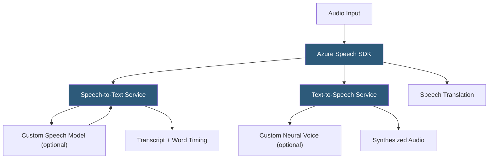

**Category:** Audio & Speech AI Hosting
**Difficulty:** Intermediate
**Reading time:** 6 min read

---

Azure Speech Services is Microsoft's unified cognitive service for speech-to-text, text-to-speech, speech translation, and speaker recognition, all accessible via a single SDK and REST API. The service supports 100+ languages for STT and 400+ neural voices for TTS, with Custom Speech functionality for fine-tuning recognition on domain-specific audio. Azure's deep enterprise integration, compliance certifications, and deployment options (cloud, on-premises containers, disconnected environments) make it the dominant choice for Microsoft ecosystem applications.

- **Speech SDK** — Unified client library for .NET, Python, Java, JavaScript, and C++ supporting all Azure Speech features
- **Custom Speech** — Service for uploading domain audio and transcripts to fine-tune the base ASR model on specific vocabulary
- **Custom Neural Voice** — Platform for creating brand-specific synthetic voices from recorded speech samples
- **Speech translation** — Real-time speech-to-text with simultaneous translation into 60+ target languages
- **Continuous recognition** — SDK mode for streaming microphone audio with event-driven partial and final result callbacks
- **Conversation transcription** — Multi-participant meeting transcription with speaker identification using voice profiles
- **Sovereign cloud deployment** — Azure Government and national cloud instances meeting data residency requirements
- **Container deployment** — Docker containers for on-premises or disconnected environments using the same API contract

Azure Speech Services exposes functionality through the Speech SDK and REST APIs. The SDK abstracts the underlying WebSocket streaming protocol, providing language-native event handlers for recognition results. In continuous recognition mode, the SDK streams microphone audio and fires `recognized` events for final utterances and `recognizing` events for interim results.

Custom Speech is the standout differentiator for enterprise deployments. Teams upload audio recordings with corresponding transcripts to create a training dataset. Azure fine-tunes the base ASR model on this data, improving recognition of industry-specific terms, product names, and regional accents. Custom models are evaluated against a test set before deployment; word error rate improvements of 20–40% are typical for domain-specific audio.

The Speech SDK supports structured output modes: `Simple` returns transcript text only, while `Detailed` returns NBest hypotheses with per-hypothesis confidence and lexical/display/ITN (inverse text normalization) form variants. ITN applies post-processing rules to convert spoken forms to written forms (e.g., "fifty dollars" → "$50").

For Conversation Transcription, the service creates voice profiles for enrolled meeting participants. During transcription, it identifies which enrolled speaker produced each utterance using speaker embeddings, enabling named speaker attribution rather than generic `Speaker 1 / Speaker 2` labels.

Container deployment packages the recognition engine and models in Docker images deployable behind a corporate firewall. Containers connect to Azure for billing metering but process audio locally, satisfying data residency requirements. Models must be pre-downloaded; containers operate offline once models are cached.

- Microsoft Teams and Office 365 ecosystem integrations using Azure-native identity and SDKs
- Enterprise healthcare applications requiring on-premises HIPAA-compliant deployment via containers
- Multilingual customer service platforms needing real-time speech translation for agents
- Accessibility tools built into Windows applications using the native Speech SDK
- Contact center analytics pipelines running within Azure data estates

| Advantage | Disadvantage |
|-----------|--------------|
| On-premises container deployment for strict data residency | SDK complexity compared to simple REST APIs of pure SaaS competitors |
| Custom Speech fine-tuning with measurable WER improvement | Custom model training and evaluation cycle takes days to complete |
| 400+ neural TTS voices with Custom Neural Voice option | Custom Neural Voice requires Microsoft approval and recorded speaker consent |
| Deep Azure ecosystem integration (Azure Cognitive Services, Bot Framework) | Premium features (Custom Neural Voice, Conversation Transcription) have higher per-unit pricing |

- [Google Cloud Speech-to-Text](google-cloud-speech-to-text.md)
- [AWS Transcribe](aws-transcribe.md)
- [Azure Neural TTS](azure-neural-tts.md)

---
*Part of the [Audio & Speech AI Hosting](index.md) category · [Back to Master Index](../../index.md)*
