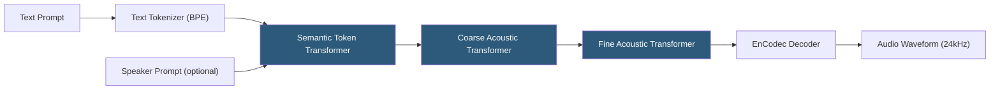

**Category:** Audio & Speech AI Hosting
**Difficulty:** Advanced
**Reading time:** 6 min read

---

Bark is an open-source text-to-audio model developed by Suno AI that generates not only speech but also music, sound effects, and environmental audio from text prompts, making it one of the most versatile generative audio models available. Unlike traditional TTS systems, Bark uses a GPT-style transformer architecture to generate audio tokens that are decoded to waveforms, enabling behaviors like laughing, singing, background noise, and non-verbal sounds within a single generation. Deploying Bark requires GPU resources (minimum 8 GB VRAM) and Python libraries from Hugging Face.

- **Semantic tokens** — Intermediate discrete text-to-coarse-audio representations generated by Bark's first-stage transformer
- **Coarse acoustic tokens** — Second-stage audio codebook tokens representing spectral structure at a coarse temporal resolution
- **Fine acoustic tokens** — Third-stage high-resolution audio codebook tokens refining the coarse representation
- **EnCodec** — Meta's neural audio codec that Bark uses for audio tokenization and decoding; converts between waveforms and audio tokens
- **Speaker prompt** — Optional short audio clip whose tokens condition generation on a specific speaker's voice characteristics
- **Non-speech sounds** — Bark-specific text prompts enclosed in brackets (`[laughs]`, `[music]`, `[gasps]`) that generate non-verbal sounds
- **suno/bark-small** — Smaller Bark variant (350M parameters) requiring less VRAM for resource-constrained deployments
- **Long-form generation** — Splitting long text into sentences and concatenating generated segments with speaker prompt chaining

Bark's architecture comprises four neural network stages. The first stage is a GPT-style transformer that converts text tokens (tokenized with BPE encoding) into semantic tokens — discrete codes capturing linguistic and prosodic intent. The second stage converts semantic tokens to coarse EnCodec tokens (first 2 of 8 codebook levels) at 75 Hz resolution. The third stage fills in the remaining 6 fine EnCodec codebook levels at the same temporal resolution. Finally, EnCodec's decoder converts all 8 codebook levels back to a 24 kHz waveform.

Bark's generation is stochastic: different runs with the same text produce different audio. Speaker conditioning is achieved by encoding a short reference audio clip through EnCodec to extract speaker tokens, which are prepended to the semantic token sequence to bias generation toward the reference speaker's characteristics. This is approximate voice cloning — results are speaker-influenced but not as precise as dedicated voice cloning models.

Non-speech generation is a unique capability: placing `[laughs]`, `[sighs]`, `[music]`, or `[clears throat]` in the prompt text causes the model to generate those sound types inline with speech. Multilingual generation uses language-specific text; Bark supports English, German, Spanish, French, Hindi, Italian, Japanese, Korean, Polish, Portuguese, Russian, Turkish, and Chinese.

Deployment uses the `suno/bark` Hugging Face model with the `bark` Python package or `transformers`. The full model requires 12+ GB VRAM for comfortable generation; `suno/bark-small` fits in 8 GB. A100 GPUs generate audio at approximately 0.5–1× real-time; inference on CPU is feasible but extremely slow.

For production serving, Bark is typically wrapped in a FastAPI or Flask endpoint with a GPU-backed worker pool, using a job queue to serialize requests per GPU.

- Game and animation audio prototyping requiring expressive NPC voices with non-verbal sounds
- AI-generated podcast content with natural laughing, hesitations, and ambient sounds
- Creative audio production exploring AI-generated soundscapes mixed with speech
- Research into generative audio models and audio codec architectures
- Accessibility tools generating emotionally expressive TTS beyond flat narration

| Advantage | Disadvantage |
|-----------|--------------|
| Generates speech, music, and sound effects from text prompts in a single model | Slow inference; not suitable for real-time applications without significant GPU hardware |
| Non-verbal sound generation enables naturalistic conversational audio | Stochastic output means results are not reproducible; quality varies across generations |
| Open-source with permissive license (MIT); no API costs | Requires 8–16 GB VRAM; high hardware cost for production deployment |
| Multilingual support across 13 languages with a single model | Voice cloning is approximate; dedicated voice cloning models achieve higher speaker similarity |

- [Tortoise TTS Deployment](tortoise-tts-deployment.md)
- [XTTS Voice Synthesis](xtts-voice-synthesis.md)
- [AudioCraft Model Hosting](audiocraft-model-hosting.md)

---
*Part of the [Audio & Speech AI Hosting](index.md) category · [Back to Master Index](../../index.md)*
