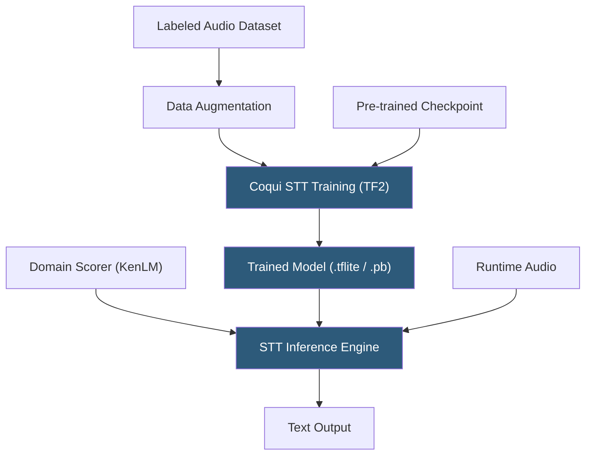

**Category:** Audio & Speech AI Hosting
**Difficulty:** Advanced
**Reading time:** 6 min read

---

Coqui STT (formerly STT, forked from Mozilla DeepSpeech after Mozilla discontinued the project) is an open-source, deep learning speech-to-text toolkit that continued DeepSpeech's development trajectory with improved models, additional language support, and an active community. Coqui provided pre-trained models, a training recipe, and inference libraries before Coqui Inc. shut down in January 2024. The open-source codebase and trained model weights remain available and actively used in self-hosted deployments.

- **CTC architecture** — Connectionist Temporal Classification decoder inherited from DeepSpeech; maps acoustic features to character sequences
- **Scorer** — KenLM n-gram language model binary used in beam search decoding to improve word selection accuracy
- **Training recipe** — Python-based training pipeline using TensorFlow/TF2 for fine-tuning acoustic models on custom audio datasets
- **Transfer learning** — Starting fine-tuning from a pre-trained checkpoint rather than random initialization, reducing required training data
- **STT Python package** — `stt` PyPI package providing Python bindings to the Coqui STT inference engine
- **TFLITE model** — Compressed TensorFlow Lite model for mobile and embedded deployment
- **Alphabet** — Character set definition file controlling which characters the model can output; must match training configuration
- **External scorer** — Separately loadable language model enabling scorer replacement without full model retraining

Coqui STT's inference engine is functionally similar to Mozilla DeepSpeech: it processes 16 kHz mono PCM audio through an MFCC feature extractor, feeds features into a bidirectional LSTM acoustic model, and decodes output probabilities with CTC beam search using an optional KenLM scorer. The inference Python API provides both batch (`stt()`) and streaming context methods (`createStream`, `feedAudioContent`, `finishStream`).

The training pipeline uses DeepSpeech's TensorFlow training code adapted for TF2 compatibility. Custom model training requires a CSV manifest file mapping audio file paths to transcript strings. Augmentation options include frequency masking, time masking, speed perturbation, and additive noise injection to improve model robustness. Transfer learning from a Coqui pre-trained checkpoint requires only thousands of utterances to adapt to a new accent or domain; training from scratch requires 100+ hours of audio.

The external scorer system separates language modeling from acoustic modeling. Custom scorers are built using KenLM: collect domain text corpora, train an n-gram model with `lmplz`, compile it to binary with `build_binary`, then bundle it with a vocabulary file into a `.scorer` archive. Loading a custom scorer at inference time requires no model retraining; scorer swapping is instantaneous, making it practical to maintain multiple domain scorers for the same base acoustic model.

Deployment options include the Python `stt` package for in-process inference, building a WebSocket server similar to Vosk Server, or containerizing the inference service with a REST API wrapper.

- Self-hosted offline ASR for multilingual applications using community-trained models
- Research prototyping requiring a transparent, trainable ASR baseline
- Transfer learning projects adapting pre-trained English or multilingual checkpoints to new accents
- Embedded applications using TFLite models on constrained devices
- Privacy-critical applications requiring verifiable, auditable, locally-running ASR

| Advantage | Disadvantage |
|-----------|--------------|
| Fully open-source with permissive Apache 2.0 license | Coqui Inc. shut down in 2024; no commercial support or active core team |
| Transfer learning reduces labeled audio requirements for custom models | Accuracy significantly below modern transformer-based models |
| External scorer enables language model updates without retraining | CTC architecture lacks attention mechanisms limiting long-range context modeling |
| TFLite model supports embedded and mobile deployment | TensorFlow dependency creates version compatibility management overhead |

- [Mozilla DeepSpeech Hosting](mozilla-deepspeech-hosting.md)
- [Vosk Offline Speech Recognition](vosk-offline-speech-recognition.md)
- [Whisper Model Deployment](whisper-model-deployment.md)

---
*Part of the [Audio & Speech AI Hosting](index.md) category · [Back to Master Index](../../index.md)*
