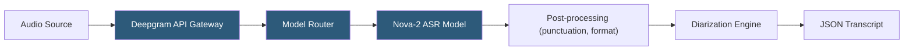

**Category:** Audio & Speech AI Hosting
**Difficulty:** Beginner
**Reading time:** 5 min read

---

Deepgram is an end-to-end deep learning speech recognition platform built around proprietary neural architectures trained specifically for transcription accuracy and speed, rather than adapted from general language models. The platform offers pre-trained models optimized for different use cases (general, meeting, phonecall, finance, medical) and supports both batch and real-time streaming via REST and WebSocket APIs. Deepgram's Nova-2 model family delivers best-in-class word error rates on English conversational audio.

- **Nova-2** — Deepgram's flagship ASR model optimized for conversational accuracy with low WER across accents and noise conditions
- **Pre-recorded API** — REST endpoint for batch transcription of uploaded audio files or URLs
- **Streaming API** — WebSocket interface for live audio transcription with interim and final results
- **Model tiers** — general, meeting, phonecall, finance, medical — each fine-tuned for domain vocabulary and acoustic environments
- **Diarize** — Deepgram parameter enabling speaker turn detection and labeling in transcripts
- **Punctuate** — Automatic punctuation insertion using language model post-processing
- **Smart format** — Contextual formatting of numbers, dates, currency, and phone numbers into readable forms
- **Custom model** — Fine-tuned Nova-2 variant trained on customer-provided audio for specialized vocabularies

Deepgram's models are end-to-end neural networks trained to map raw audio waveforms directly to text tokens, bypassing traditional acoustic-phonetic pipelines. This architecture reduces cascading error propagation present in multi-stage HMM/GMM systems and enables models to learn domain-specific pronunciation patterns from training data.

For pre-recorded audio, clients POST to the `/v1/listen` endpoint with audio content in the request body (up to 2 GB) or a `url` parameter pointing to hosted audio. Feature parameters are passed as query strings: `model=nova-2`, `diarize=true`, `punctuate=true`, `language=en-US`. Deepgram parallelizes transcription across audio segments to reduce total latency for long files.

The response JSON includes a `results.channels[0].alternatives[0]` path containing the full transcript text plus a `words` array with per-word start/end times and confidence scores. When diarization is enabled, each word entry includes a `speaker` field with an integer speaker ID. Confidence scores per word allow downstream applications to flag low-confidence segments for human review.

For custom model training, customers provide audio-transcript pairs; Deepgram fine-tunes a Nova-2 checkpoint on this data, typically requiring 10–50 hours of domain audio for meaningful accuracy gains on specialized vocabulary. Custom models are accessed by name in the `model` parameter and are private to the customer's project.

Deepgram's on-premises deployment option (available on enterprise plans) runs the same API within a customer's private cloud or data center using Docker containers, addressing data residency requirements.

- High-volume call center recording transcription requiring phonecall-optimized models
- Meeting transcription platforms with speaker identification requirements
- Medical documentation software requiring HIPAA-compliant transcription with medical vocabulary
- Financial services call monitoring requiring accurate recognition of financial terminology
- Voicemail-to-text services processing millions of short recordings daily

| Advantage | Disadvantage |
|-----------|--------------|
| Domain-specific models improve accuracy over general-purpose ASR | Custom model training requires sufficient labeled audio data |
| End-to-end architecture eliminates cascading errors from pipeline stages | Vendor dependency; model updates can change transcript output format |
| Competitive word error rates on English conversational audio | Non-English language support is narrower than Whisper |
| On-premises deployment option for data residency compliance | On-premises requires enterprise contract negotiation |

- [Deepgram Streaming API](deepgram-streaming-api.md)
- [AssemblyAI Speech-to-Text](assemblyai-speech-to-text.md)
- [Speaker Diarization Services](speaker-diarization-services.md)

---
*Part of the [Audio & Speech AI Hosting](index.md) category · [Back to Master Index](../../index.md)*
